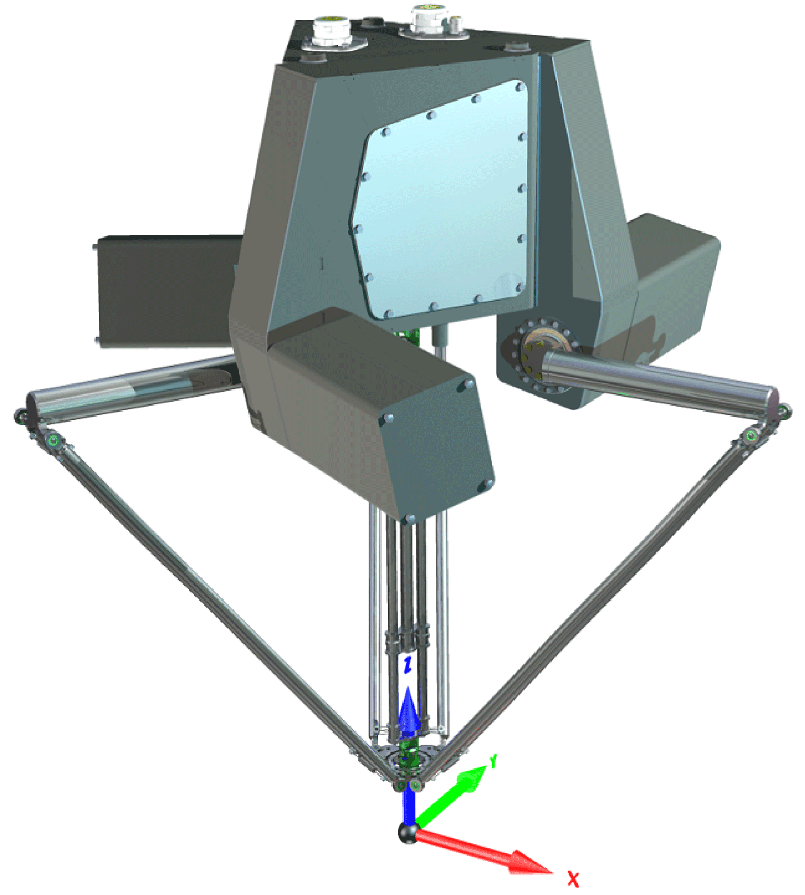
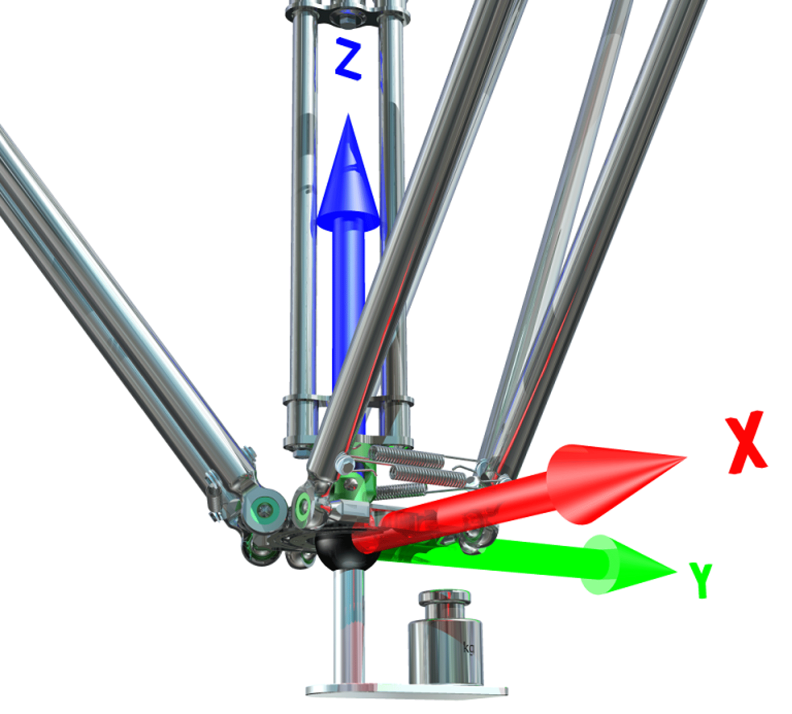
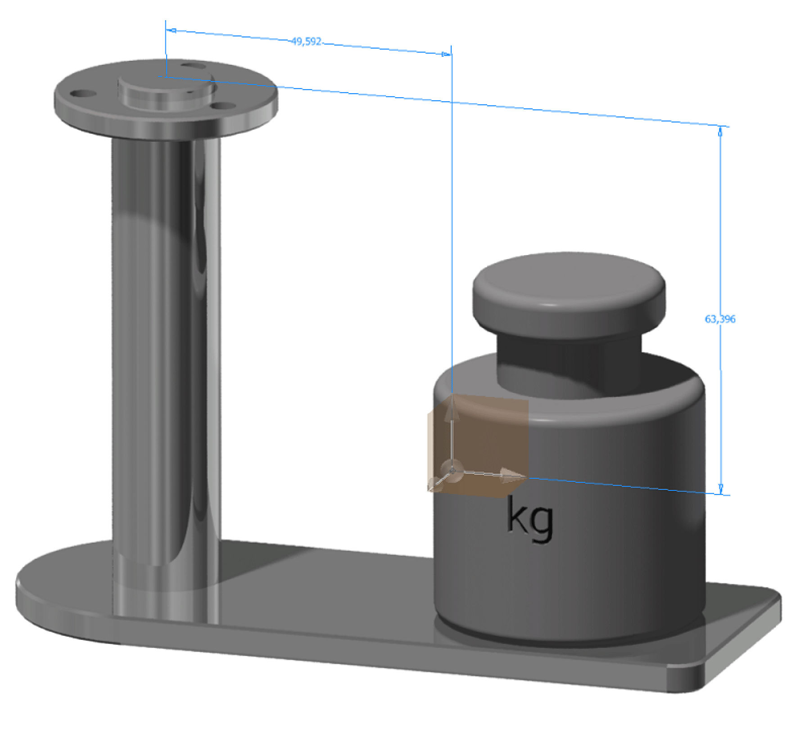

# FB\_RobotPSeries - SetKinematicParameter (Method)

## Overview

|  |  |
| --- | --- |
| Type: | Method |
| Available as of: | V1.0.0.0 |
| Versions: | Current version |

This chapter provides information on:

* [Task](#D-SE-0075199__D-SE-0075199.3)
* [Description](#D-SE-0075199__D-SE-0075199.12)
* [Use of](#D-SE-0075199__D-SE-0075199.4) i\_stCenterOfMass
* [Interface](#D-SE-0075199__D-SE-0075199.5)
* [Diagnostic Messages](#D-SE-0075199__D-SE-0075199.6)

## Task

Set kinematic parameter for a Lexium P Robot.

## Description

By calling up the method, the kinematic parameter can be adapted.

## Use of i\_stCenterOfMass

With i\_stCenterOfMass, you can define the vector that describes the location of the center of mass of the selected kinematic parameter. The picture shows a Lexium P Robot with a default coordinate system. If the coordinate has not been modified, the x-direction is parallel to the upper-arm A of the robot.

In this example, the payload is mounted asymmetrically in y-direction and the center of mass is in negative z-direction.

With the given orientation of the coordinate system and the dimension shown in the next picture, the i\_stCenterOfMass has to have the following values.

* i\_stCenterOfMass.lrX := 0.0;
* i\_stCenterOfMass.lrY := 49.592;
* i\_stCenterOfMass.lrZ := -63.693;

## Interface

| Input | Data type | Description |
| --- | --- | --- |
| i\_etName | [ET\_KinematicParameter](D-SE-0075190.html#D-SE-0075190) | Select the kinematic parameter. |
| i\_lrValue | LREAL | Mass of the selected kinematic parameter [kg]. |
| i\_stCenterOfMass | PDL.ST\_Vector3D | Set the center of mass for the selected kinematic parameter [mm]. |

| Output | Data type | Description |
| --- | --- | --- |
| q\_etDiag | [GD.ET\_Diag](../../../../../api/crossBook?lang=en-US&virtualBookName=PD.Lib.GlobalDiagnostic&topicID=D_SE_0076228) | General, library-independent statement on the diagnostic.  A value not equal to ET\_Diag.Ok corresponds to a diagnostic message. |
| q\_etDiagExt | [ET\_DiagExt](D-SE-0075188.html#D-SE-0075188) | POU-specific output for the diagnostic.  q\_etDiag = ET\_Diag.Ok -> Status message  q\_etDiag <> ET\_Diag.Ok -> Diagnostic message |
| q\_sMsg | STRING[80] | Event-triggered message that gives additional information on the diagnostic state. |

## Diagnostic Messages

| q\_etDiag | q\_etDiagExt | Enumeration value | Description |
| --- | --- | --- | --- |
| OK | GripperMassSet | 16 | The gripper mass is set. |
| OK | ProductMassSet | 17 | The product mass is set. |
| InputParameterInvalid | GripperMassInvalid | 18 | The gripper mass is invalid. |
| InputParameterInvalid | KinematicParameterInvalid | 15 | The kinematic parameter is invalid. |
| InputParameterInvalid | ProductMassInvalid | 19 | The product mass is invalid. |

## GripperMassInvalid

|  |  |
| --- | --- |
| Enumeration name: | GripperMassInvalid |
| Enumeration value: | 18 |
| Description: | The gripper mass is invalid. |

| Issue | Cause | Solution |
| --- | --- | --- |
| Setting the gripper mass was unsuccessful | The value transferred at the input i\_lrValue is invalid | A value greater than or equal to 0 must be transferred at the input i\_lrValue. |

## GripperMassSet

|  |  |
| --- | --- |
| Enumeration name: | GripperMassSet |
| Enumeration value: | 16 |
| Description: | The gripper mass is set. |

Setting the gripper mass was successful

## KinematicParameterInvalid

|  |  |
| --- | --- |
| Enumeration name: | KinematicParameterInvalid |
| Enumeration value: | 15 |
| Description: | The kinematic parameter is invalid. |

| Issue | Cause | Solution |
| --- | --- | --- |
| Setting the kinematic parameter was unsuccessful. | The value transferred at the input i\_etName is invalid | Ensure that at the input i\_etName a valid kinematic parameter has been transferred. |

## ProductMassInvalid

|  |  |
| --- | --- |
| Enumeration name: | ProductMassInvalid |
| Enumeration value: | 19 |
| Description: | The product mass is invalid. |

| Issue | Cause | Solution |
| --- | --- | --- |
| Setting the gripper mass was unsuccessful | The value transferred at the input i\_lrValue is invalid | A value greater than or equal to 0 must be transferred at the input i\_lrValue. |

## ProductMassSet

|  |  |
| --- | --- |
| Enumeration name: | ProductMassSet |
| Enumeration value: | 17 |
| Description: | The product mass is set. |

Setting the product mass was successful

EIO0000002236.19