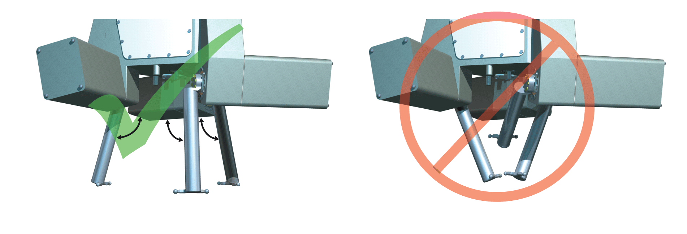
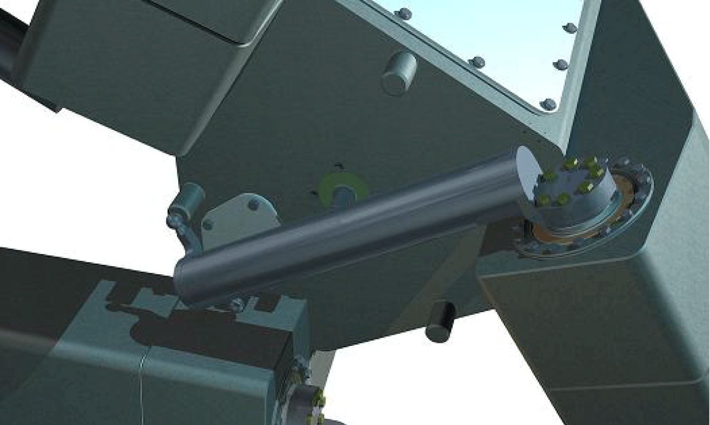
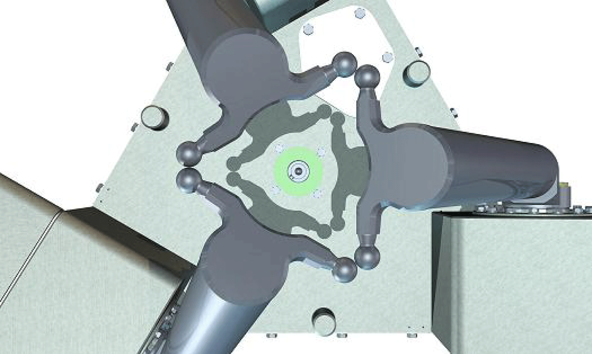

# Calibration

## Overview

The absolute encoders in the motors of the Lexium P Robot are calibrated to the zero point of the robot in the factory. Therefore a re-calibration is only necessary after disassembling and assembling the motors, gear boxes or upper arms.

NOTE: Provide a function to start the calibration on an HMI. To be able to perform a new calibration with the help of the FB\_RobotPSeries.ifCalibration, it is necessary that the interface can be handled with the HMI.

NOTE: The robotic module must be disabled for a calibration (astSubModuleInterface[x].i\_xEnable:=FALSE).

This reduces the machine downtime period after a mechanics replacement.

The following calibration modes are available:

## OnTorque

| NOTICE | |
| --- | --- |
|  | DEFORMATION OR BREAKAGE OF THE MOVING PARTS ON THE ROBOT  * Disassemble the lower arms of the robot before the OnTorque calibration starts. * If present, disassemble the rotational axis of the robot before the OnTorque calibration starts. * Verify that no upper arm is in the area below the rotational axis before stating the OnTorque calibration mode.  Failure to follow these instructions can result in equipment damage. |

With this calibration the absolute encoders of the motors are calibrated to the robot. For this purpose, the upper arms of the robot are moved to their stop positions on the robot housing one after another. This equates to a "Home on torque".

## MoveToCheckPosition

| NOTICE | |
| --- | --- |
|  | DEFORMATION OR BREAKAGE OF THE MOVING PARTS ON THE ROBOT  * If present, disassemble the rotational axis of the robot before the MoveToCheckPosition calibration starts. * Verify that no upper arm is in the area below the rotational axis before stating the MoveToCheckPosition calibration mode.  Failure to follow these instructions can result in equipment damage. |

In this calibration mode, the upper arms are moved together beneath the robot, so that the ball joints of the lower arm suspensions almost touch each other and form a triangle. The robot is calibrated correctly if there is a gap of 0.3 mm +/- 0.3 mm between two ball joints that lie against each other. If the robot is not calibrated correctly, then the calibration has to be repeated with the calibration mode OnTorque.

If the gap is still not within the specification after a repeated calibration, then please contact the Schneider Electric support team.

## MoveToMountPosition

| NOTICE | |
| --- | --- |
|  | DEFORMATION OR BREAKAGE OF THE MOVING PARTS ON THE ROBOT  * If present, disassemble the rotational axis of the robot before the MoveToMountPosition calibration starts. * Verify that no upper arm is in the area below the rotational axis before stating the MoveToMountPosition calibration mode.  Failure to follow these instructions can result in equipment damage. |

This calibration mode normally follows a MoveToCheckPosition. The robot is moved into a position in which the lower arms and a possibly existing rotational axis can be assembled and disassembled.

## BrakeRelease

| NOTICE | |
| --- | --- |
|  | DEFORMATION OR BREAKAGE OF THE MOVING PARTS ON THE ROBOT  * If present, disassemble the rotational axis of the robot before the BrakeRelease calibration starts. * Verify that no upper arm is in the area below the rotational axis before starting the BrakeRelease calibration mode.  Failure to follow these instructions can result in equipment damage. |

This calibration mode allows a manual interference of the upper arms of the robot. By using this calibration mode, the brakes of the axes A, B, C and of the rotational axis can be released.

## StandardProcedure

| NOTICE | |
| --- | --- |
|  | DEFORMATION OR BREAKAGE OF THE MOVING PARTS ON THE ROBOT  * If present, disassemble the rotational axis of the robot before the StandardProcedure calibration starts. * Verify that no upper arm is in the area below the rotational axis before stating the StandardProcedure calibration mode.  Failure to follow these instructions can result in equipment damage. |

In case of a disassembling and assembling of the motors, gearboxes or upper arms, this calibration mode enables a new calibration of the absolute encoders in the motors of the Lexium P Robot to the robot zero point.

The StandardProcedure calibration mode combines the following calibration modes, which are executed one after the other:

* OnTorque
* MoveToCheckPosition

## WriteEncoderRotationalAxis

This calibration mode writes directly on the absolute encoder of an existing rotational axis. This causes the absolute encoder position to change.

EIO0000002236.19