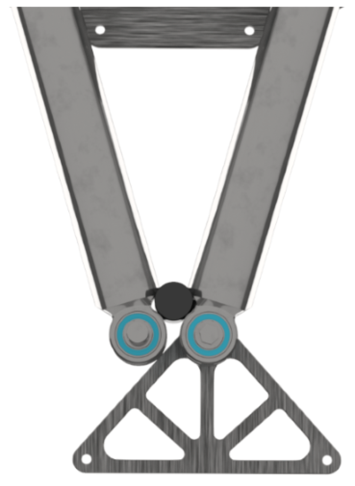

# Calibration

## Overview

The absolute encoders in the motors of the Lexium T Robot are calibrated to the zero point of the robot in the factory. Therefore a re-calibration is only necessary after disassembling and assembling the motors, gear boxes or upper arms.

NOTE: Provide a function to start the calibration on an HMI. To be able to perform a new calibration with the help of the FB\_RobotTSeries.ifCalibration, it is necessary that the interface can be handled with the HMI.

NOTE: The robotic module must be disabled for a calibration (astSubModuleInterface[x].i\_xEnable:=FALSE).

This reduces the machine downtime period after a mechanics replacement.

The following calibration modes are available:

## StandardProcedure

| NOTICE | |
| --- | --- |
|  | DEFORMATION OR BREAKAGE OF THE MOVING PARTS ON THE ROBOT  Disassemble the lower arms of the robot before the StandardProcedure calibration starts.  Failure to follow these instructions can result in equipment damage. |

In case of a disassembling and assembling of the motors, gearboxes or upper arms, this calibration mode enables a new calibration of the absolute encoders in the motors of the Lexium T Robot to the robot zero point.

Before calling the StandardProcedure calibration mode, the calibration tool has to be mounted and the robot has to be in the position as shown in the graphic.

The BrakeRelease mode can be used to reach this position for the upper arms.

## MoveToMountPosition

| NOTICE | |
| --- | --- |
|  | DEFORMATION OR BREAKAGE OF THE MOVING PARTS ON THE ROBOT  Verify that the upper arms have free space to move to a position in which the upper arms are nearly horizontal.  Failure to follow these instructions can result in equipment damage. |

The robot is moved into a position in which the lower arms can be assembled and disassembled.

## BrakeRelease

| NOTICE | |
| --- | --- |
|  | DEFORMATION OR BREAKAGE OF THE MOVING PARTS ON THE ROBOT  Verify that no lower arms and no parallel linkage are mounted before starting the BrakeRelease calibration mode.  Failure to follow these instructions can result in equipment damage. |

This calibration mode allows a manual interference of the upper arms of the robot. By using this calibration mode, the brakes of the axes A and B can be released.

EIO0000002236.19