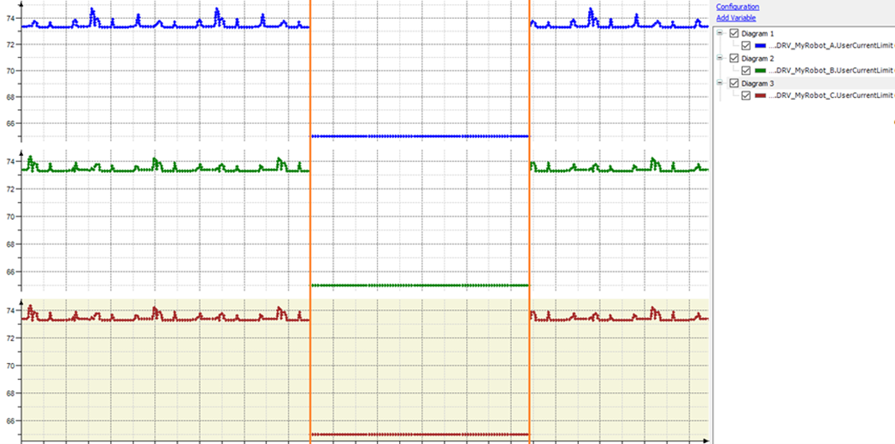

# Use and Behavior of ET\_ControlLoopParameter.UserCurrentLimit

## Overview

The trace shows the UserCurrentLimit of robot axes A, B and C. In case the value for UserDrivePeakCurrent of the drives A, B or C of the robot is set to a value greater than [ST\_DataPSeries.stAxesABC.lrUserDrivePeakCurrentDefault](TPC_FB_RobotPSeries_GetRobotData_Meth.html), then the UserCurrentLimit is set by an internal algorithm. At the first orange line, the SetControlLoopParameter method (for [P-Series](D-SE-0075198.html) or [T-Series](D-SE-0075205.html)) is called with a value to limit it to 65.0. At the second orange line, the SetControlLoopParameter method (for [P-Series](D-SE-0075198.html) or [T-Series](D-SE-0075205.html)) is called with a value to limit it to 100.0, this means it has no more effect and only the internal algorithm is limiting the UserCurrentLimit.

EIO0000002236.19