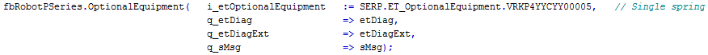
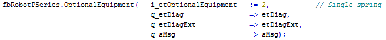

# V2.1.0.0

## System Requirements

Using the library with other versions of software or firmware may have results other than described in the present documentation.

| WARNING | |
| --- | --- |
|  | UNINTENDED EQUIPMENT OPERATION  * Ensure that the software and firmware are of the versions supported by this library. * Contact your Schneider Electric service representative for compatibility information.  Failure to follow these instructions can result in death, serious injury, or equipment damage. |

## Supported Hardware

* PacDrive LMC Eco
* PacDrive LMC Pro
* PacDrive LMC Pro2

## Software Requirements

* SoMachine Motion V4.3 SP1

## Firmware Requirements

PacDrive 3 V4.3 SP1

* PacDrive LMC Eco V1.54.20.3 or greater
* PacDrive LMC Pro V1.54.20.3 or greater
* PacDrive LMC Pro2 V1.54.20.3 or greater

## New Functions

* New robot types added to ET\_RobotPSeries:

  + P4 robots: VRKP4S4C0700000, VRKP4S4C0900000
  + P6 robots: VRKP6L0FNC00000, VRKP6L0RNC00000
* New robot types added to ET\_RobotTSeries:

  + T3 robots: VRKT3L0FNC00000
  + T5 robots: VRKT5L0FNC00000
* New optional equipment added to ET\_OptionalEquipment.

  + Parallel plate titanium without rotational axis: VRKP4YYYYY00034

## Modifications

Optional equipment removed from ET\_OptionalEquipment:

* Single spring system: VRKP4YYCYY00005

  + If ET\_OptionalEquipment.VRKP4YYCYY00005 is used in an existing project and the library SchneiderElectricRobotics Parameters is updated to V2.1.0.0, there will be a compile error message.

    
  + If the enumeration value 2 is used in an existing project instead of ET\_OptionalEquipment.VRKP4YYCYY00005 and the library SchneiderElectricRobotics Parameters is updated to V2.1.0.0, the method OptionalEquipment returns the diagnostic message GD.ET\_Diag.InputParameterInvalid in combination with ET\_DiagExt.UnknownOptionalEquipment.

    

## Enhancements

* None

EIO0000002238.19