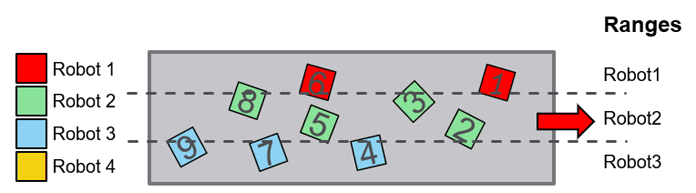

# FB\_ConveyorWidthBalancing - General Information

## Overview

|  |  |
| --- | --- |
| Type: | Function block |
| Available as of: | V1.4.1.0 |
| Inherits from: | - |
| Implements: | IF\_BalancingStrategy |

This chapter provides information on:

* [Task](#D-SE-0097995__D-SE-0097995.7)
* [Description](#D-SE-0097995__D-SE-0097995.3)
* [Methods](#D-SE-0097995__D-SE-0097995.6)

## Task

Balancing strategy for a multi-robot application considering the width of the conveyor.

## Description

A minimum and a maximum position along the width of the conveyor is assigned to each robot. In case of overlapping position ranges between two or more robots, the first robot in the list that shares that range is assigned to a target within the overlap range.

Considering the tracking direction, the axis that moves along the width of the conveyor belt is the remaining axis in the configured working plane.

For example, if the tracking direction is ROB.ET\_RobotComponent.CartesianX and the configured working plane is ROB.ET\_WorkingPlane.XY, the Y axis is the one aligned to the width of the conveyor.

## Methods

| Name | Description |
| --- | --- |
| AssignTargetsOwners | Implements the algorithm that is then applied to assign the owners of the targets in the list. |
| SetData | Sets additional information required by the algorithm to assign an owner to a target. |

EIO0000002716.11