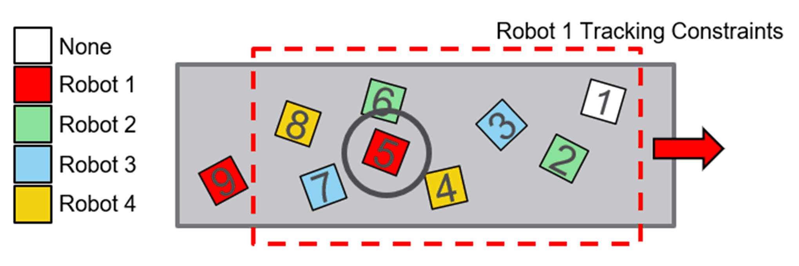

# FB\_FIFOInsideArea - General Information

## Overview

|  |  |
| --- | --- |
| Type: | Function block |
| Available as of: | V1.4.1.0 |
| Inherits from: | - |
| Implements: | IF\_TargetSelectionStrategy |

This chapter provides information on:

* [Task](#D-SE-0098037__D-SE-0098037.7)
* [Description](#D-SE-0098037__D-SE-0098037.3)
* [Methods](#D-SE-0098037__D-SE-0098037.6)

## Task

Search for a valid target with the greatest position along the direction of the tracking.

## Description

The FIFO (First In First Out) algorithm searches for a valid target with the greatest position along the direction of the tracking.

Other than the position, the owner of each target is also accounted in applying the algorithm, depending on the values of i\_xSelectTargetsWithNoOwner and i\_xSelectTargetsWithAnyOwner provided on the last successful call of the method SetData.

## Methods

| Name | Description |
| --- | --- |
| SetData | Sets additional information required by the algorithm to assign an owner to a target. |

EIO0000002716.11