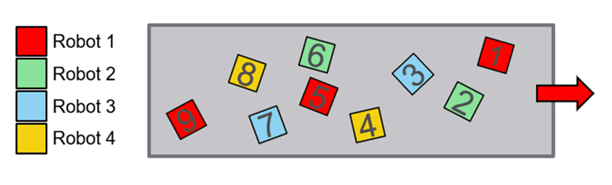

# FB\_ListBalancing - General Information

## Overview

|  |  |
| --- | --- |
| Type: | Function block |
| Available as of: | V1.4.1.0 |
| Inherits from: | - |
| Implements: | IF\_BalancingStrategy |

This chapter provides information on:

* [Task](#D-SE-0097985__D-SE-0097985.7)
* [Description](#D-SE-0097985__D-SE-0097985.3)
* [Methods](#D-SE-0097985__D-SE-0097985.6)

## Task

Assign an owner to each target based on a list of robots.

## Description

The function block FB\_ListBalancing implements an algorithm that tries to assign an owner to each target based on a list of robots.

The targets without an owner are assigned to the robots following the order of the list. Once the end of the list is reached, the algorithm restarts assigning the owners from the first element of the list.

**Example:**

{Robot1, Robot2, Robot3, Robot4}

The algorithm will assign the owners accordingly with the sequence

Robot1, Robot2, Robot3, Robot4, Robot1, Robot2, … and so on.

## Methods

| Name | Description |
| --- | --- |
| AssignTargetsOwners | Implements the algorithm that is then applied to assign the owners of the targets in the list. |
| SetData | Sets additional information required by the algorithm to assign an owner to a target. |

EIO0000002716.11