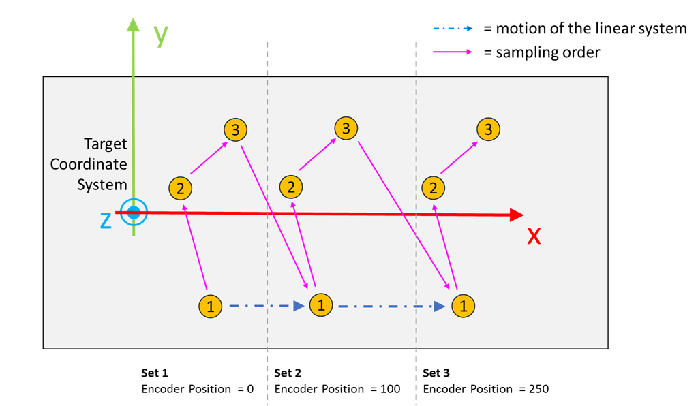

# FB\_TeachingLinearMotionSystem - AddSample (Method)

## Overview

|  |  |
| --- | --- |
| Type: | Method |
| Available as of: | V1.8.0.0 |

This chapter provides information on:

* [Task](#FB_TeachingLinearMotionSystem-AddSa-E86EB991__Task-E86CDECB)
* [Description](#FB_TeachingLinearMotionSystem-AddSa-E86EB991__Description-E86CDF67)
* [Interface](#FB_TeachingLinearMotionSystem-AddSa-E86EB991__Interface-E86CE0DA)
* [Diagnostic Messages](#FB_TeachingLinearMotionSystem-AddSa-E86EB991__DiagnosticMessages-E86EA05E)

## Task

Adds a new sample.

## Description

With the method AddSample(...), a new sample is added to the active set. The TCP position and the position on the linear motion system are automatically stored by the function block.

The methods Configuration and SetProcedureData must be successfully called before calling this method.

All the coordinates are handled by the function block, but the samples must be acquired in the expected order:

* The reference points must be sampled in the same order for each set.

  For example, if for the first set the reference points are acquired following the order (1, 2, 3), then all the other sets must be acquired following the same order.
* The active set and the number of samples already stored inside the set can be read using the properties udiActiveSetIndex and udiNumberOfSamplesInActiveSet.
* It is not necessary for the points to be aligned. On the other hand, the reference points along the Y axis must be as distant as possible; likewise the sets along the X axis must be as distant as possible.

Access: PUBLIC

## Interface

| Input | Data type | Description |
| --- | --- | --- |
| i\_lrSampleTolerance | LREAL | Tolerance value used to verify the consistency of the samples.  The algorithm verifies whether the distance between the previous and the new sample of the TCP position corresponds to the distance between the samples acquired in the other coordinate system.  Default value: 1.0 mm |

| Output | Data type | Description |
| --- | --- | --- |
| q\_xError | BOOL | TRUE: An error occurred during last command. For more information refer also to q\_etResult and q\_sResultMsg. |
| q\_etResult | [ET\_Result](ET_Result-GeneralInformation-E1DD1980.html) | Provides diagnostic and status information.  If q\_xError = FALSE, then q\_etResult provides status information.  If q\_xError = TRUE, then q\_etResult provides diagnostic/error information.  The enumeration ET\_Result contains the possible values of the POU operation results. |
| q\_sResultMsg | STRING[80] | Provides additional information about the current status of the POU. |

## Diagnostic Messages

| q\_xError | q\_etResult | Enumeration value of q\_etResult | Description |
| --- | --- | --- | --- |
| FALSE | Ok | 0 | Success. |
| TRUE | NotConfigured | 29 | The function block is not configured. |
| TRUE | MaxNumberOfSetsReached | 35 | The maximum number of sets is already sampled. |
| TRUE | ProcedureDataNotSet | 57 | No data is set for the procedure. |
| TRUE | SampleToleranceExceeded | 43 | The last set of provided samples exceeds the sample tolerance value. |
| TRUE | SampleToleranceRange | 42 | The provided value for the sample tolerance is out of range. |

## NotConfigured

|  |  |
| --- | --- |
| Enumeration name: | NotConfigured |
| Enumeration value: | 29 |
| Description: | The function block is not configured. |

| Issue | Cause | Solution |
| --- | --- | --- |
| Not possible to add a new sample. | The function block is not configured. | Ensure that the method Configuration is called successfully before calling this method. |

## MaxNumberOfSetsReached

|  |  |
| --- | --- |
| Enumeration name: | MaxNumberOfSetsReached |
| Enumeration value: | 35 |
| Description: | The maximum number of sets is already sampled. |

| Issue | Cause | Solution |
| --- | --- | --- |
| Not possible to add a new sample. | The maximum number of sets are already sampled. | Call the RemoveAllSamples method to remove all the stored samples and start a new sampling. |

## Ok

|  |  |
| --- | --- |
| Enumeration name: | Ok |
| Enumeration value: | 0 |
| Description: | Success. |

Status message: Adding a new sample to the active set was successful.

## ProcedureDataNotSet

|  |  |
| --- | --- |
| Enumeration name: | ProcedureDataNotSet |
| Enumeration value: | 57 |
| Description: | No data is set for the procedure. |

| Issue | Cause | Solution |
| --- | --- | --- |
| Not possible to add a new sample. | The procedure data are not set. | Make a successful call of the method SetProcedureData before calling this method. |

## SampleToleranceExceeded

|  |  |
| --- | --- |
| Enumeration name: | SampleToleranceExceeded |
| Enumeration value: | 43 |
| Description: | The last set of provided samples exceeds the sample tolerance value. |

| Issue | Cause | Solution |
| --- | --- | --- |
| Not possible to add a new sample. | The distance between the previous and the new TCP position compared with the distance between the previous and new position in the other coordinate system is exceeding the value of i\_lrSampleTolerance. | Verify the accuracy of the sampling procedure or increase the value of i\_lrSampleTolerance. |

## SampleToleranceRange

|  |  |
| --- | --- |
| Enumeration name: | SampleToleranceRange |
| Enumeration value: | 42 |
| Description: | The provided value for the sample tolerance is out of range. |

| Issue | Cause | Solution |
| --- | --- | --- |
| Not possible to add a new sample. | The value of i\_lrSampleTolerance is either zero or negative. | Verify that i\_lrSampleTolerance > 0.0 |

EIO0000002716.11