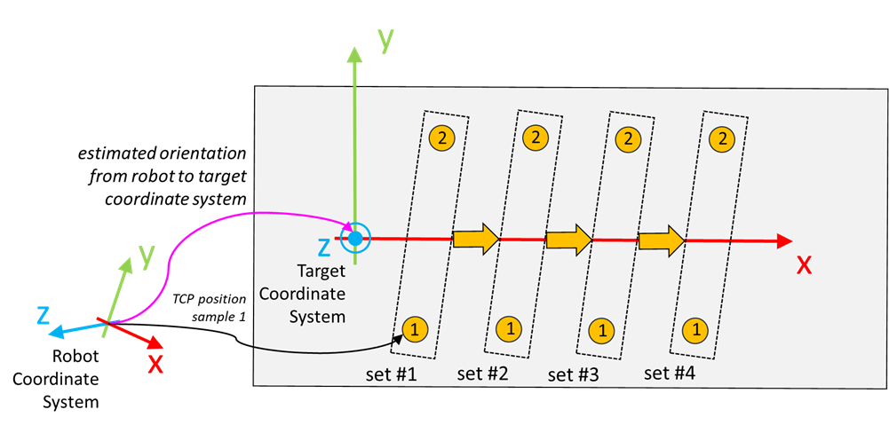

# FB\_TeachingOrientation - General Information

## Overview

|  |  |
| --- | --- |
| Type: | Function block |
| Available as of: | V1.8.0.0 |
| Inherits from: | - |
| Implements: | IF\_TeachingOrientation |

This chapter provides information on:

* [Task](#FB_TeachingOrientation-GeneralInfor-DFB4769D__Task-DFB48717)
* [Description](#FB_TeachingOrientation-GeneralInfor-DFB4769D__Description-DFB487FF)
* [Methods](#FB_TeachingOrientation-GeneralInfor-DFB4769D__Methods-DFB489D3)
* [Properties](#FB_TeachingOrientation-GeneralInfor-DFB4769D__Properties-DFB63E55)

## Task

Estimates an orientation starting from a set of sampled positions.

## Description

The function block samples a series of TCP positions of the robot and then uses this information to estimate the 3D orientation, which is provided as roll, pitch and yaw angles, and as an equivalent rotation matrix.

The estimated orientation depends on the arrangement of the scanned positions and is related to the robots coordinate system.

NOTE: The Z-axis of the taught coordinate system is always assumed to point upwards, which means that it must have a positive Z-coordinate.

## Methods

| Name | Description |
| --- | --- |
| AddSample | Adds a new sample to the active set. |
| EstimateOrientation | Estimates an orientation based on sampled data. |
| GetSample | Gets a previously stored sample. |
| RemoveAllSamples | Removes the last stored samples. |
| RemoveLastSample | Removes the last stored sample. |
| SetNumberOfSamplesPerSet | Defines the number of samples that must be stored in a set. |

## Properties

| Name | Data type | Accessing | Description |
| --- | --- | --- | --- |
| udiActiveSetIndex | UDINT | Get | Index of the set that is acquired. |
| udiNumberOfCompleteSets | UDINT | Get | Number of sets for which the samples are acquired. |
| udiNumberOfSamplesInActiveSet | UDINT | Get | Number of samples acquired for the set with index udiActiveSetIndex. |
| udiNumberOfSamplesPerSet | UDINT | Get | Configured number of samples for each set. The number of samples is configured by calling the method SetNumberOfSamplesPerSet. |

EIO0000002716.11