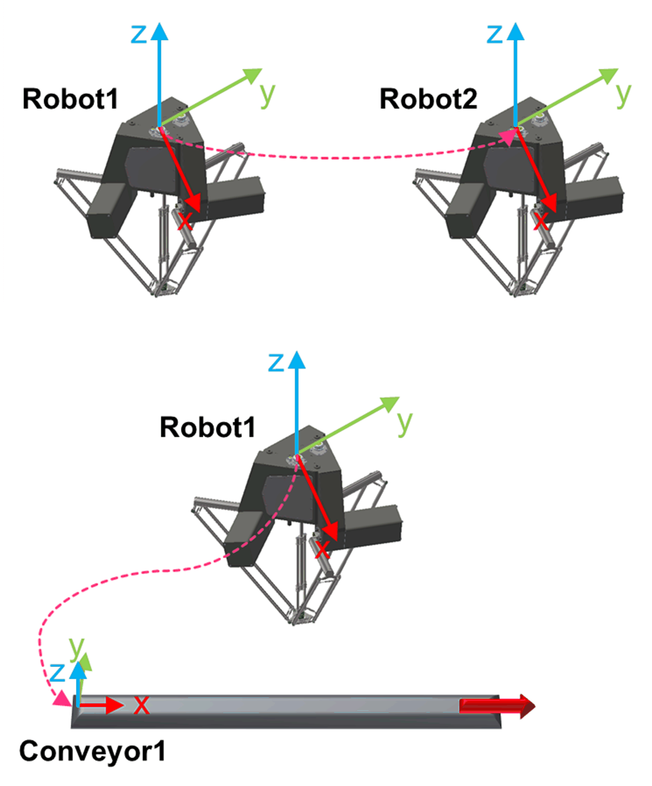

# IF\_EntitiesHandler - CalcEntitiesRelativePose (Method)

## Overview

|  |  |
| --- | --- |
| Type: | Method |
| Available as of: | V1.4.1.0 |

This chapter provides information on:

* [Task](#IF_EntitiesHandler-CalcEntitiesRela-CDCCCA7E__Task-CDCCD425)
* [Description](#IF_EntitiesHandler-CalcEntitiesRela-CDCCCA7E__Description-CDCCD596)
* [Interface](#IF_EntitiesHandler-CalcEntitiesRela-CDCCCA7E__Interface-CDCCD804)
* [Return Value](#IF_EntitiesHandler-CalcEntitiesRela-CDCCCA7E__ReturnValue-CDCCDA13)
* [Diagnostic Messages](#IF_EntitiesHandler-CalcEntitiesRela-CDCCCA7E__DiagnosticMessages-CDCCDDB4)

## Task

Calculate the relative Cartesian pose between the base frame of a source entity and the base frame of a target entity.

## Description

The method CalcEntitiesRelativePose is used to calculate the relative Cartesian pose between the base frame of a source entity and the base frame of a target entity.

## Interface

| Input | Data type | Description |
| --- | --- | --- |
| i\_etSourceSystemId | ET\_SystemEntity | An ID used to unequivocally identify an entity in the system.  Admissible values are in the ranges:   * ET\_SystemEntity.Conveyor1...ET\_SystemEntity.Conveyor30 and * ET\_SystemEntity.Robot1...ET\_SystemEntity.Robot10 and * ET\_SystemEntity.TargetGenerator1...ET\_SystemEntity.TargetGenerator30 and * ET\_SystemEntity.Global |
| i\_etTargetSystemId | ET\_SystemEntity | An ID used to unequivocally identify an entity in the system.  Admissible values are in the ranges:   * ET\_SystemEntity.Conveyor1...ET\_SystemEntity.Conveyor30 and * ET\_SystemEntity.Robot1...ET\_SystemEntity.Robot10 and * ET\_SystemEntity.TargetGenerator1...ET\_SystemEntity.TargetGenerator30 and * ET\_SystemEntity.Global |
| i\_etOrientationConvention | ROB.ET\_OrientationConvention | Orientation convention used to represent the orientation of the resulting pose.  Admissible values are in the ranges:   * ROB.ET\_OrientationConvention.XYZ * ROB.ET\_OrientationConvention.ZYX   Refer to Robotic Library - *[ET\_OrientationConvention](../../../../../api/crossBook?lang=en-US&virtualBookName=PD.Lib.Robotic&topicID=D_SE_0075485)*. |

| Output | Data type | Description |
| --- | --- | --- |
| q\_etDiag | *[GD.ET\_Diag](../../../../../api/crossBook?lang=en-US&virtualBookName=PD.Lib.GlobalDiagnostic&topicID=D_SE_0076228)* | General library-independent statement on the diagnostic. A value unequal to GD.ET\_Diag.Ok corresponds to a diagnostic message. |
| q\_etDiagExt | ET\_DiagExt | POU-specific output on the diagnostic.  q\_etDiag = ET\_Diag.Ok -> Status message  q\_etDiag <> ET\_Diag.Ok -> Diagnostic message |
| q\_sMsg | STRING[80] | Event-triggered message that gives more detailed information on the diagnostic state. |

## Return Value

| Data type | Description |
| --- | --- |
| ST\_CartesianPose | A Cartesian pose describing the relative Cartesian pose transformation from the source system base pose to the target system base pose. |

## Diagnostic Messages

| q\_etDiag | q\_etDiagExt | Enumeration value of q\_etDiagExt | Description |
| --- | --- | --- | --- |
| Ok | Ok | 0 | Ok |
| InputParameterInvalid | ConveyorIdUnknown | 133 | A provided conveyor ID is invalid. |
| InputParameterInvalid | EntityIdInvalid | 132 | A provided entity ID is invalid. |
| InputParameterInvalid | OrientationConventionInvalid | 38 | Invalid orientation convention. |
| InputParameterInvalid | RobotIdUnknown | 130 | A provided robot ID is invalid. |
| UnexpectedProgramBehavior | UnexpectedFeedback | 4 | Internal error detected. |
| InputParameterInvalid | TargetGeneratorIdUnknown | 174 | A provided target generator type is invalid. |

## ConveyorIdUnknown

|  |  |
| --- | --- |
| Enumeration name: | ConveyorIdUnknown |
| Enumeration value: | 133 |
| Description: | A provided conveyor ID is invalid. |

| Issue | Cause | Solution |
| --- | --- | --- |
| The relative pose has not been successfully evaluated. | i\_etSourceSystemId contains an indeterminable conveyor system ID. | Ensure that the value of i\_etSourceSystemId refers to a previously configured conveyor. |
| i\_etTargetSystemId contains an indeterminable conveyor system ID. | Ensure that the value of i\_etTargetSystemId refers to a previously configured conveyor. |

## EntityIdInvalid

|  |  |
| --- | --- |
| Enumeration name: | EntityIdInvalid |
| Enumeration value: | 132 |
| Description: | A provided entity ID is invalid |

| Issue | Cause | Solution |
| --- | --- | --- |
| The relative pose has not been successfully evaluated. | i\_etSourceSystemId contains an invalid entity ID. | Ensure that the value of i\_etSourceSystemId refers to an entity ID in the range:   * ET\_SystemEntity.Conveyor1...ET\_SystemEntity.Conveyor30 or * ET\_SystemEntity.Robot1...ET\_SystemEntity.Robot10 |
| i\_etTargetSystemId contains an invalid entity ID. | Ensure that the value of i\_etTargetSystemId refers to an entity ID in the range:   * ET\_SystemEntity.Conveyor1...ET\_SystemEntity.Conveyor30 or * ET\_SystemEntity.Robot1...ET\_SystemEntity.Robot10. |

## Ok

|  |  |
| --- | --- |
| Enumeration name: | Ok |
| Enumeration value: | 0 |
| Description: | Success |

Status message: The relative pose has been evaluated successfully.

## OrientationConventionInvalid

|  |  |
| --- | --- |
| Enumeration name: | OrientationConventionInvalid |
| Enumeration value: | 38 |
| Description: | Invalid orientation convention. |

| Issue | Cause | Solution |
| --- | --- | --- |
| The relative pose has not been successfully evaluated. | i\_etOrientationConvention contains an invalid orientation convention. | Provide a valid value for the orientation convention.  Admissible values are:   * ROB.ET\_OrientationConvention.XYZ * ROB.ET\_OrientationConvention.ZYX   Refer to [*Robotic Library - ET\_OrientationConvention*](../../../../../api/crossBook?lang=en-US&virtualBookName=PD.Lib.Robotic&topicID=D_SE_0075489). |

## RobotIdUnknown

|  |  |
| --- | --- |
| Enumeration name: | RobotIdUnknown |
| Enumeration value: | 130 |
| Description: | A provided robot ID is invalid. |

| Issue | Cause | Solution |
| --- | --- | --- |
| The relative pose has not been successfully evaluated. | i\_etSourceSystemId contains an indeterminable robot system ID. | Ensure that the value of i\_etSourceSystemId refers to a previously configured robot. |
| i\_etTargetSystemId contains an indeterminable robot system ID. | Ensure that the value of i\_etTargetSystemId refers to a previously configured robot. |

## UnexpectedFeedback

|  |  |
| --- | --- |
| Enumeration name: | UnexpectedFeedback |
| Enumeration value: | 4 |
| Description: | Internal error detected. |

| Issue | Cause | Solution |
| --- | --- | --- |
| The relative pose has not been successfully evaluated. | An indeterminable exception occurred. | - |

## TargetGeneratorIdUnknown

|  |  |
| --- | --- |
| Enumeration name: | TargetGeneratorIdUnknown |
| Enumeration value: | 174 |
| Description: | A provided target generator type is invalid. |

| Issue | Cause | Solution |
| --- | --- | --- |
| A provided target generator ID is invalid. | i\_etTargetGeneratorId contains an indeterminable target generator system ID. | Ensure that the value of i\_etTargetGeneratorId refers to a previously configured target generator. |

EIO0000002716.11