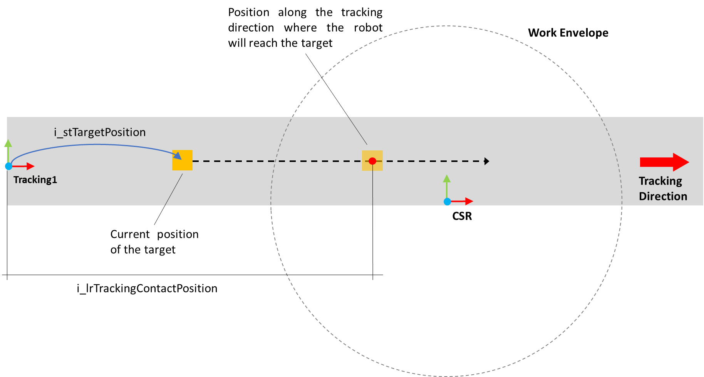

# IF\_LinearTrackingVelOverrideScaling - EvaluateScaledVelOverride (Method)

## Overview

|  |  |
| --- | --- |
| Type: | Method |
| Available as of: | V1.7.3.0 |

This chapter provides information on:

* [Task](#IF_LinearTrackingVelOverrideScaling-48DD1CD0__Task-48DAD09B)
* [Description](#IF_LinearTrackingVelOverrideScaling-48DD1CD0__Description-48DAD1EB)
* [Interface](#IF_LinearTrackingVelOverrideScaling-48DD1CD0__Interface-48DAD37A)
* [Return Value](#IF_LinearTrackingVelOverrideScaling-48DD1CD0__ReturnValue-48DBD526)

## Task

This method is used to evaluate a scaled velocity override value based on the state of the robot and the reachability of a target in a linear tracking system.

## Description

This method evaluates a velocity override value to scale the velocity of a robot during its motion toward a target in a linear tracking system. The scaling is adjusted based on the reachability of the target, the time required by the robot to reach it and the velocity of the linear tracking system.

NOTE:

* Before calling this method, a successful call of the Configuration method must be performed. If the function block is properly configured, the property xConfigDone is set to TRUE.
* The scaled velocity override value is returned by the method but not automatically applied to the robot.

## Interface

| Input | Data type | Description |
| --- | --- | --- |
| i\_stTargetPosition | SE\_MATH.ST\_Vector3D | Target position to be reached in relation to the tracking coordinate system. |
| i\_etTrackingCoordinateSystem | [ROB.ET\_CoordinateSystem](../../../../../api/crossBook?lang=en-US&virtualBookName=PD.Lib.Robotic&topicID=D_SE_0075477) | Specification of the coordinate system to be considered in the calculation. The positions i\_stTargetPosition and i\_lrTrackingContactPosition are referring to this coordinate system. |
| i\_lrTrackingContactPosition | LREAL | Position along the tracking direction where the robot will reach the target. |
| i\_lrMaxVelOverride | LREAL | Maximum velocity override that the robot is allowed to use for the motion. |

| Input | Data type | Description |
| --- | --- | --- |
| q\_xError | BOOL | TRUE: An error occurred during last command. For more information, refer to q\_etResult and q\_sResultMsg. |
| q\_etResult | [ET\_Result](ET_Result-GeneralInformation-E1DD1980.html) | Provides diagnostic and status information.  If q\_xError = FALSE, then q\_etResult provides status information.  If q\_xError = TRUE, then q\_etResult provides diagnostic/error information.  The enumeration ET\_Result contains the possible values of the POU operation results. |
| q\_sResultMsg | STRING[80] | Provides additional information about the status of the POU. |

## Return Value

| Data type | Description |
| --- | --- |
| LREAL | The method returns the scaled velocity override value. |

EIO0000002716.11