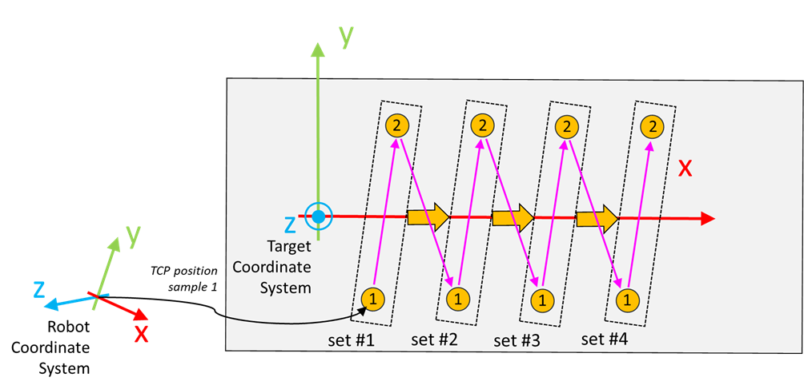

# IF\_TeachingOrientation - AddSample (Method)

## Overview

|  |  |
| --- | --- |
| Type: | Method |
| Available as of: | V1.8.0.0 |

This chapter provides information on:

* [Task](#IF_TeachingOrientation-AddSampleMet-DCA232C1__Task-DCA20AB4)
* [Description](#IF_TeachingOrientation-AddSampleMet-DCA232C1__Description-DCA20BE1)
* [Interface](#IF_TeachingOrientation-AddSampleMet-DCA232C1__Interface-DCA20D81)

## Task

Adds a new sample to the active set.

## Description

With the method AddSample(...), a new sample is added to the active set. Each sample contains the TCP position at a specific target point with reference to the coordinate system of the robot.

NOTE: The active set and the number of samples already stored inside such a set can be read using the properties udiActiveSetIndex and udiNumberOfSamplesInActiveSet.

The following graphic displays an example of the sampling order of the points. In this case, two samples per set are acquired across four different sets, for a total of eight samples.

Access: PUBLIC

## Interface

| Input | Data type | Description |
| --- | --- | --- |
| i\_stTCPPosition | SE\_MATH.ST\_Vector3D | Cartesian position of the TCP referred to the coordinate system of the robot. |

| Output | Data type | Description |
| --- | --- | --- |
| q\_xError | BOOL | TRUE: An error occurred during last command. For more information refer also to q\_etResult and q\_sResultMsg. |
| q\_etResult | [ET\_Result](ET_Result-GeneralInformation-E1DD1980.html) | Provides diagnostic and status information.  If q\_xError = FALSE, then q\_etResult provides status information.  If q\_xError = TRUE, then q\_etResult provides diagnostic/error information.  The enumeration ET\_Result contains the possible values of the POU operation results. |
| q\_sResultMsg | STRING[80] | Provides additional information about the current status of the POU. |

EIO0000002716.11