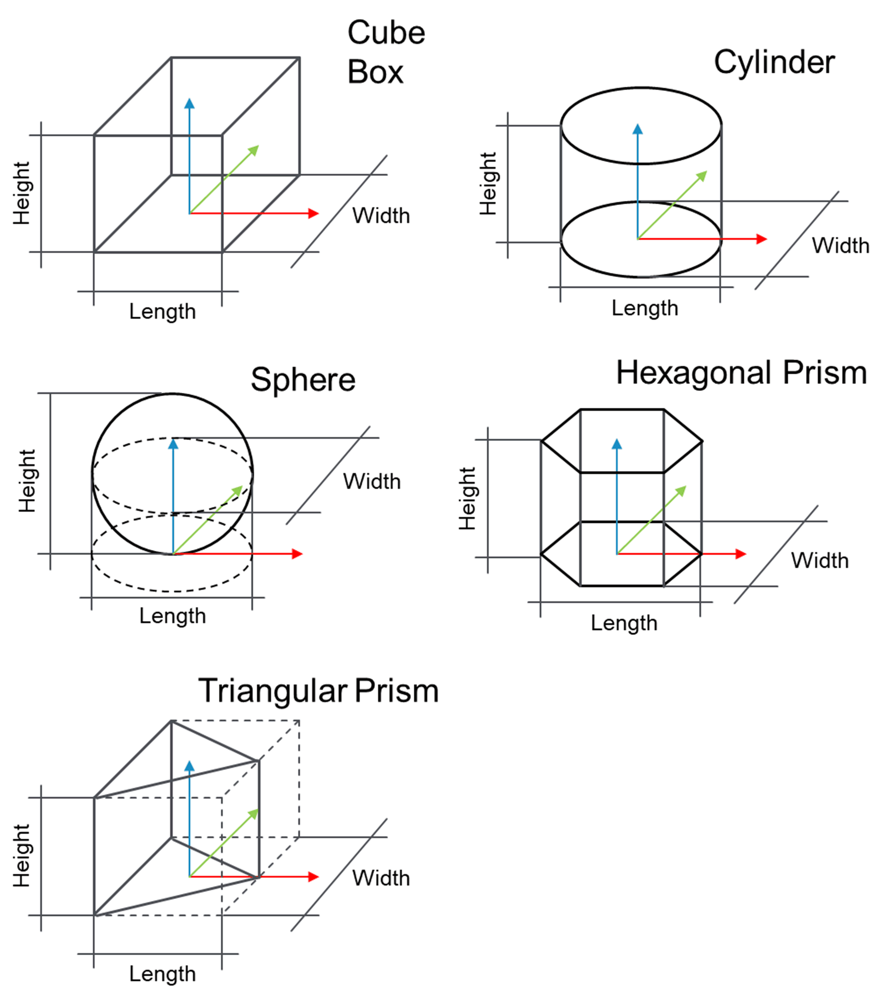

# ST\_TargetTypeData

## Overview

|  |  |
| --- | --- |
| Type: | Structure |
| Available as of: | V1.4.1.0 |
| Inherits from: | - |

## Description

Structure to store information on a target type such as its physical size and its mass and center of mass.

## Structure Elements

| Name | Data type | Description |
| --- | --- | --- |
| sName | STRING[80] | A string used to describe the target type. |
| etType | ET\_TargetType | The type id linked to the target type. |
| etShape | ET\_GeometricShape | Geometric shape of the target type. |
| lrLength | LREAL | Physical length of the target type. |
| lrWidth | LREAL | Physical width of the target type. |
| lrHeight | LREAL | Physical height of the target type. |
| lrMass | LREAL | Mass of the target type. |
| stCenterOfMass | *[PDL.ST\_Vector3D](../../../../../api/crossBook?lang=en-US&virtualBookName=PD.Lib.PacDriveLib&topicID=D_SE_0087802)* | Center of mass of the target type. |

EIO0000002716.11