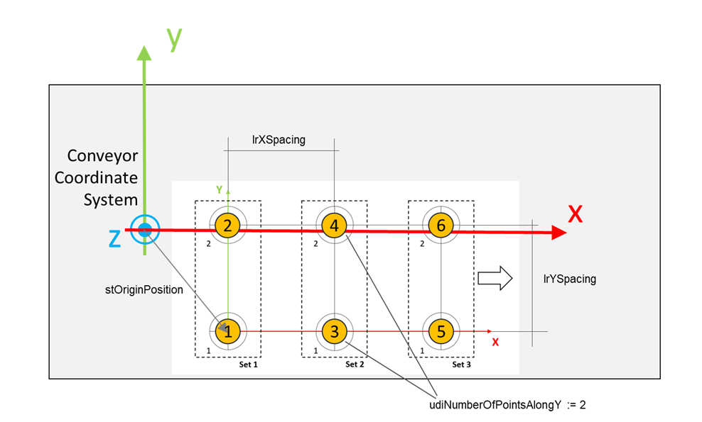

# ST\_TeachingFixedSystemData

## Overview

|  |  |
| --- | --- |
| Type: | Structure |
| Available as of: | V1.8.0.0 |
| Inherits from: | - |

## Description

Structure used to configure a teaching procedure for a fixed system. The procedure is based on using a custom grid of reference points that is described by the parameters of this structure.

The procedure is implemented by the function block FB\_TeachingFixedSystem.

## Structure Elements

| Name | Data type | Description |
| --- | --- | --- |
| stOriginPosition | SE\_MATH.ST\_Vector3D | Cartesian position of the origin of the grid, that is coincident with the first reference point. |
| udiNumberOfPointsAlongY | UDINT | Number of points for the reference grid along the Y direction. |
| lrXSpacing | LREAL | Spacing of the points of the reference grid along the X direction. |
| lrYSpacing | LREAL | Spacing of the points of the reference grid along the Y direction. |

EIO0000002716.11