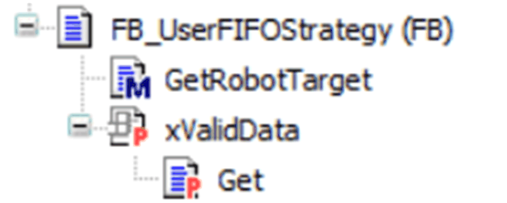
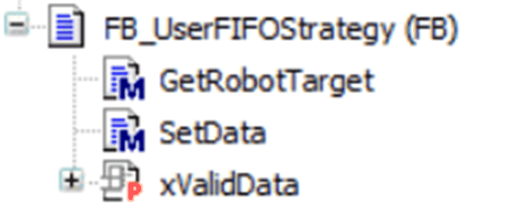

# Implementation Example of a FIFO Strategy

## Overview

This example shows how you can implement a custom target selection strategy.

For this example it is assumed that:

* The tracking direction is always set to ROB.ET\_RobotComponent.CartesianX.
* The Targets Handler on which the algorithm is applied does not contain slots.

## Creation of the Target Selection Strategy Implementation

At first, you must create a new function block that implements the library interface IF\_TargetSelectionStrategy. In this case, a function block named FB\_UserFIFOStrategy is created.



Inside the interface of FB\_UserFIFOStrategy, a new internal variable called \_xValidData of type BOOL was defined. This is used as return value for the interface property xValidData.

```
FUNCTION_BLOCK FB_UserFIFOStrategy IMPLEMENTS SERT.IF_TargetSelectionStrategy
VAR
       _xValidData : BOOL;
END_VAR
```

The underscore in front of the variable name is just a naming convention to identify the internal variables of the function block.

It is also possible to add an implementation for the Get method of the property xValidData.

xValidData := \_xValidData;

## Adding a Configuration Method

The interface IF\_TargetSelectionStrategy does not contain any configuration method and you have to create an own method for this purpose.



In this case, it has been defined a method called SetData with the following interface:

```
VAR_INPUT
       i_ifTargetsHandler : SERT.IF_TargetsHandler;
       i_stTrackingConstraints : SERT.ST_TrackingConstraints;
END_VAR
```

Moreover, two internal variables are added to the function block since they are required to store the values passed through the SetData method.

```
FUNCTION_BLOCK FB_UserFIFOStrategy IMPLEMENTS SERT.IF_TargetSelectionStrategy
VAR
    _xValidData : BOOL;
    _ifTargetsHandler : SERT.IF_TargetsHandler;
    _stTrackingConstraints : SERT.ST_TrackingConstraints;
END_VAR
```

The body of the SetData method can be implemented as it follows:

```
   //clean the flag
   _xValidData := FALSE;

   //check that i_ifTargetsHandler contains a valid interface, 
   //otherwise return
   IF i_ifTargetsHandler = 0 THEN
       //add some diagnostics here
       RETURN;
   END_IF

   //store the values inside the internal variables
   _ifTargetsHandler := i_ifTargetsHandler;
   _stTrackingConstraints := i_stTrackingConstraints;

   //set the flag
    _xValidData := TRUE;
```

## Implementing GetRobotTarget

In this case, it is required to implement a FIFO strategy. The algorithm searches for the target with the greatest position along the tracking direction and within a working area described by the tracking constraints.

It is required to define some additional variables used inside the GetRobotTarget method first:

```
METHOD GetRobotTarget : SERT.ST_RobotTarget
VAR_INPUT
   i_etRobotId : SERT.ET_SystemEntity;
END_VAR
VAR_OUTPUT
   q_etDiag : GD.ET_Diag := GD.ET_Diag.Ok;
   q_etDiagExt : SERT.ET_DiagExt := SERT.ET_DiagExt.Ok;
   q_sMsg : STRING(80);
END_VAR
VAR
   udiIndex : UDINT;
   stTempTarget : SERT.ST_RobotTarget;
END_VAR
```

The following code is added to the body of the method:

```
IF NOT _xValidData THEN
   //add diagnostics here
   RETURN;
END_IF

//get the first index in the list
udiIndex := _ifTargetsHandler.udiFirstListIndex;

WHILE udiIndex <> SERT.Gc_udiTailListIndex DO
      //get the target in the list at index udiIndex
      stTempTarget := _ifTargetsHandler.GetTarget( 
         i_udiListIndex := udiIndex,
         q_etDiag => q_etDiag,
         q_etDiagExt => q_etDiagExt,
         q_sMsg => q_sMsg
      );
      //there was an error while getting a target
      IF q_etDiag <> GD.ET_Diag.Ok THEN
         RETURN;
      END_IF
      //check if the target is inside the working area, if yes, 
      //the search ends here
      IF stTempTarget.stCurrentPose.stPosition.lrX >=       _stTrackingConstraints.stMinPosition.lrX AND       stTempTarget.stCurrentPose.stPosition.lrX <=       _stTrackingConstraints.stMaxPosition.lrX THEN
           //return the current target as the selected one
           GetRobotTarget := stTempTarget;
           RETURN;
      END_IF
      //get the next index in the list
      udiIndex := _ifTargetsHandler.GetNextListIndex(
        i_udiListIndex := udiIndex,
        q_etDiag => q_etDiag,
        q_etDiagExt => q_etDiagExt,
        q_sMsg => q_sMsg
      );
      //there was an error while getting the next list index
      IF q_etDiag <> GD.ET_Diag.Ok THEN
         RETURN;
      END_IF
END_WHILE
```

Description of the code content:

* Verify that the internal data is valid, otherwise return.
* Get the first index in the list in the targets handler; since the targets inside the targets handler are sorted in descending order, the first element of the list has always the greatest position along the tracking direction (positive X direction in this case).
* For each index, get the relative ST\_RobotTarget in the list and verify if its position is within the minimum and maximum positions defined inside the tracking constraints.
* Since the elements in the list are in descending order, as soon as a target inside the working area is found, the algorithm can return.
* If the present target is not valid, the algorithm gets the next target index from the targets handler and proceeds with the next cycle.

EIO0000002716.11