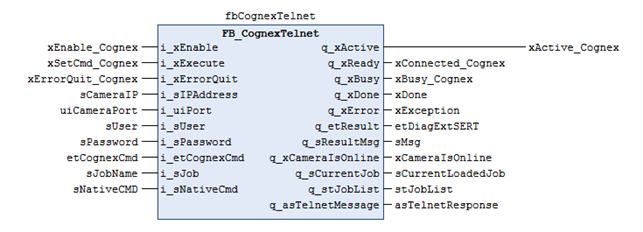

# Using FB\_CognexTelnet

## Call the Function Block

## Enable the Function Block

* Before the function block is enabled, the inputs i\_sIPAddress, i\_uiPort, i\_sUser and i\_sPassword should be filled with valid values. If the values are not correct, the function block returns an error.
* For Cognex Vision Systems, the default values are:

  + Port: 23
  + User: admin
  + Password: empty string
* With the correct parameterization for the Cognex Vision System, the function block connects automatically to the Cognex Vision System. As long as the Telnet connection is established, the output q\_xReady is set to TRUE.
* During the first connection, the function block reads the online state of the Cognex Vision System, and the corresponding signal sets the output q\_xCameraIsOnline.
* While a command is being processed, the output q\_xBusy is set to TRUE. When q\_xBusy is TRUE, the input i\_xExecute is ignored.

## Get Online State

* Select GetOnlineState at the input i\_etCognexCmd and set the input i\_xExecute.
* When the command has been processed, the output q\_xDone is set to TRUE, and the state is shown with the output q\_xCameraIsOnline.

## Change Online State

* Select ChangeOnlineState at the input i\_etCognexCmd and set the input i\_xExecute.
* When the command has been processed, the output q\_xDone is set to TRUE, and the state is shown with the output q\_xCameraIsOnline.

## Get Job

* Select GetCurrentJob at the input i\_etCognexCmd and set the input i\_xExecute.
* When the command has been processed, the output q\_xDone is set to TRUE, and the current job is shown at the output q\_sCurrentJob.

## Load Job

* Select LoadJob at the input i\_etCognexCmd, set the wanted job at the input i\_sJob, and set the input i\_xExecute.
* When the command has been processed, the output q\_xDone is set to TRUE, and the current job is shown at the output q\_sCurrentJob.

  NOTE: Make sure, the camera is offline before loading a job. When the job has been loaded, go online.

## Get JobLlist

* To get a complete list of jobs that are saved on the camera, select GetJobList at the input i\_etCognexCmd, and set the input i\_xExecute.
* When the command has been processed, the output q\_xDone is set to TRUE, and the current JobList is shown at the output structure q\_stJobList.
* The structure includes the uiNumberOfJobs, which indicates the number of jobs and an array with the name of the jobs that are stored on the camera.

## Send NativeCMD

* You can send other Native Commands to the camera. These commands are specified by the manufacturer of the camera.
* Select SendNativeCmd at the input i\_etCognexCmd, set the command you want to send at i\_sNativeCmd, and set the input i\_xExecute.
* The command is sent directly to the camera. When the function block has received the response, the output q\_xDone is set to TRUE. The response of the camera is shown at the output q\_asTelnetMessage.

EIO0000002716.11