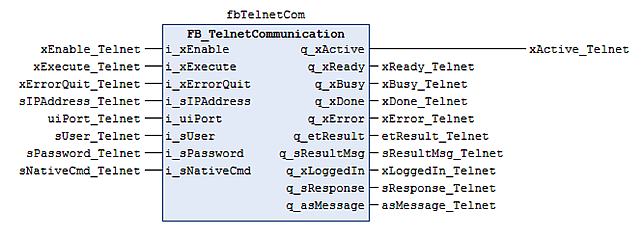

# Using FB\_TelnetCommunication

## Call the Function Block

## Enable the Function Block

* Before the function block is enabled, the inputs i\_sIPAddress, i\_uiPort, i\_sUser and i\_sPassword should be filled with valid values. If the values are not correct, the function block returns an error.
* For Cognex cameras, the default values are:

  + Port: 23
  + User: admin
  + Password: empty string
* With the correct parameterization for the camera, the function block connects automatically to the camera. As long as the Telnet connection is established, the output q\_xReady is set to TRUE.
* While a command is being processed, the output q\_xBusy is set to TRUE. When q\_xBusy is TRUE, the input i\_xExecute is ignored.

## Send NativeCMD

You can send other Native Commands to the camera. These commands are specified by the manufacturer of the camera.

* Set the command you want to send at i\_sNativeCmd, and set the input i\_xExecute.
* The command is sent directly to the camera. When the function block has received the response , the output q\_xDone is set to TRUE. The response of the camera is shown line by line at the output q\_sResponse, the complete response is shown at the output q\_asMessage.

EIO0000002716.11