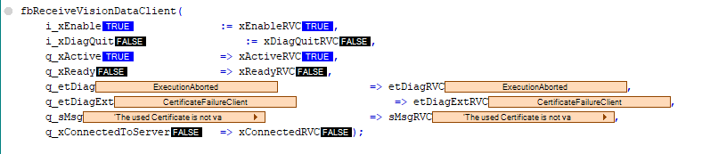
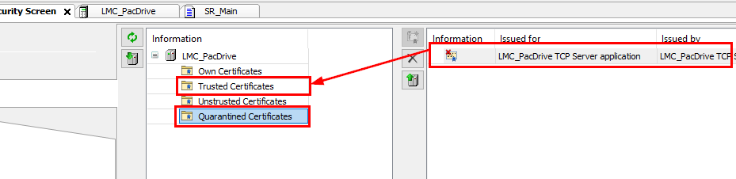
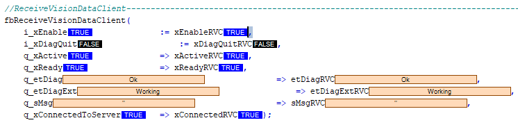

# Using Function Blocks with TLS-Certificate

## Handling TLS-Certification

Use the standard configuration of the TLS settings (only instance the structure).

With these settings the server does not require a certificate from the client, but the client would require a certificate from the server. Also, the handling or creation of the certificates are managed by the Schneider Electric software.

NOTE: If no standard settings are used, you have to handle and create the certificates.

## General Behavior of the Function Block Using TLS

When using the client with TLS-Encryption, you have to save the certificate manually to the trusted certificates:

At the first connection, the client function block will provide an exception:

This exception displays that the certificate is not being trusted. To set the certificate to trusted, you have to verify and move (drag & drop) the certificate from Quarantined Certificates to Trusted certificates in the security screen.

For further information, refer to [Handling the TLS-Certification](../../../../../api/crossBook?lang=en-US&virtualBookName=UsingFunctionBlocksWithTLS-Certific-4C08ACD1.html#UsingFunctionBlocksWithTLS-Certific-4C08ACD1__HandlingTLS-Certification-4C089F59) or in the [Security Screen](../../SoMMenu&topicID=D_SE_0099371) (Machine Expert > V2.0 > Software > Programming > Menu Commands Online Help > Security Screen )  in the Online Help.

After these settings, you must restart the function block to start a new communication. The connection must be established without an exception.

EIO0000002716.11