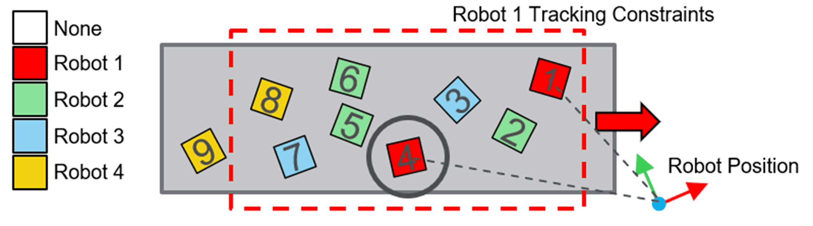

# FB\_FarthestTargetInsideArea - General Information

## Overview

|  |  |
| --- | --- |
| Type: | Function block |
| Available as of: | V1.4.1.0 |
| Inherits from: | - |
| Implements: | IF\_TargetSelectionStrategy |

This chapter provides information on:

* [Task](#D-SE-0098122__D-SE-0098122.7)
* [Description](#D-SE-0098122__D-SE-0098122.3)
* [Methods](#D-SE-0098122__D-SE-0098122.6)

## Task

Search for the target within the tracking constraints that is farthest from a position to compare.

## Description

The algorithm searches for the target within the tracking constraints that is farthest from a position to compare. The orientation of the targets are not considered by this algorithm.

Other than the position, the owner of each target is also accounted in applying the algorithm, depending on the values of i\_xSelectTargetsWithNoOwner and i\_xSelectTargetsWithAnyOwner provided on the last successful call of the method [**SetData**](D-SE-0098123.html#D-SE-0098123).

## Methods

| Name | Description |
| --- | --- |
| SetData | Sets additional information required by the algorithm to assign an owner to a target. |

EIO0000006044.00