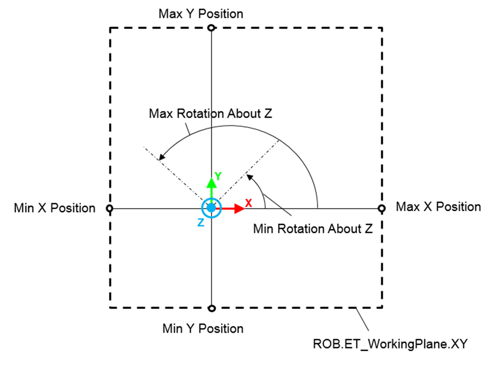

# FB\_RandomPoseGenerator - SetPoseInPlane (Method)

## Overview

|  |  |
| --- | --- |
| Type: | Method |
| Available as of: | V1.0.2.0 |

This chapter provides information on:

* [Task](#D-SE-0079459__D-SE-0079459.27)
* [Description](#D-SE-0079459__D-SE-0079459.3)
* [Interface](#D-SE-0079459__D-SE-0079459.4)
* [Diagnostic Messages](#D-SE-0079459__D-SE-0079459.5)

## Task

Define a set of constraints for the generation of random poses.

## Description

The method SetPoseInPlane allows you to define a set of constraints for the generation of random poses contained in a selected working plane.

To define a specific value for a constraint, set the minimum and the maximum to the same value.

The following is an example of working plane set to XY:

## Interface

| Input | Data type | Description |
| --- | --- | --- |
| i\_etPlane | SE\_MATH.ET\_CartesianPlane | Used to select a working plane (for example, XY, XZ, YZ). The value of this input cannot be SE\_MATH.ET\_CartesianPlane.None.  While a specific working plane is selected, any generated pose describes a position contained in the plane (the position along the third 3D axis is set to 0) and a rotation about a vector normal to the plane. |
| i\_stMinPosition | *SE\_MATH.ST\_Vector3D* | Minimum position value that a generated pose can take. It can be considered as the minimum Cartesian coordinate contained in a volume defined by you. |
| i\_stMaxPosition | *SE\_MATH.ST\_Vector3D* | Maximum position value that a generated pose can take. It can be considered as the maximum Cartesian coordinate contained in a volume defined by you. |
| i\_lrMinRotation | LREAL | Minimum rotation angle about an axis normal to the selected plane that is used to generate the pose. |
| i\_lrMaxRotation | LREAL | Maximum rotation angle about an axis normal to the selected plane that is used to generate the pose. |
| i\_etOrientationConvention | SE\_MATH.ET\_OrientationConvention | Convention for the rotation angles of the orientation. |

| Output | Data type | Description |
| --- | --- | --- |
| q\_etDiag | *[GD.ET\_Diag](../../../../../api/crossBook?lang=en-US&virtualBookName=PD.Lib.GlobalDiagnostic&topicID=D_SE_0076228)* | General library-independent statement on the diagnostic. A value unequal to GD.ET\_Diag.Ok corresponds to a diagnostic message. |
| q\_etDiagExt | ET\_DiagExt | POU-specific output on the diagnostic.  q\_etDiag = ET\_Diag.Ok -> Status message  q\_etDiag <> ET\_Diag.Ok -> Diagnostic message |
| q\_sMsg | STRING[80] | Event-triggered message that gives more detailed information on the diagnostic state. |

## Diagnostic Messages

| q\_etDiag | q\_etDiagExt | Enumeration value of q\_etDiagExt | Description |
| --- | --- | --- | --- |
| Ok | Ok | 0 | Ok |
| InputParameterInvalid | PlaneInvalid | 37 | The selected working plane is invalid. |
| InputParameterInvalid | PositionXRange | 40 | The X position range provided as constraint of the random generation is invalid. |
| InputParameterInvalid | PositionYRange | 41 | The Y position range provided as constraint of the random generation is invalid. |
| InputParameterInvalid | PositionZRange | 42 | The Z position range provided as constraint of the random generation is invalid. |
| InputParameterInvalid | RotationRange | 46 | The rotation range provided as constraint of the random generation is invalid. |
| InputParameterInvalid | OrientationConventionInvalid | 38 | Invalid orientation convention. |

## Ok

|  |  |
| --- | --- |
| Enumeration name: | Ok |
| Enumeration value: | 0 |
| Description: | Success |

The set of constrains were sucessfully configured.

## PlaneInvalid

|  |  |
| --- | --- |
| Enumeration name: | PlaneInvalid |
| Enumeration value: | 37 |
| Description: | The selected working plane is invalid. |

| Issue | Cause | Solution |
| --- | --- | --- |
| The selected working plane is invalid. | The provided value does not identify a known working plane. | Verify that the value is chosen from this set:   * SE\_MATH.ET\_CartesianPlane.XY * SE\_MATH.ET\_CartesianPlane.XZ * SE\_MATH.ET\_CartesianPlane.YZ |

## PositionXRange

|  |  |
| --- | --- |
| Enumeration name: | PositionXRange |
| Enumeration value: | 40 |
| Description: | The X position range provided as constraint of the random generation is invalid. |

| Issue | Cause | Solution |
| --- | --- | --- |
| The X position range provided as constraint of the random generation is invalid. | The provided X position range is invalid. | * Provide a range that respects the following condition:  i\_stMinPosition.lrX ≤ i\_stMaxPosition.lrX * If a working plane was selected, verify that i\_stMinPosition.lrX and i\_stMaxPosition.lrX are contained in the plane. |

## PositionYRange

|  |  |
| --- | --- |
| Enumeration name: | PositionYRange |
| Enumeration value: | 41 |
| Description: | The Y position range provided as constraint of the random generation is invalid. |

| Issue | Cause | Solution |
| --- | --- | --- |
| The Y position range provided as constraint of the random generation is invalid. | The provided Y position range is invalid. | * Provide a range that respects the following condition:  i\_stMinPosition.lrY ≤ i\_stMaxPosition.lrY * If a working plane was selected, verify that i\_stMinPosition.lrY and i\_stMaxPosition.lrY are contained the plane. |

## PositionZRange

|  |  |
| --- | --- |
| Enumeration name: | PositionZRange |
| Enumeration value: | 42 |
| Description: | The Z position range provided as constraint of the random generation is invalid. |

| Issue | Cause | Solution |
| --- | --- | --- |
| The Z position range provided as constraint of the random generation is invalid. | The provided Z position range is invalid. | * Provide a range that respects the following condition:  i\_stMinPosition.lrZ ≤ i\_stMaxPosition.lrZ * If a working plane was selected, verify that i\_stMinPosition.lrZ and i\_stMaxPosition.lrZ are contained the plane. |

## RotationRange

|  |  |
| --- | --- |
| Enumeration name: | RotationRange |
| Enumeration value: | 46 |
| Description: | The rotation range provided as constraint of the random generation is invalid. |

| Issue | Cause | Solution |
| --- | --- | --- |
| The rotation range provided as constraint of the random generation is invalid. | The provided rotation range is invalid. | Provide a range that respects the following condition:  i\_lrMinRotation ≤ i\_lrMaxRotation |

## OrientationConventionInvalid

|  |  |
| --- | --- |
| Enumeration name: | OrientationConventionInvalid |
| Enumeration value: | 38 |
| Description: | Invalid orientation convention. |

| Issue | Cause | Solution |
| --- | --- | --- |
| The orientation convention is invalid. | The input value of i\_etOrientationConvention is invalid. | Provide one of the permissible values of SE\_MATH.ET\_OrientationConvention. |

EIO0000006044.00