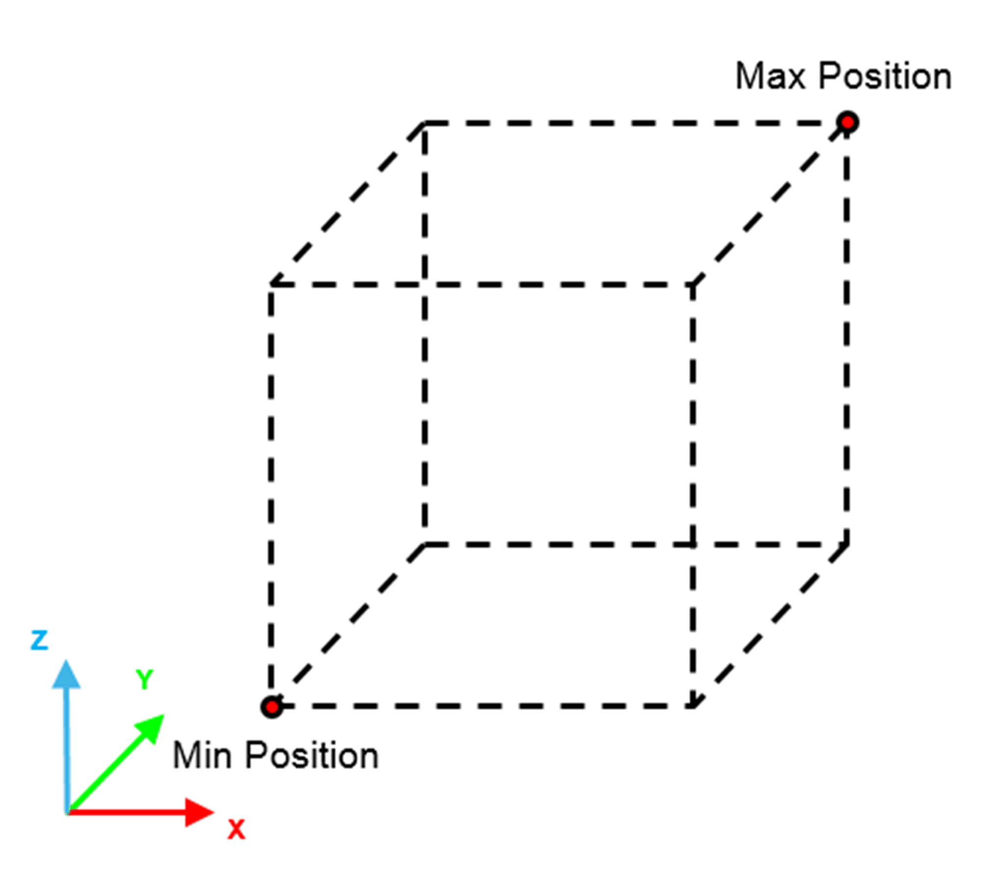

# FB\_RandomPoseGenerator - SetPose (Method)

## Overview

|  |  |
| --- | --- |
| Type: | Method |
| Available as of: | V1.0.2.0 |

This chapter provides information on:

* [Task](#D-SE-0079523__D-SE-0079523.26)
* [Description](#D-SE-0079523__D-SE-0079523.3)
* [Interface](#D-SE-0079523__D-SE-0079523.4)
* [Diagnostic Messages](#D-SE-0079523__D-SE-0079523.5)

## Task

Define constraints on position and orientation for the generation of a random Cartesian pose.

## Description

The method SetPose allows you to define constraints on position and orientation for the generation of a random Cartesian pose.

To define a specific value for a constraint, set the minimum and the maximum to the same value.

The following is an example of volume including all the possible positions generated by the method:

## Interface

| Input | Data type | Description |
| --- | --- | --- |
| i\_stMinPosition | *SE\_MATH.ST\_Vector3D* | Minimum position value that a generated pose can take. It can be considered as the minimum Cartesian coordinate contained in a volume defined by you. |
| i\_stMaxPosition | *SE\_MATH.ST\_Vector3D* | Maximum position value that a generated pose can take. It can be considered as the maximum Cartesian coordinate contained in a volume defined by you. |
| i\_stMinOrientation | *SE\_MATH.ST\_Vector3D* | Contains a set of roll, pitch and yaw angles that are the minimum angles that the generated pose can assume for the representation of an orientation. |
| i\_stMaxOrientation | *SE\_MATH.ST\_Vector3D* | Contains a set of roll, pitch and yaw angles that are the maximum angles that the generated pose can assume for the representation of an orientation. |
| i\_etOrientationConvention | SE\_MATH.ET\_OrientationConvention | Convention for the rotation angles of the orientation. |

| Output | Data type | Description |
| --- | --- | --- |
| q\_etDiag | *[GD.ET\_Diag](../../../../../api/crossBook?lang=en-US&virtualBookName=PD.Lib.GlobalDiagnostic&topicID=D_SE_0076228)* | General library-independent statement on the diagnostic. A value unequal to GD.ET\_Diag.Ok corresponds to a diagnostic message. |
| q\_etDiagExt | ET\_DiagExt | POU-specific output on the diagnostic.  q\_etDiag = ET\_Diag.Ok -> Status message  q\_etDiag <> ET\_Diag.Ok -> Diagnostic message |
| q\_sMsg | STRING[80] | Event-triggered message that gives more detailed information on the diagnostic state. |

## Diagnostic Messages

| q\_etDiag | q\_etDiagExt | Enumeration value of q\_etDiagExt | Description |
| --- | --- | --- | --- |
| Ok | Ok | 0 | The parameters were successfully loaded. |
| InputParameterInvalid | OrientationConventionInvalid | 38 | Invalid orientation convention. |
| InputParameterInvalid | OrientationXRange | 43 | The X rotation range provided as constraint of the random generation is invalid. |
| InputParameterInvalid | OrientationYRange | 44 | The Y rotation range provided as constraint of the random generation is invalid. |
| InputParameterInvalid | OrientationZRange | 45 | The Z rotation range provided as constraint of the random generation is invalid. |
| InputParameterInvalid | PositionXRange | 40 | The X position range provided as constraint of the random generation is invalid. |
| InputParameterInvalid | PositionYRange | 41 | The Y position range provided as constraint of the random generation is invalid. |
| InputParameterInvalid | PositionZRange | 42 | The Z position range provided as constraint of the random generation is invalid. |

## Ok

|  |  |
| --- | --- |
| Enumeration name: | Ok |
| Enumeration value: | 0 |
| Description: | Success |

The constrains were successfully retrieved.

## OrientationConventionInvalid

|  |  |
| --- | --- |
| Enumeration name: | OrientationConventionInvalid |
| Enumeration value: | 38 |
| Description: | Invalid orientation convention. |

| Issue | Cause | Solution |
| --- | --- | --- |
| The orientation convention is invalid. | The input value of i\_etOrientationConvention is invalid. | Provide one of the permissible values of SE\_MATH.ET\_OrientationConvention. |

## OrientationXRange

|  |  |
| --- | --- |
| Enumeration name: | OrientationXRange |
| Enumeration value: | 43 |
| Description: | The X rotation range provided as constraint of the random generation is invalid. |

| Issue | Cause | Solution |
| --- | --- | --- |
| The X rotation range provided as constraint of the random generation is invalid. | The provided X rotation range is invalid. | Provide a range that respects the following condition:  i\_stMinOrientation.lrX ≤ i\_stMaxOrientation.lrX |

## OrientationYRange

|  |  |
| --- | --- |
| Enumeration name: | OrientationYRange |
| Enumeration value: | 44 |
| Description: | The Y rotation range provided as constraint of the random generation is invalid. |

| Issue | Cause | Solution |
| --- | --- | --- |
| The Y rotation range provided as constraint of the random generation is invalid. | The provided Y rotation range is invalid. | Provide a range that respects the following condition:  i\_stMinOrientation.lrY ≤ i\_stMaxOrientation.lrY |

## OrientationZRange

|  |  |
| --- | --- |
| Enumeration name: | OrientationZRange |
| Enumeration value: | 45 |
| Description: | The Z rotation range provided as constraint of the random generation is invalid. |

| Issue | Cause | Solution |
| --- | --- | --- |
| The Z rotation range provided as constraint of the random generation is invalid. | The provided Z rotation range is invalid. | Provide a range that respects the following condition:  i\_stMinOrientation.lrZ ≤ i\_stMaxOrientation.lrZ |

## PositionXRange

|  |  |
| --- | --- |
| Enumeration name: | PositionXRange |
| Enumeration value: | 40 |
| Description: | The X position range provided as constraint of the random generation is invalid. |

| Issue | Cause | Solution |
| --- | --- | --- |
| The X position range provided as constraint of the random generation is invalid. | The provided X position range is invalid. | Provide a range that respects the following condition:  i\_stMinPosition.lrX ≤ i\_stMaxPosition.lrX |

## PositionYRange

|  |  |
| --- | --- |
| Enumeration name: | PositionYRange |
| Enumeration value: | 41 |
| Description: | The Y position range provided as constraint of the random generation is invalid. |

| Issue | Cause | Solution |
| --- | --- | --- |
| The Y position range provided as constraint of the random generation is invalid. | The provided Y position range is invalid. | Provide a range that respects the following condition:  i\_stMinPosition.lrY ≤ i\_stMaxPosition.lrY |

## PositionZRange

|  |  |
| --- | --- |
| Enumeration name: | PositionZRange |
| Enumeration value: | 42 |
| Description: | The Z position range provided as constraint of the random generation is invalid. |

| Issue | Cause | Solution |
| --- | --- | --- |
| The Z position range provided as constraint of the random generation is invalid. | The provided Z position range is invalid. | Provide a range that respects the following condition:  i\_stMinPosition.lrZ ≤ i\_stMaxPosition.lrZ |

EIO0000006044.00