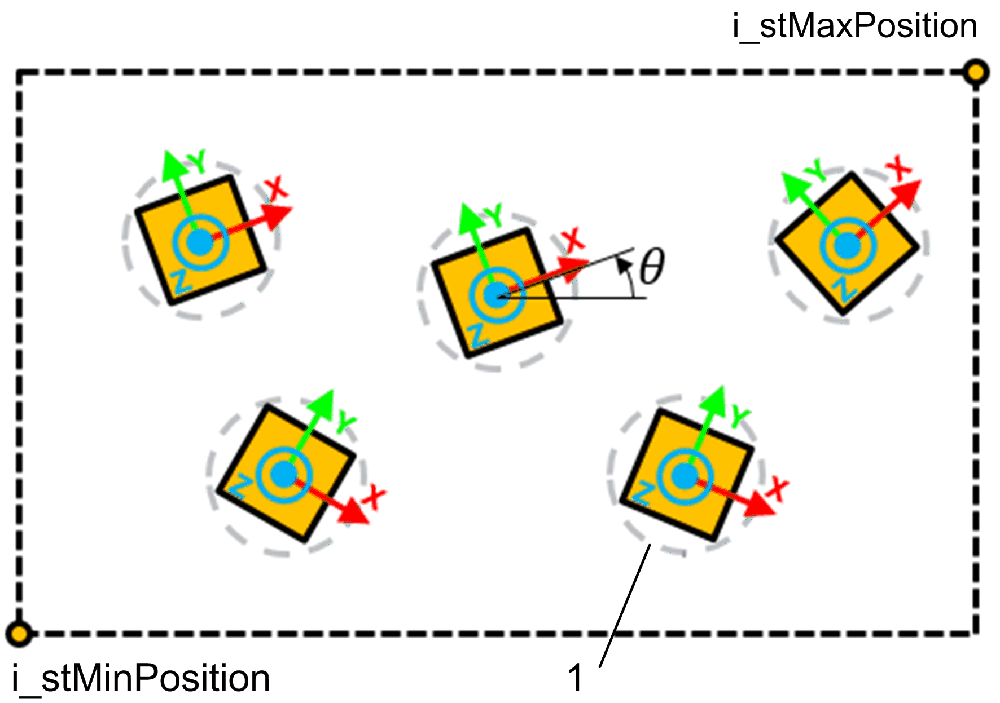

# FB\_RandomTargetsGenerator - SetTargetsInPlaneRotationList (Method)

## Overview

|  |  |
| --- | --- |
| Type: | Method |
| Available as of: | V1.1.0.0 |

This chapter provides information on:

* [Task](#D-SE-0079239__D-SE-0079239.31)
* [Description](#D-SE-0079239__D-SE-0079239.3)
* [Interface](#D-SE-0079239__D-SE-0079239.4)
* [Diagnostic Messages](#D-SE-0079239__D-SE-0079239.5)

## Task

Define a set of constraints for the generation of random targets.

## Description

The method SetTargetsInPlaneRotationList allows you to define a set of constraints for the generation of random targets contained in a selected working plane.

The rotation of the targets is randomly selected from a list of possible rotations.

To define a specific value for a constraint, set the minimum and the maximum to the same value.

The following is an example of target generation in a selected plane:

**1** Collision circle to determine overlaps

## Interface

| Input | Data type | Description |
| --- | --- | --- |
| i\_udiNumberOfTargets | UDINT | Number of targets to be generated by the method. |
| i\_lrTargetOverlapRadius | LREAL | Radius of a circle around each target. The targets are generated so that there are no overlaps between the circles.  This value must be either 0 or positive. If value = 0 the collision verification is ignored. |
| i\_udiMaxOverlapCheckIterations | UDINT | The method attempts i\_udiMaxOverlapCheckIterations times to generate i\_udiNumberOfTargets targets without overlaps. After this number of iterations is exceeded, an error message is generated. |
| i\_etPlane | SE\_MATH.ET\_CartesianPlane | Used to select a working plane (for example, XY, XZ, YZ). The value of this input cannot be SE\_MATH.ET\_CartesianPlane.None.  While a specific working plane is selected, any generated pose describes a position contained in the plane (the position along the third 3D axis is set to 0) and a rotation about a vector normal to the plane. |
| i\_stMinPosition | *SE\_MATH.ST\_Vector3D* | Minimum position value that a generated target can take. It can be considered as the minimum Cartesian coordinate contained in a volume defined by you. |
| i\_stMaxPosition | *SE\_MATH.ST\_Vector3D* | Maximum position value that a generated target can take. It can be considered as the maximum Cartesian coordinate contained in a volume defined by you. |
| i\_alrRotationList | ARRAY [1... Gc\_uiMaxNumberOfRotations] OF LREAL | List of rotations. On each call of the method Generate(), a rotation value is selected in accordance to the values listed in i\_alrRotationProbabilityList. |
| i\_alrRotationProbabilityList | ARRAY [1... Gc\_uiMaxNumberOfRotations] OF LREAL | List used to define the probabilities related to the random selection of a rotation from i\_alrRotationList. The probability of each rotation is evaluated as the ratio between the value assigned to each element of the array and the total sum of all the listed values. |
| i\_etOrientationConvention | SE\_MATH.ET\_OrientationConvention | Convention for the rotation angles of the orientation. |
| i\_alrTargetTypeProbabilityList | ARRAY [1...Gc\_uiMaxNumberOfTargetTypes] OF LREAL | Every index of this array is linked to a specific target type and every element contains a value that affects the probability that a target with a certain target type is randomly generated.  The probability of each target type is evaluated as the ratio between the value assigned to each element of the array and the total sum of the listed values.  Example: A value in the field [1] of the array is linked to the generation of targets of type 1, field [2] is linked to type 2, and so on. |

| Output | Data type | Description |
| --- | --- | --- |
| q\_etDiag | *[GD.ET\_Diag](../../../../../api/crossBook?lang=en-US&virtualBookName=PD.Lib.GlobalDiagnostic&topicID=D_SE_0076228)* | General library-independent statement on the diagnostic. A value unequal to GD.ET\_Diag.Ok corresponds to a diagnostic message. |
| q\_etDiagExt | ET\_DiagExt | POU-specific output on the diagnostic.  q\_etDiag = ET\_Diag.Ok -> Status message  q\_etDiag <> ET\_Diag.Ok -> Diagnostic message |
| q\_sMsg | STRING[80] | Event-triggered message that gives more detailed information on the diagnostic state. |

## Diagnostic Messages

| q\_etDiag | q\_etDiagExt | Enumeration value of q\_etDiagExt | Description |
| --- | --- | --- | --- |
| Ok | Ok | 0 | Ok |
| InputParameterInvalid | NumberOfTargetsRange | 54 | Number of targets out of range. |
| InputParameterInvalid | MaxOverlapCheckIterationsRange | 55 | Maximum number of iterations out of range. |
| InputParameterInvalid | OrientationConventionInvalid | 38 | Invalid orientation convention. |
| InputParameterInvalid | PlaneInvalid | 37 | The selected working plane is invalid. |
| InputParameterInvalid | PositionXRange | 40 | The X position range provided as constraint of the random generation is invalid. |
| InputParameterInvalid | PositionYRange | 41 | The Y position range provided as constraint of the random generation is invalid. |
| InputParameterInvalid | PositionZRange | 42 | The Z position range provided as constraint of the random generation is invalid. |
| InputParameterInvalid | RotationProbabilitiesSumInvalid | 47 | The sum of the rotation probabilities provided by you is zero. |
| InputParameterInvalid | RotationProbabilityRange | 48 | A negative value for one of the probabilities related to the list of possible rotations was provided. |
| InputParameterInvalid | TargetOverlapRadiusRange | 53 | A negative radius value was provided. |
| InputParameterInvalid | TargetTypeProbabilitiesSumInvalid | 61 | The sum of the probabilities is zero. |
| InputParameterInvalid | TargetTypeProbabilityRange | 60 | The value of one of the probabilities is negative. |

## MaxOverlapCheckIterationsRange

|  |  |
| --- | --- |
| Enumeration name: | MaxOverlapCheckIterationsRange |
| Enumeration value: | 55 |
| Description: | Maximum number of iterations out of range. |

| Issue | Cause | Solution |
| --- | --- | --- |
| Provided value out of range. | The value of i\_udiMaxOverlapCheckIterations cannot be less than i\_udiNumberOfTargets. | * Provide a value so that i\_udiMaxOverlapCheckIterations ≥ i\_udiNumberOfTargets * A first attempt value could be i\_udiMaxOverlapCheckIterations ≥ 2 \* i\_udiNumberOfTargets. But this can vary, depending on the other constraints. |

## NumberOfTargetsRange

|  |  |
| --- | --- |
| Enumeration name: | NumberOfTargetsRange |
| Enumeration value: | 54 |
| Description: | Number of targets out of range. |

| Issue | Cause | Solution |
| --- | --- | --- |
| Provided value out of range. | The value provided by you is either minor that 1 or greater than Gc\_udiMaxNumberOfGeneratedTargets (for example, the maximum size of the list). | Provide a value within the valid range. |

## Ok

|  |  |
| --- | --- |
| Enumeration name: | Ok |
| Enumeration value: | 0 |
| Description: | Success |

The parameters were successfully set.

## OrientationConventionInvalid

|  |  |
| --- | --- |
| Enumeration name: | OrientationConventionInvalid |
| Enumeration value: | 38 |
| Description: | Invalid orientation convention. |

| Issue | Cause | Solution |
| --- | --- | --- |
| The orientation convention is invalid. | The input value of i\_etOrientationConvention is invalid. | Provide one of the permissible values of SE\_MATH.ET\_OrientationConvention. |

## PlaneInvalid

|  |  |
| --- | --- |
| Enumeration name: | PlaneInvalid |
| Enumeration value: | 37 |
| Description: | The selected working plane is invalid. |

| Issue | Cause | Solution |
| --- | --- | --- |
| The selected working plane is invalid. | The provided value does not identify a known working plane. | Verify that the value is chosen from this set:   * SE\_MATH.ET\_CartesianPlane.XY * SE\_MATH.ET\_CartesianPlane.XZ * SE\_MATH.ET\_CartesianPlane.YZ |

## PositionXRange

|  |  |
| --- | --- |
| Enumeration name: | PositionXRange |
| Enumeration value: | 40 |
| Description: | The X position range provided as constraint of the random generation is invalid. |

| Issue | Cause | Solution |
| --- | --- | --- |
| The X position range provided as constraint of the random generation is invalid. | The provided X position range is invalid. | * Provide a range that respects the following condition:  i\_stMinPosition.lrX ≤ i\_stMaxPosition.lrX * If a working plane was selected, verify that i\_stMinPosition.lrX and i\_stMaxPosition.lrX are contained in the plane. |

## PositionYRange

|  |  |
| --- | --- |
| Enumeration name: | PositionYRange |
| Enumeration value: | 41 |
| Description: | The Y position range provided as constraint of the random generation is invalid. |

| Issue | Cause | Solution |
| --- | --- | --- |
| The Y position range provided as constraint of the random generation is invalid. | The provided Y position range is invalid. | * Provide a range that respects the following condition:  i\_stMinPosition.lrY ≤ i\_stMaxPosition.lrY * If a working plane was selected, verify that i\_stMinPosition.lrY and i\_stMaxPosition.lrY are contained the plane. |

## PositionZRange

|  |  |
| --- | --- |
| Enumeration name: | PositionZRange |
| Enumeration value: | 42 |
| Description: | The Z position range provided as constraint of the random generation is invalid. |

| Issue | Cause | Solution |
| --- | --- | --- |
| The Z position range provided as constraint of the random generation is invalid. | The provided Z position range is invalid. | * Provide a range that respects the following condition:  i\_stMinPosition.lrZ ≤ i\_stMaxPosition.lrZ * If a working plane was selected, verify that i\_stMinPosition.lrZ and i\_stMaxPosition.lrZ are contained the plane. |

## RotationProbabilitiesSumInvalid

|  |  |
| --- | --- |
| Enumeration name: | RotationProbabilitiesSumInvalid |
| Enumeration value: | 47 |
| Description: | The sum of the rotation probabilities provided is zero. |

| Issue | Cause | Solution |
| --- | --- | --- |
| The sum of the provided rotation probabilities is 0. | The sum of the probabilities listed inside the input i\_alrRotationProbabilityList must be greater than 0. | Verify that the sum of the provided probabilities is > 0. |

## RotationProbabilityRange

|  |  |
| --- | --- |
| Enumeration name: | RotationProbabilityRange |
| Enumeration value: | 48 |
| Description: | A negative value for one of the probabilities related to the list of possible rotations was provided. |

| Issue | Cause | Solution |
| --- | --- | --- |
| A a negative value for one of the probabilities related to the list of possible rotations was provided. | One of the probabilities inside i\_alrRotationProbabilityList has a negative value. | Verify that every probability has a value of zero or a positive value. |

## TargetOverlapRadiusRange

|  |  |
| --- | --- |
| Enumeration name: | TargetOverlapRadiusRange |
| Enumeration value: | 53 |
| Description: | A negative radius value was provided. |

| Issue | Cause | Solution |
| --- | --- | --- |
| A negative or zero value was provided as input. | The value of the radius must be strictly positive. | Verify that i\_lrTargetOverlapRadius > 0. |

## TargetTypeProbabilitiesSumInvalid

|  |  |
| --- | --- |
| Enumeration name: | TargetTypeProbabilitiesSumInvalid |
| Enumeration value: | 61 |
| Description: | The sum of probabilities is zero. |

| Issue | Cause | Solution |
| --- | --- | --- |
| The sum of the provided probabilities is 0. | The sum of the probabilities listed inside the input i\_alrTargetTypeProbabilityList must be greater than 0. | Verify that the sum of the provided probabilities is greater than 0. |

## TargetTypeProbabilityRange

|  |  |
| --- | --- |
| Enumeration name: | TargetTypeProbabilityRange |
| Enumeration value: | 60 |
| Description: | The value of one of the probabilities is negative. |

| Issue | Cause | Solution |
| --- | --- | --- |
| The value of one of the probabilities is negative. | One of the probabilities inside i\_alrTargetTypeProbabilityList has a negative value. | Verify that every probability has either a value of 0 or a positive value. |

EIO0000006044.00