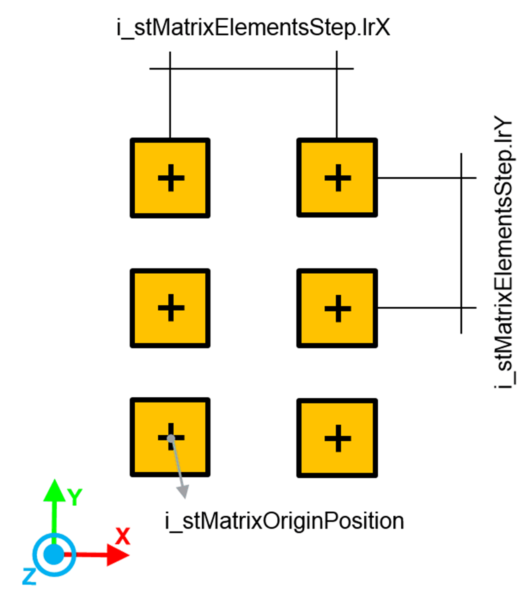
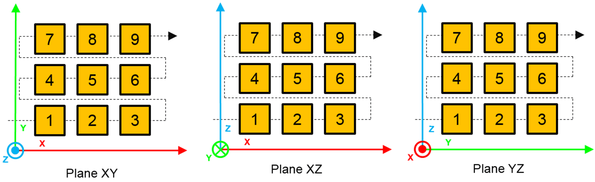
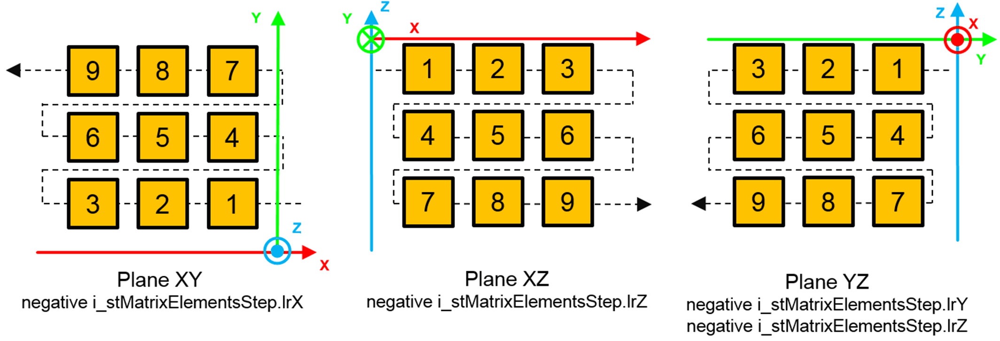

# FB\_RandomTargetsGenerator - SetTargetMatrixInPlaneRotationList (Method)

## Overview

|  |  |
| --- | --- |
| Type: | Method |
| Available as of: | V1.1.0.0 |

This chapter provides information on:

* [Task](#D-SE-0079585__D-SE-0079585.36)
* [Description](#D-SE-0079585__D-SE-0079585.3)
* [Interface](#D-SE-0079585__D-SE-0079585.4)
* [Diagnostic Messages](#D-SE-0079585__D-SE-0079585.5)

## Task

Define a set of constraints for the generation of a matrix of targets.

## Description

The method SetTargetMatrixInPlaneRotationList allows you to define a set of constraints for the generation of a matrix of targets contained in a selected working plane.

The rotation of the targets is randomly selected from a list provided by you.

To define a specific value for a constraint, set the minimum and the maximum to the same value.

The following is an example of matrix generation of targets:



Targets generation order, according to the selected working plane:



Targets generation order, according to the selected working plane and the value of i\_stMatrixElementsStep:



## Example

```
i_alrRotationList[1] := 90.0;
i_alrRorationList[2] := 180.0;
i_alrRotationProbabilityList[1] := 3.5;
i_alrRotationProbabilityList[2] := 1.5;
```

* In 1.5/5 (30%) of the cases, a rotation value of 90.0 is used.
* In 3.5/5 (70%) of the cases, a rotation value of 180.0 is used.

## Interface

| Input | Data type | Description |
| --- | --- | --- |
| i\_udiNumberOfRows | UDINT | Number of rows of the matrix of targets. |
| i\_udiNumberOfColumns | UDINT | Number of columns of the matrix of targets. |
| i\_etPlane | SE\_MATH.ET\_CartesianPlane | Used to select a working plane (for example, XY, XZ, YZ). The value of this input cannot be SE\_MATH.ET\_CartesianPlane.None.  While a specific working plane is selected, any generated pose describes a position contained in the plane (the position along the third 3D axis is set to 0) and a rotation about a vector normal to the plane. |
| i\_stMatrixOriginPosition | *SE\_MATH.ST\_Vector3D* | Position of the matrix origin. The targets are generated starting from this position. It must be contained in the selected working plane. |
| i\_stMatrixElementStep | *SE\_MATH.ST\_Vector3D* | Position steps along the X, Y and Z axes, used for the generation of the positions in the matrix. The value provided here must be compliant with the selected working plane. |
| i\_alrRotationList | ARRAY [1... Gc\_uiMaxNumberOfRotations] OF LREAL | List of rotations. On each call of the method, a rotation value is selected according to the probabilities listed in i\_alrRotationProbabilityList. |
| i\_alrRotationProbabilityList | ARRAY [1... Gc\_uiMaxNumberOfRotations] OF LREAL | List used to define the probabilities related to the random selection of a rotation from i\_alrRotationList. The probability of each rotation is evaluated as the ratio between the value assigned to each element of the array and the total sum of the listed values. |
| i\_etOrientationConvention | *SE\_MATH.ET\_OrientationConvention.* | Convention for the rotation angles of the orientation. |
| i\_alrTargetTypeProbabilityList | ARRAY [1...Gc\_uiMaxNumberOfTargetTypes] OF LREAL | Every index of this array is linked to a specific target type and every element contains a value that affects the probability that a target with a certain target type is randomly generated.  The probability of each target type is evaluated as the ratio between the value assigned to each element of the array and the total sum of the listed values.  Example: A value in the field [1] of the array is linked to the generation of targets of type 1, field [2] is linked to type 2, and so on. |

| Output | Data type | Description |
| --- | --- | --- |
| q\_etDiag | *[GD.ET\_Diag](../../../../../api/crossBook?lang=en-US&virtualBookName=PD.Lib.GlobalDiagnostic&topicID=D_SE_0076228)* | General library-independent statement on the diagnostic. A value unequal to GD.ET\_Diag.Ok corresponds to a diagnostic message. |
| q\_etDiagExt | ET\_DiagExt | POU-specific output on the diagnostic.  q\_etDiag = ET\_Diag.Ok -> Status message  q\_etDiag <> ET\_Diag.Ok -> Diagnostic message |
| q\_sMsg | STRING[80] | Event-triggered message that gives more detailed information on the diagnostic state. |

## Diagnostic Messages

| q\_etDiag | q\_etDiagExt | Enumeration value of q\_etDiagExt | Description |
| --- | --- | --- | --- |
| Ok | Ok | 0 | The parameters was successfully set. |
| InputParameterInvalid | NumberOfColumnsRange | 63 | The number of target columns is out of range. |
| InputParameterInvalid | NumberOfRowsRange | 62 | The number of target rows is out of range. |
| InputParameterInvalid | NumberOfTargetsRange | 54 | Number of targets out of range. |
| InputParameterInvalid | MatrixElementStepXRange | 57 | Invalid value of the X position step. |
| InputParameterInvalid | MatrixElementStepYRange | 58 | Invalid value of the Y position step. |
| InputParameterInvalid | MatrixElementStepZRange | 59 | Invalid value of the Z position step. |
| InputParameterInvalid | OrientationConventionInvalid | 38 | Invalid orientation convention. |
| InputParameterInvalid | PlaneInvalid | 37 | The selected working plane is invalid |
| InputParameterInvalid | PositionXRange | 40 | The X position range provided as constraint of the random generation is invalid. |
| InputParameterInvalid | PositionYRange | 41 | The Y position range provided as constraint of the random generation is invalid. |
| InputParameterInvalid | PositionZRange | 42 | The Z position range provided as constraint of the random generation is invalid. |
| InputParameterInvalid | RotationProbabilitiesSumInvalid | 49 | The sum of the orientation probabilities provided by you is zero. |
| InputParameterInvalid | RotationProbabilityRange | 48 | A negative value for one of the probabilities related to the list of possible rotations was provided. |
| InputParameterInvalid | TargetTypeProbabilitiesSumInvalid | 61 | The sum of the probabilities is zero. |
| InputParameterInvalid | TargetTypeProbabilityRange | 60 | The value of one of the probabilities is negative. |

## NumberOfColumnsRange

|  |  |
| --- | --- |
| Enumeration name: | NumberOfColumnsRange |
| Enumeration value: | 63 |
| Description: | The number of target columns is out of range. |

| Issue | Cause | Solution |
| --- | --- | --- |
| The number of target columns is out of range. | The number of columns provided as input is outside the range [1, Gc\_udiMaxNumberOfGeneratedTargets]. | Verify that the value of the number of columns is within a proper range. |

## NumberOfRowsRange

|  |  |
| --- | --- |
| Enumeration name: | NumberOfRowsRange |
| Enumeration value: | 62 |
| Description: | The number of target rows is out of range. |

| Issue | Cause | Solution |
| --- | --- | --- |
| The number of target rows is out of range. | The number of rows provided as input is outside the range [1, Gc\_udiMaxNumberOfGeneratedTargets]. | Verify that the value of the number of rows is within a proper range. |

## NumberOfTargetsRange

|  |  |
| --- | --- |
| Enumeration name: | NumberOfTargetsRange |
| Enumeration value: | 54 |
| Description: | Number of targets out of range. |

| Issue | Cause | Solution |
| --- | --- | --- |
| Provided value out of range. | The target of i\_udiNumberOfRows and i\_udiNumberOfColumns is bigger than Gc\_udiMaxNumberOfGeneratedTargets. | Verify that i\_udiNumberOfRows \* i\_udiNumberOfColumns ≤ Gc\_udiMaxNumberOfGeneratedTargets. |

## MatrixElementStepXRange

|  |  |
| --- | --- |
| Enumeration name: | MatrixElementStepXRange |
| Enumeration value: | 57 |
| Description: | Invalid value of the X position step. |

| Issue | Cause | Solution |
| --- | --- | --- |
| Invalid value of the X position step. | The X position step of the matrix elements is invalid. | Verify that i\_stMatrixElementsStep.lrX is compliant with the selected working plane. |

## MatrixElementStepYRange

|  |  |
| --- | --- |
| Enumeration name: | MatrixElementStepYRange |
| Enumeration value: | 58 |
| Description: | Invalid value of the Y position step. |

| Issue | Cause | Solution |
| --- | --- | --- |
| Invalid value of the Y position step. | The Y position step of the matrix elements is invalid. | Verify that i\_stMatrixElementsStep.lrY is compliant with the selected working plane. |

## MatrixElementStepZRange

|  |  |
| --- | --- |
| Enumeration name: | MatrixElementStepZRange |
| Enumeration value: | 59 |
| Description: | Invalid value of the Z position step. |

| Issue | Cause | Solution |
| --- | --- | --- |
| Invalid value of the Z position step. | The Z position step of the matrix elements is invalid. | Verify that i\_stMatrixElementsStep.lrZ is compliant with the selected working plane. |

## Ok

|  |  |
| --- | --- |
| Enumeration name: | Ok |
| Enumeration value: | 0 |
| Description: | Success |

The parameters were successfully set.

## OrientationConventionInvalid

|  |  |
| --- | --- |
| Enumeration name: | OrientationConventionInvalid |
| Enumeration value: | 38 |
| Description: | Invalid orientation convention. |

| Issue | Cause | Solution |
| --- | --- | --- |
| The orientation convention is invalid. | The input value of i\_etOrientationConvention is invalid. | Provide one of the permissible values of SE\_MATH.ET\_OrientationConvention. |

## PlaneInvalid

|  |  |
| --- | --- |
| Enumeration name: | PlaneInvalid |
| Enumeration value: | 37 |
| Description: | The selected working plane is invalid. |

| Issue | Cause | Solution |
| --- | --- | --- |
| The selected working plane is invalid. | The provided value does not identify a known working plane. | Verify that the value is chosen from this set:   * SE\_MATH.ET\_CartesianPlane.XY * SE\_MATH.ET\_CartesianPlane.XZ * SE\_MATH.ET\_CartesianPlane.YZ |

## PositionXRange

|  |  |
| --- | --- |
| Enumeration name: | PositionXRange |
| Enumeration value: | 40 |
| Description: | The X position range provided as constraint of the random generation is invalid. |

| Issue | Cause | Solution |
| --- | --- | --- |
| The X position range provided as constraint of the random generation is invalid. | The X position of the matrix origin is invalid. | Verify that i\_stMatrixOriginPosition.lrX is contained in the selected working plane. |

## PositionYRange

|  |  |
| --- | --- |
| Enumeration name: | PositionYRange |
| Enumeration value: | 41 |
| Description: | The Y position range provided as constraint of the random generation is invalid. |

| Issue | Cause | Solution |
| --- | --- | --- |
| The Y position range provided as constraint of the random generation is invalid. | The Y position of the matrix origin is invalid. | Verify that i\_stMatrixOriginPosition.lrY is contained in the selected working plane. |

## PositionZRange

|  |  |
| --- | --- |
| Enumeration name: | PositionZRange |
| Enumeration value: | 42 |
| Description: | The Z position range provided as constraint of the random generation is invalid. |

| Issue | Cause | Solution |
| --- | --- | --- |
| The Z position range provided as constraint of the random generation is invalid. | The Z position of the matrix origin is invalid. | Verify that i\_stMatrixOriginPosition.lrZ is contained in the selected working plane. |

## RotationProbabilitiesSumInvalid

|  |  |
| --- | --- |
| Enumeration name: | RotationProbabilitiesSumInvalid |
| Enumeration value: | 47 |
| Description: | The sum of the rotation probabilities provided is zero. |

| Issue | Cause | Solution |
| --- | --- | --- |
| The sum of the orientation probabilities provided by you is zero. | The sum of the probabilities listed inside the input i\_alrRotationProbabilityList must be greater than 0. | Verify that the sum of the provided probabilities is greater than 0. |

## RotationProbabilityRange

|  |  |
| --- | --- |
| Enumeration name: | RotationProbabilityRange |
| Enumeration value: | 48 |
| Description: | A negative value for one of the probabilities related to the list of possible rotations was provided. |

| Issue | Cause | Solution |
| --- | --- | --- |
| A negative value for one of the probabilities related to the list of possible rotations was provided. | One of the probabilities inside i\_alrRotationProbabilityList has a negative value. | Verify that every probability has either a zero or a positive value. |

## TargetTypeProbabilitiesSumInvalid

|  |  |
| --- | --- |
| Enumeration name: | TargetTypeProbabilitiesSumInvalid |
| Enumeration value: | 61 |
| Description: | The sum of probabilities is zero. |

| Issue | Cause | Solution |
| --- | --- | --- |
| The sum of the provided probabilities is 0. | The sum of the probabilities listed inside the input i\_alrTargetTypeProbabilityList must be greater than 0. | Verify that the sum of the provided probabilities is greater than 0. |

## TargetTypeProbabilityRange

|  |  |
| --- | --- |
| Enumeration name: | TargetTypeProbabilityRange |
| Enumeration value: | 60 |
| Description: | The value of one of the probabilities is negative. |

| Issue | Cause | Solution |
| --- | --- | --- |
| The value of one of the probabilities is negative. | One of the probabilities inside i\_alrTargetTypeProbabilityList has a negative value. | Verify that every probability has either a value of 0 or a positive value. |

EIO0000006044.00