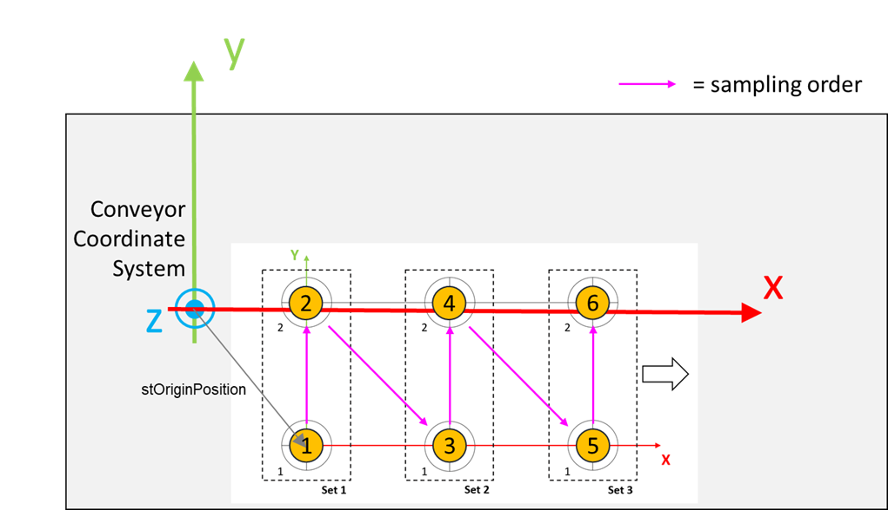

# FB\_TeachingFixedSystem - AddSample (Method)

## Overview

|  |  |
| --- | --- |
| Type: | Method |
| Available as of: | V1.8.0.0 |

This chapter provides information on:

* [Task](#FB_TeachingFixedSystem-AddSampleMet-E55A1B3C__Task-E55947F0)
* [Description](#FB_TeachingFixedSystem-AddSampleMet-E55A1B3C__Description-E5594C63)
* [Interface](#FB_TeachingFixedSystem-AddSampleMet-E55A1B3C__Interface-E5594E55)
* [Diagnostic Messages](#FB_TeachingFixedSystem-AddSampleMet-E55A1B3C__DiagnosticMessages-E5594FF8)

## Task

Adds a new sample to the active set.

## Description

With the method AddSample(...), a sample is added to the active set. The TCP position and the grid reference position are automatically stored by the function block.

The methods Configuration and SetProcedureData must be successfully called before calling this method.

All the coordinates are handled by the function block, but the samples must be acquired in the expected order:

* The sets are sorted along the positive X direction.
* When moving inside a set, the points are sorted along the positive Y direction.

  For example, the first point to acquire is the origin point, then all the remaining points along the positive Y direction must be acquired to complete the set. After that, the first set is completed and the teaching continues with the next set.

There is always a distance of lrXSpacing in the positive X-direction between two sets. Within a set, all samples are spaced by lrYSpacing in the positive Y-direction.

The active set and the number of samples already stored in this set can be read by using the properties udiActiveSetIndex and udiNumberOfSamplesInActiveSet.

Since a fixed set of points is acquired, the estimated orientation approximation to that of the system to be teached depends on the alignment between the coordinate system of the grid and the coordinate system to be teached.

Access: PUBLIC

## Interface

| Input | Data type | Description |
| --- | --- | --- |
| i\_lrSampleTolerance | LREAL | Tolerance value used to verify the consistency of the samples.  The algorithm verifies whether the distance between the previous and the new sample of the TCP position corresponds to the distance between the samples acquired in the other coordinate system.  Default value: 1.0 mm |

| Output | Data type | Description |
| --- | --- | --- |
| q\_xError | BOOL | TRUE: An error occurred during last command. For more information refer also to q\_etResult and q\_sResultMsg. |
| q\_etResult | [ET\_Result](ET_Result-GeneralInformation-E1DD1980.html#ET_Result-GeneralInformation-E1DD1980) | Provides diagnostic and status information.  If q\_xError = FALSE, then q\_etResult provides status information.  If q\_xError = TRUE, then q\_etResult provides diagnostic/error information.  The enumeration ET\_Result contains the possible values of the POU operation results. |
| q\_sResultMsg | STRING[80] | Provides additional information about the current status of the POU. |

## Diagnostic Messages

| q\_xError | q\_etResult | Enumeration value of q\_etResult | Description |
| --- | --- | --- | --- |
| FALSE | Ok | 0 | Success. |
| TRUE | NotConfigured | 29 | The function block is not configured. |
| TRUE | MaxNumberOfSetsReached | 35 | The maximum number of sets is already sampled. |
| TRUE | ProcedureDataNotSet | 57 | No data is set for the procedure. |
| TRUE | SampleToleranceExceeded | 43 | The last set of provided samples exceeds the sample tolerance value. |
| TRUE | SampleToleranceRange | 42 | The provided value for the sample tolerance is out of range. |

## NotConfigured

|  |  |
| --- | --- |
| Enumeration name: | NotConfigured |
| Enumeration value: | 29 |
| Description: | The function block is not configured. |

| Issue | Cause | Solution |
| --- | --- | --- |
| Not possible to add a new sample. | The function block is not configured. | Ensure that the method Configuration is called successfully before calling this method. |

## MaxNumberOfSetsReached

|  |  |
| --- | --- |
| Enumeration name: | MaxNumberOfSetsReached |
| Enumeration value: | 35 |
| Description: | The maximum number of sets is already sampled. |

| Issue | Cause | Solution |
| --- | --- | --- |
| Not possible to add a new sample. | The maximum number of sets are already sampled. | Call the RemoveAllSamples method to remove all the stored samples and start a new sampling. |

## Ok

|  |  |
| --- | --- |
| Enumeration name: | Ok |
| Enumeration value: | 0 |
| Description: | Success. |

Status message: Adding a new sample to the active set was successful.

## ProcedureDataNotSet

|  |  |
| --- | --- |
| Enumeration name: | ProcedureDataNotSet |
| Enumeration value: | 57 |
| Description: | No data is set for the procedure. |

| Issue | Cause | Solution |
| --- | --- | --- |
| Not possible to add a new sample. | The procedure data are not set. | Make a successful call of the method SetProcedureData before calling this method. |

## SampleToleranceExceeded

|  |  |
| --- | --- |
| Enumeration name: | SampleToleranceExceeded |
| Enumeration value: | 43 |
| Description: | The last set of provided samples exceeds the sample tolerance value. |

| Issue | Cause | Solution |
| --- | --- | --- |
| Not possible to add a new sample. | The distance between the previous and the new TCP position compared with the distance between the previous and new position in the other coordinate system is exceeding the value of i\_lrSampleTolerance. | Verify the accuracy of the sampling procedure or increase the value of i\_lrSampleTolerance. |

## SampleToleranceRange

|  |  |
| --- | --- |
| Enumeration name: | SampleToleranceRange |
| Enumeration value: | 42 |
| Description: | The provided value for the sample tolerance is out of range. |

| Issue | Cause | Solution |
| --- | --- | --- |
| Not possible to add a new sample. | The value of i\_lrSampleTolerance is either zero or negative. | Verify that i\_lrSampleTolerance > 0.0 |

EIO0000006044.00