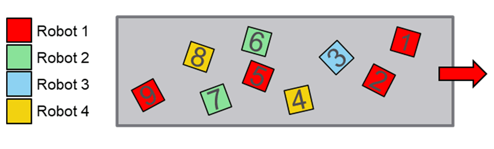

# FB\_WeightedBalancing - General Information

## Overview

|  |  |
| --- | --- |
| Type: | Function block |
| Available as of: | V1.4.1.0 |
| Inherits from: | - |
| Implements: | IF\_BalancingStrategy |

This chapter provides information on:

* [Task](#D-SE-0097947__D-SE-0097947.24)
* [Description](#D-SE-0097947__D-SE-0097947.3)
* [Methods](#D-SE-0097947__D-SE-0097947.6)

## Task

Randomly assign the owner of a target based on a set of weights.

## Description

The function block FB\_WeightedBalancing implements an algorithm that randomly assigns the owner of a target based on a set of weights.

Each robot is assigned to a weight that influences the probability that a target is assigned to such a robot. The owner of a target is randomly picked based on these probabilities.

## Methods

| Name | Description |
| --- | --- |
| AssignTargetsOwners | Implements the algorithm that is then applied to assign the owners of the targets in the list. |
| SetData | Sets additional information required by the algorithm to assign an owner to a target. |
| SetRandomSeed | Initializes the random seed used for the internal random number generation. |

EIO0000006044.00