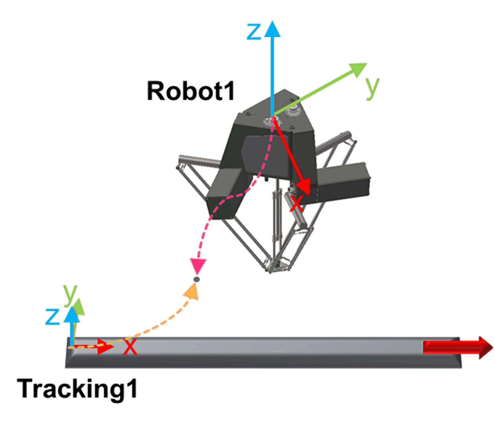

# IF\_EntitiesHandler - CalcRobotPoseInTrackingSystem (Method)

## Overview

|  |  |
| --- | --- |
| Type: | Method |
| Available as of: | V1.4.1.0 |

This chapter provides information on:

* [Task](#IF_EntitiesHandler-CalcRobotPoseInT-CDD040EE__Task-CDD0A2A7)
* [Description](#IF_EntitiesHandler-CalcRobotPoseInT-CDD040EE__Description-CDD0A48D)
* [Interface](#IF_EntitiesHandler-CalcRobotPoseInT-CDD040EE__Interface-CDD0A6EA)
* [Return Value](#IF_EntitiesHandler-CalcRobotPoseInT-CDD040EE__ReturnValue-CDD0A927)
* [Diagnostic Messages](#IF_EntitiesHandler-CalcRobotPoseInT-CDD040EE__DiagnosticMessages-CDD0AB8B)

## Task

Transform a Cartesian pose referred to a robot coordinate system to a Cartesian pose referred to a tracking coordinate system.

## Description

The method CalcRobotPoseInTrackingSystem is used to transform a Cartesian pose referred to a robot coordinate system to a Cartesian pose referred to a tracking coordinate system.

## Interface

| Input | Data type | Description |
| --- | --- | --- |
| i\_etRobotId | ET\_SystemEntity | An ID used to unequivocally identify an entity in the system.  Admissible values are in the range ET\_SystemEntity.Robot1...ET\_SystemEntity.Robot10. |
| i\_stRobotPose | ST\_CartesianPose | A Cartesian pose referred to the coordinate system identified by i\_etRobotId. |
| i\_etTrackingId | *[ROB.ET\_CoordinateSystem](../../../../../api/crossBook?lang=en-US&virtualBookName=PD.Lib.Robotic&topicID=D_SE_0075477)* | An ID used to unequivocally identify a tracking coordinate system.  Admissible values are in the range ROB.ET\_CoordinateSystem.Tracking1...ROB.ET\_CoordinateSystem.Tracking30. |

| Output | Data type | Description |
| --- | --- | --- |
| q\_etDiag | *[GD.ET\_Diag](../../../../../api/crossBook?lang=en-US&virtualBookName=PD.Lib.GlobalDiagnostic&topicID=D_SE_0076228)* | General library-independent statement on the diagnostic. A value unequal to GD.ET\_Diag.Ok corresponds to a diagnostic message. |
| q\_etDiagExt | ET\_DiagExt | POU-specific output on the diagnostic.  q\_etDiag = ET\_Diag.Ok -> Status message  q\_etDiag <> ET\_Diag.Ok -> Diagnostic message |
| q\_sMsg | STRING[80] | Event-triggered message that gives more detailed information on the diagnostic state. |

## Return Value

| Data type | Description |
| --- | --- |
| ST\_CartesianPose | A Cartesian pose describing the pose i\_stRobotPose with reference to the coordinate system of the tracking coordinate system identified by i\_etTrackingId. |

## Diagnostic Messages

| q\_etDiag | q\_etDiagExt | Enumeration value of q\_etDiagExt | Description |
| --- | --- | --- | --- |
| Ok | Ok | 0 | Ok |
| InputParameterInvalid | OrientationConventionInvalid | 38 | Invalid orientation convention. |
| InputParameterInvalid | RobotIdInvalid | 120 | A provided robot ID has an invalid value. |
| InputParameterInvalid | RobotIdUnknown | 130 | A provided robot ID is invalid. |
| InputParameterInvalid | TrackingIdInvalid | 104 | The tracking ID is invalid. |
| InputParameterInvalid | TrackingIdUnknown | 131 | A provided tracking ID is invalid. |

## Ok

|  |  |
| --- | --- |
| Enumeration name: | Ok |
| Enumeration value: | 0 |
| Description: | Success |

Status message: The Cartesian pose has been evaluated successfully.

## OrientationConventionInvalid

|  |  |
| --- | --- |
| Enumeration name: | OrientationConventionInvalid |
| Enumeration value: | 38 |
| Description: | Invalid orientation convention. |

| Issue | Cause | Solution |
| --- | --- | --- |
| The relative pose has not been successfully evaluated. | i\_stRobotPose.etOrientationConvention contains an invalid value. | Ensure that the orientation convention has one of the following values:   * SE\_MATH.ET\_OrientationConvention.XYZ * SE\_MATH.ET\_OrientationConvention.ZYX |

## RobotIdInvalid

|  |  |
| --- | --- |
| Enumeration name: | RobotIdInvalid |
| Enumeration value: | 120 |
| Description: | A provided robot ID has an invalid value. |

| Issue | Cause | Solution |
| --- | --- | --- |
| The Cartesian pose has not been evaluated successfully. | i\_etRobotId contains an invalid entity ID. | Ensure that the value of i\_etRobotId  refers to an entity ID in the range  ET\_SystemEntity.Robot1...ET\_SystemEntity.Robot10. |

## RobotIdUnknown

|  |  |
| --- | --- |
| Enumeration name: | RobotIdUnknown |
| Enumeration value: | 130 |
| Description: | A provided robot ID is invalid. |

| Issue | Cause | Solution |
| --- | --- | --- |
| The Cartesian pose has not been evaluated successfully. | i\_etRobotId contains an invalid robot system ID. | Ensure that the value of i\_etRobotId refers to a previously configured robot. |

## TrackingIdInvalid

|  |  |
| --- | --- |
| Enumeration name: | TrackingIdInvalid |
| Enumeration value: | 104 |
| Description: | The tracking ID is invalid. |

| Issue | Cause | Solution |
| --- | --- | --- |
| The Cartesian pose has not been evaluated successfully. | i\_etTrackingId contains an invalid tracking ID. | Ensure that the value of i\_etTrackingId refers to an entity ID in the range ROB.ET\_CoordinateSystem.Tracking1...ROB.ET\_CoordinateSystem.Tracking30. |

## TrackingIdUnknown

|  |  |
| --- | --- |
| Enumeration name: | TrackingIdUnknown |
| Enumeration value: | 131 |
| Description: | A provided tracking ID is invalid. |

| Issue | Cause | Solution |
| --- | --- | --- |
| The Cartesian pose has not been evaluated successfully. | i\_etTrackingId refers to an indeterminable tracking system. | Ensure that a tracking system with ID i\_etTrackingId has been already configured before calling this method. |

EIO0000006044.00