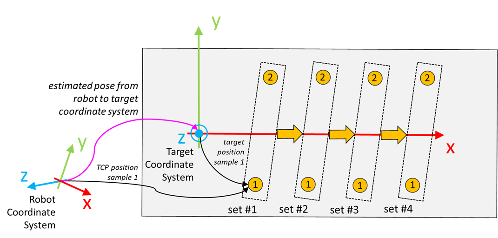

# IF\_TeachingCartesianPose - EstimateCartesianPose (Method)

## Overview

|  |  |
| --- | --- |
| Type: | Method |
| Available as of: | V1.8.0.0 |

This chapter provides information on:

* [Task](#IF_TeachingCartesianPose-EstimateOr-DD25B3C6__Task-DD25C02B)
* [Description](#IF_TeachingCartesianPose-EstimateOr-DD25B3C6__Description-DD25C154)
* [Interface](#IF_TeachingCartesianPose-EstimateOr-DD25B3C6__Interface-DD25C35D)
* [Return Value](#IF_TeachingCartesianPose-EstimateOr-DD25B3C6__ReturnValue-DD25C5B3)

## Task

Estimates a cartesian pose based on sampled data.

## Description

With the method EstimateCartesianPose(...), a cartesian pose from a source to a target coordinate system is estimated.

Example:

Access: PUBLIC

## Interface

| Input | Data type | Description |
| --- | --- | --- |
| i\_etOrientationConvention | GEM.ET\_OrientationConvention | Orientation convention that must be used for the estimated cartesian pose.  Default value: GEM.ET\_OrientationConvention.ZYX |
| i\_lrQualityTolerance | LREAL | Value used to make a comparison between the provided samples and the estimated pose. Refer to the outputs q\_lrSamplesDirectionQuality and q\_lrSamplesPlaneQuality for more information.  Default value: 1.0 mm |

| Output | Data type | Description |
| --- | --- | --- |
| q\_xError | BOOL | TRUE: An error occurred during last command. For more information refer also to q\_etResult and q\_sResultMsg. |
| q\_etResult | [ET\_Result](ET_Result-GeneralInformation-E1DD1980.html#ET_Result-GeneralInformation-E1DD1980) | Provides diagnostic and status information.  If q\_xError = FALSE, then q\_etResult provides status information.  If q\_xError = TRUE, then q\_etResult provides diagnostic/error information.  The enumeration ET\_Result contains the possible values of the POU operation results. |
| q\_sResultMsg | STRING[80] | Event-triggered message that gives more detailed information on the diagnostic state. |
| q\_stPoseMatrix | SE\_MATH.ST\_Matrix3D | Estimated cartesian pose described as a 4D homogeneous transformation matrix. |
| q\_lrSamplesDirectionQuality | LREAL | Percentage value providing an indication of the quality of the estimated X direction. It depends on the number of samples that are more distant from the estimated X direction than i\_lrQualityTolerance.  Range: [0, 100] |
| q\_lrSamplesPlaneQuality | LREAL | Percentage value providing an indication of the quality of the estimated XY plane. It depends on the number of samples that are more distant from the estimated XY plane than i\_lrQualityTolerance.  Range: [0, 100] |
| q\_lrMaxErrorOnSamples | LREAL | Each provided sample is verified based on the estimated pose to verify that the estimation allows a correct reconstruction of the sample. This value represents the maximum measurement error found for the provided samples and their equivalent values calculated using the estimated pose. |

## Return Value

| Data type | Description |
| --- | --- |
| GEM.ST\_CartesianPose | Estimated cartesian pose with the position defined as a 3D vector and the orientation described as roll, pitch and yaw angles. The applied orientation convention is the same provided as input. |

EIO0000006044.00