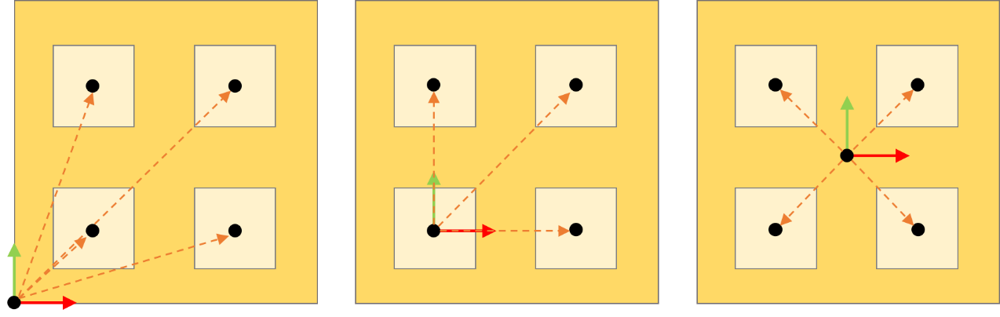

# IF\_TargetsHandler - ConfigureSlotList (Method)

## Overview

|  |  |
| --- | --- |
| Type: | Method |
| Available as of: | V1.4.1.0 |

This chapter provides information on:

* [Task](#D-SE-0098222__D-SE-0098222.3)
* [Description](#D-SE-0098222__D-SE-0098222.4)
* [Interface](#D-SE-0098222__D-SE-0098222.5)
* [Diagnostic Messages](#D-SE-0098222__D-SE-0098222.7)

## Task

Describes how slots are geometrically displaced with reference to a common origin referred to the container target.

## Description

The method ConfigureSlotList is used to describe how slots are geometrically displaced with reference to a common origin referred to the container target. Considering, for example, a tray containing a set of slots, this method would be used to define the relative position and orientation of each slot with reference to the origin of the trace.

If the configured number of slots is greater than zero, each target stored inside the targets handler contains a list of i\_uiNumberOfSlots slots that have a relative pose (referred to the origin of its container target) described by i\_astSlotPosesList.

You can call the method ConfigureSlotList at any time but it is a prerequisite that the list is empty. In case of reconfiguration, first call the method RemoveAllTargets to empty the list and then call the method ConfigureSlotList.

## Interface

| Input | Data type | Description |
| --- | --- | --- |
| i\_uiNumberOfSlots | UINT | The number of slots to configure. |
| i\_astSlotPosesList | ARRAY [1..Gc\_uiMaxNumberOfSlots] OF ST\_CartesianPose | The Cartesian poses of the slots to configure, referred to the origin of a container target. |

| Output | Data type | Description |
| --- | --- | --- |
| q\_etDiag | *[GD.ET\_Diag](../../../../../api/crossBook?lang=en-US&virtualBookName=PD.Lib.GlobalDiagnostic&topicID=D_SE_0076228)* | General library-independent statement on the diagnostic. A value unequal to GD.ET\_Diag.Ok corresponds to a diagnostic message. |
| q\_etDiagExt | ET\_DiagExt | POU-specific output on the diagnostic.  q\_etDiag = ET\_Diag.Ok -> Status message  q\_etDiag <> ET\_Diag.Ok -> Diagnostic message |
| q\_sMsg | STRING[80] | Event-triggered message that gives more detailed information on the diagnostic state. |

## Diagnostic Messages

| q\_etDiag | q\_etDiagExt | Enumeration value | Description |
| --- | --- | --- | --- |
| Ok | Ok | 0 | Ok |
| ExecutionAborted | NumberOfTargetsInvalid | 118 | A method was called that requires the list of targets to be empty. |
| InputParameterInvalid | NumberOfSlotsRange | 115 | The number of slots is greater than the maximum allowed value Gc\_udiMaxNumberOfSlots. |
| InputParameterInvalid | OrientationConventionInvalid | 38 | Invalid orientation convention. |

## NumberOfSlotsRange

|  |  |
| --- | --- |
| Enumeration name: | NumberOfSlotsRange |
| Enumeration value: | 115 |
| Description: | The number of slots is greater than the maximum allowed value Gc\_udiMaxNumberOfSlots. |

| Issue | Cause | Solution |
| --- | --- | --- |
| The list of slots has not been successfully configured. | i\_uiNumberOfSlots is greater than Gc\_uiMaxNumberOfSlots. | Ensure that i\_uiNumberOfSlots ≤Gc\_uiMaxNumberOfSlots. |

## NumberOfTargetsInvalid

|  |  |
| --- | --- |
| Enumeration name: | NumberOfTargetsInvalid |
| Enumeration value: | 118 |
| Description: | A method was called that requires the list of targets to be empty. |

| Issue | Cause | Solution |
| --- | --- | --- |
| The list of slots has not been successfully configured. | The method has been called while the list is not empty. | Ensure that the list of targets is empty before calling this method. To achieve this, you can call, for example, RemoveAllTargets. |

## Ok

|  |  |
| --- | --- |
| Enumeration name: | Ok |
| Enumeration value: | 0 |
| Description: | Success |

Status Message: The list of slots has been successfully configured.

## OrientationConventionInvalid

|  |  |
| --- | --- |
| Enumeration name: | OrientationConventionInvalid |
| Enumeration value: | 38 |
| Description: | Invalid orientation convention. |

| Issue | Cause | Solution |
| --- | --- | --- |
| The list of slots has not been successfully configured. | One of the orientation convention values for the poses of i\_astSlotPosesList is invalid. | Provide one of the permissible values of SE\_MATH.ET\_OrientationConvention. |

EIO0000006044.00