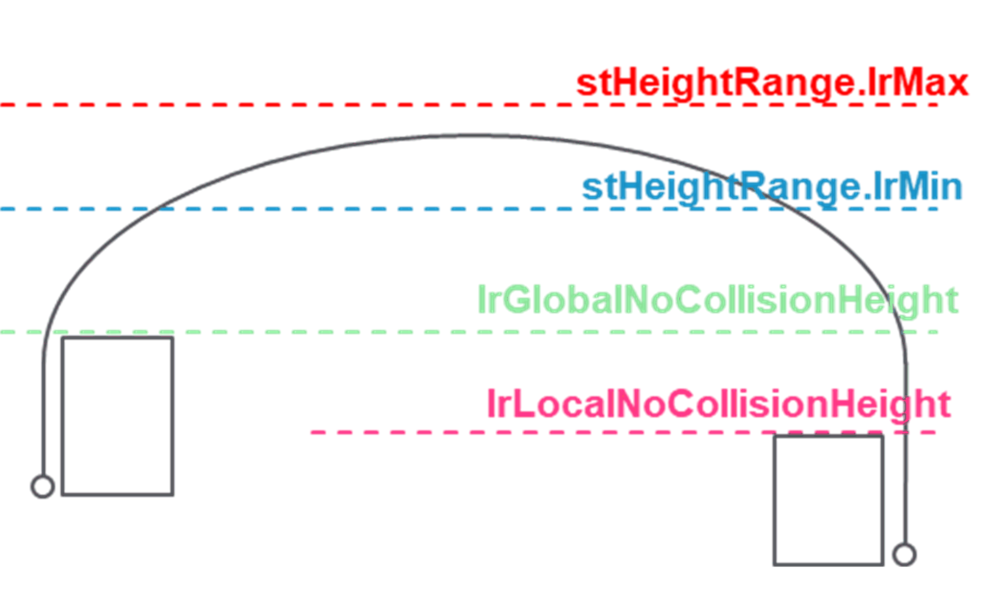

# ST\_TrackingConstraints

## Overview

|  |  |
| --- | --- |
| Type: | Structure |
| Available as of: | V1.4.1.0 |
| Inherits from: | - |

## Description

Structure to provide a list of constraints for a certain robot within a tracking system.

## Structure Elements

| Name | Data type | Description |
| --- | --- | --- |
| stMinPosition | ST\_CartesianPose | Minimum position of a surface defined regarding the tracking coordinate system. |
| stMaxPosition | *SE\_MATH.ST\_Vector3D* | Maximum position of a surface defined regarding the tracking coordinate system. |
| etWorkingPlane | SE\_MATH.ET\_CartesianPlane | Working plane of the tracking system. |
| etDirection | *[ROB.ET\_RobotComponent](../../../../../api/crossBook?lang=en-US&virtualBookName=PD.Lib.Robotic&topicID=D_SE_0075489)* | Direction of the tracking system. |
| lrMaxDirectionPosition | LREAL | Maximum position that the robot can reach along the direction of the tracking and regarding the tracking coordinate system. |
| stHeightRange | ST\_ValueRange | Absolute height range referred to the tracking coordinate system. For example, in case of a spline movement, the apex of the spline must be within this range. |
| lrGlobalNoCollisionHeight | LREAL | Absolute minimum height with no risk of collision considering all the systems with reference to the tracking coordinate system. |
| lrLocalNoCollisionHeight | LREAL | Absolute minimum height with no risk of collision considering this tracking system with reference to the tracking coordinate system. |

EIO0000006044.00