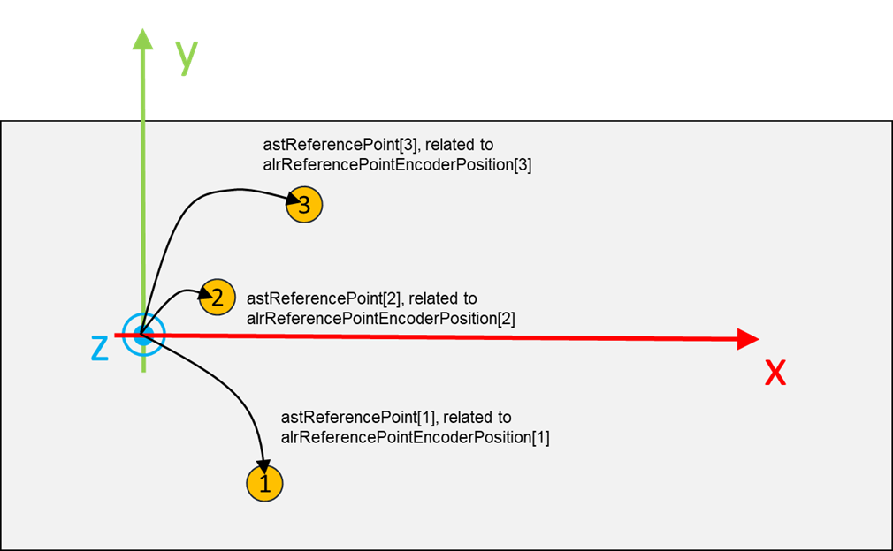

# ST\_TeachingLinearMotionSystemData

## Overview

|  |  |
| --- | --- |
| Type: | Structure |
| Available as of: | V1.0.2.0 |
| Inherits from: | - |

## Description

Structure used to configure a teaching procedure for a linear moving system. The procedure is based on using a set of reference points which coordinates are provided during the configuration in combination with the related encoder positions.

The procedure is implemented by the function block FB\_TeachingLinearMotionSystem.

## Structure Elements

| Name | Data type | Description |
| --- | --- | --- |
| ifVelocitySource | CMI.IF\_AxisIdentification | Velocity source related to the linear motion system that must be considered during the teaching procedure. |
| astReferencePoint | ARRAY [1...Gc\_udiMaxNumberOfSamplesPerSet] OF SE\_MATH.ST\_Vector3D | A 3D vector representing the position of a reference point with relation to the coordinate system involved in the teaching procedure. |
| alrReferencePointEncoderPosition | ARRAY [1...Gc\_udiMaxNumberOfSamplesPerSet] OF LREAL | A position referred to the encoder used by the teaching function block. Each element of this array is linked to the elements of *astReferencePoint* and they represent the position of the encoder represented by *stLEncLogicalAddress* when a position listed inside *astReferencePoint* was measured. |
| udiNumberOfReferencePoints | UDINT | The number of listed reference points and related encoder positions. |

EIO0000006044.00