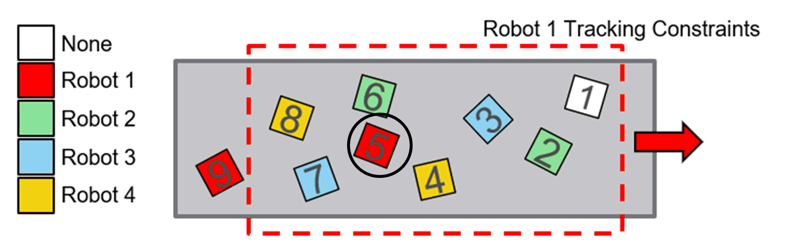
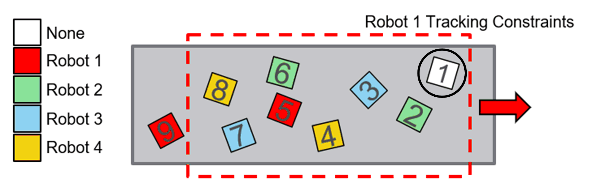
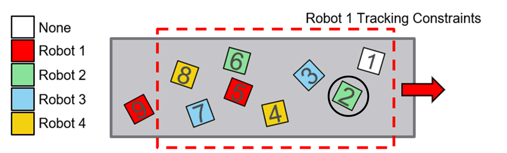

# TargetSelectionStrategy - Owner Flags

## Overview

Each implementation of IF\_TargetSelectionStrategy provided by the library has two owner flags that can be used to influence the behavior of the strategy:

| Parameter | Description |
| --- | --- |
| i\_xSelectTargetsWithNoOwner | Allows the algorithm to select a target to which no owner is assigned. |
| i\_xSelectTargetsWithAnyOwner | Allows the algorithm to select a target with an assigned owner different from the robot for which a valid target is searched. |

## Example 1

Searching for a valid FIFO target for Robot1 with the following configuration:

* i\_xSelectTargetsWithNoOwner = FALSE
* i\_xSelectTargetsWithAnyOwner = FALSE

The algorithm would select target number 5, since it is the only one assigned to **Robot1** within the tracking constraints.

## Example 2

Searching for a valid FIFO target for **Robot1** with the following configuration:

* i\_xSelectTargetsWithNoOwner = TRUE
* i\_xSelectTargetsWithAnyOwner = FALSE

The algorithm would return target number 1, since it is now allowed to select targets with no assigned owners (but not targets with other owners) and between target 1 and 5 the one marked as 1 has the greatest position along the tracking direction.

## Example 3

Searching for a valid FIFO target for **Robot1** with the following configuration:

* i\_xSelectTargetsWithNoOwner = FALSE
* i\_xSelectTargetsWithAnyOwner = TRUE

The algorithm would return target number 2, since it is now allowed to select targets with other owners (but not targets with no owner) and between target 2 and 5 the one marked as 2 has the greatest position along the tracking direction.

## Example 4

Searching for a valid FIFO target for **Robot1** with the following configuration:

* i\_xSelectTargetsWithNoOwner = TRUE
* i\_xSelectTargetsWithAnyOwner = TRUE

The algorithm is allowed to select any targets within the tracking constraints and, in this specific case, it would select the target marked as 1 since it is the one with the greatest position along the tracking direction.

The typical use case for this configuration is to implement a behavior for the last robot of the robot cell when such robot is required to pick or place all the targets in a tracking system. Setting both flags to TRUE indicates to the selected algorithm that the owner properties of the targets must be ignored, and then each target within the tracking constraints is a valid target.

EIO0000006044.00