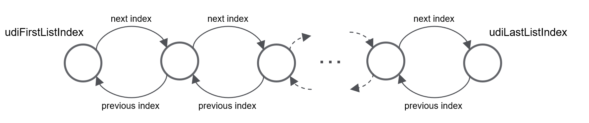
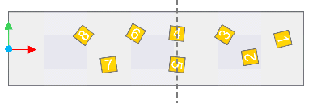

# Targets Handler - Operating Modes

## Overview

The function block FB\_TargetsHandler has been designed to store the pose of targets coming from a sensing system (such as a camera system) in a list. It updates their position over time in accordance with the motion of a reference logical encoder.

The function block FB\_TargetsHandler implements the interface IF\_TargetsHandler.

You cannot directly access the internal list of targets from the outside. The following parameters of the IF\_TargetsHandler [interface](D-SE-0098034.html#D-SE-0098034) are available to navigate through the list:

* [Properties](D-SE-0098034.html#D-SE-0098034__D-SE-0098034.8):

  + udiFirstListIndex
  + udiLastListIndex
* Methods:

  + GetNextListIndex
  + GetPreviousListIndex

The list of targets is implemented as a doubly linked list. That means that you can navigate through the list of targets in two directions: from udiFirstListIndex to udiLastListIndex or from udiLastListIndex to udiFirstListIndex:

## Sorting Targets in the List

New targets are inserted in the list in an ordered way, based on the direction and the working plane of the tracking system linked to the targets handler:

* First, new targets are sorted in descending order along the tracking direction.
* In case of the same coordinate, they are then sorted in descending order according to the second axis of the working plane.

For example, in the case of a tracking system moving in X direction and working in the XY plane, the targets are first sorted over X and then, in case of the same X coordinate, they are sorted over Y:

The figure illustrates that the targets are inserted in the list in the order indicated by the numbers:

* The first element in the list is the one with the greatest X coordinate (in this case, X is the direction of the tracking and XY is the working plane).
* Since targets number 4 and 5 share the same X coordinate, they are sorted based on the Y coordinate. Thus, target 4 is inserted before target 5 since it has a greater Y coordinate.

EIO0000006044.00