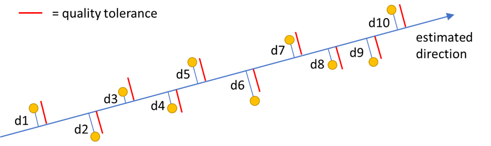
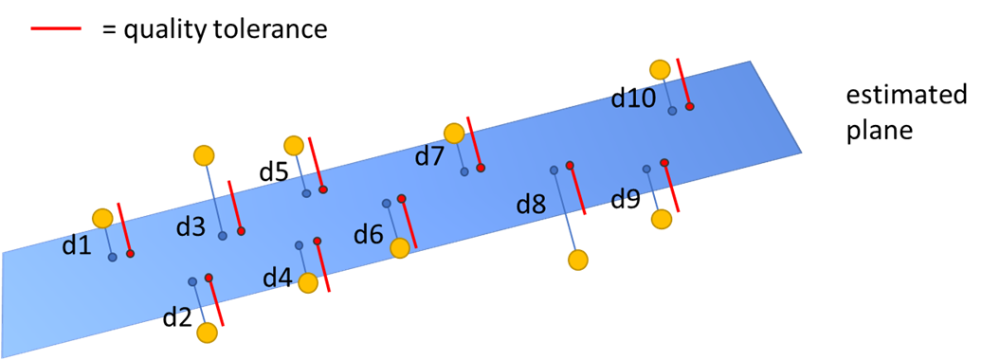
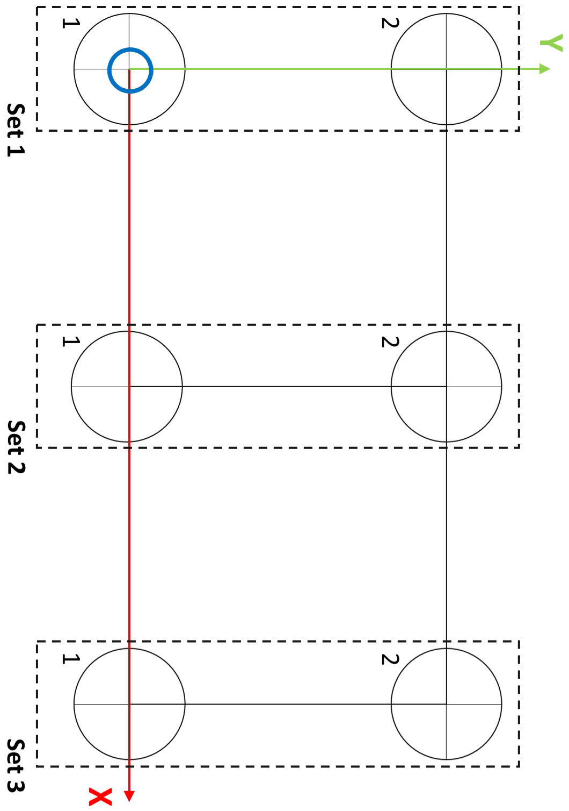

# Quality of the Estimated Orientation or Pose

## Overview

This chapter contains an explanation of the quality indices provided when an orientation or a pose are estimated starting from a set of provided samples.

## Samples Direction Quality

The Samples Direction Quality value is a percentage that represents the number of samples that have a distance to the estimated direction that is within a specified quality tolerance value.

The lower the value, the more the acquired samples are dispersed around the estimated direction; the higher the value, the more the samples are close to the estimated direction.

The figure below displays ten samples, and only one of them has a distance from the estimated direction greater than the quality tolerance. In this case, the value for Samples Direction Quality is equal to 90%, it represents how many samples out of the total number of samples have a distance to the estimated direction that is within the quality tolerance value.

## Samples Plane Quality

The Samples Plane Quality value is a percentage that represents the number of samples that have a distance to the estimated plane that is within a specified quality tolerance value.

The lower the value, the more the acquired samples are dispersed around the estimated plane; the higher the value, the more the samples are close to the estimated plane.

The figure below displays ten samples, and only two of them have a distance from the estimated plane greater than the quality tolerance. In this case, the value for Samples Plane Quality is equal to 80%, it represents how many samples out of the total number of samples have a distance to the estimated plane within the quality tolerance value.

## Example of Reference Grid

The following grid can be used as a reference for the teaching procedures.

EIO0000006044.00