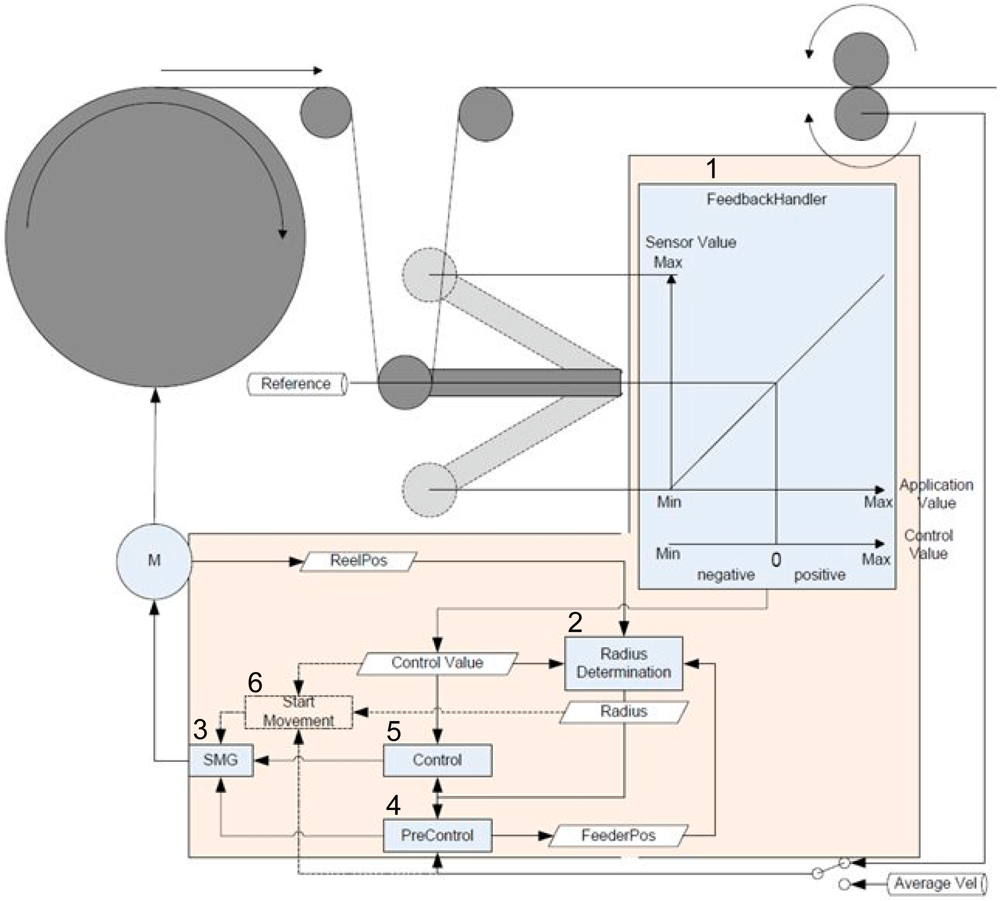

# Working Principle of an Unwinder Process

Working Principle of an Unwinder Process

The graphic shows a schematic representation of an unwinder process. The functions provided by the Unwinder Library are divided into six parts:

1 Feedback handler

2 Radius determination

3 SMG (SoMotionGenerator)

4 PreControl (PreControl with master connection or PreControl by given velocity)

5 Control (Control by a three point controller or by a PI controller)

6 Start movements (start by moving to reference position or start by splicing from standstill)