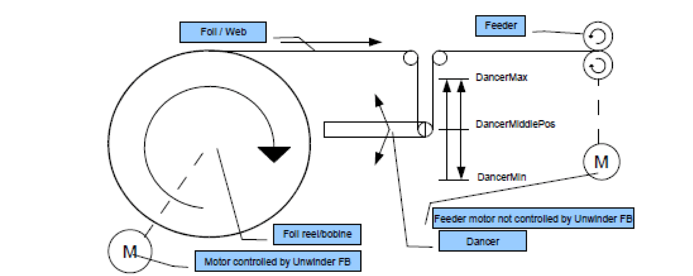

# Overview

Overview

Mechanic with dancer

The unwinder controls the motor of the bobbin and the feeder is controlled by a different motor. In between is a dancer, that keeps a constant tension on the foil. The unwinder moves the bobbin, to keep the dancer in the middle position.