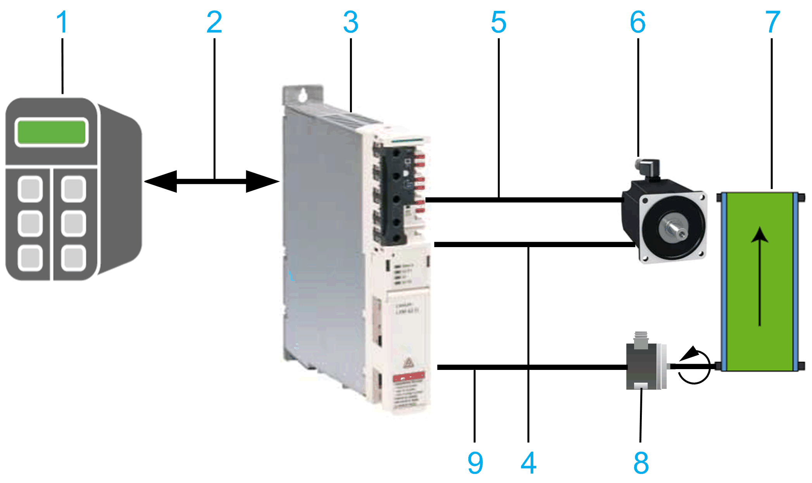

# General Information

## Library Overview

The library UserMotorTypePlate provides functionalities to write the motor typeplate data in the motor encoder or drive and for parameterization of a machine encoder.

**1** Motion Controller (for example, PacDrive LMC or M660)

**2** Sercos bus

**3** Lexium drive

**4** Motor powercable

**5** Motor encoder cable (not for BMP or asynchronous motors)

**6** Motor (optional with motor encoder and Hiperface memory area)

**7** Mechanics (for example, conveyor belt)

**8** Machine encoder with Hiperface memory area

**9** Machine encoder cable

Functional overview of the library:

| Item | Hardware component | Elements | |
| --- | --- | --- | --- |
| 1 | Motion controller | Area with variables of type:   * ST\_UserMotorData    + ST\_UserMotorDataACIM   + ST\_UserMotorDataPMSM * ST\_UserMachineEncoderData | Mass storage (for example flash card)   * .blh    + Motor data provided by Schneider Electric * .mdf    + Motor data |
| 3 | Drive | Components:   * Firmware of the drive * FPGA (Field Programmable Gate Array) * Typeplate of the drive | Memory area for motor data of type ST\_UserMotorData for connected motor, if data cannot be stored directly in the motor encoder. |
| 6 | Motor with optional encoder | Optional motor encoder  Supported ET\_EncoderType elements for motor encoders:   * SinCos Hiperface * SinCos * SinCos Hiperface Linear * SinCos Linear | |
| 8 | Machine encoder | Supported ET\_EncoderType elements for machine encoders:   * SinCos Hiperface | |

## Preconditions / Restrictions

* To use the machine encoder functionality, a machine encoder with a Hiperface feature and Lexium 62 Advanced Plus drive must be used.

  One of the following preconditions must be met in addition to the Hiperface:

  + The encoder has a generic typeplate.
  + The encoder is of type:

    – SC• 60, SR• 50, SK• 36 (•=S or M)

    – SEK 37, SEL 37, TTK 70, L 230
* BLH files can be read from a controller and be transferred to drive or motor encoder. These files are not created by the library, but they can be requested from your local Schneider Electric support representative.
* In case the Hiperface memory area is needed in the motor encoder or the machine encoder, a minimum of 2 Kb of physical memory is needed.

NOTE: If you are using a third-party motor, follow the instructions in the following section.

## Typical Use Cases of the Library

* For the use of third-party motors with SinCos encoder:

  + In case the motor encoder has the Hiperface feature (not Hiperface DSL), the motor typeplate data can be written to the motor encoder.
  + In case there is no Hiperface feature or not enough Hiperface memory, the motor typeplate data can be written directly to the drive.
* For the use of third-party motors without motor encoder: the motor typeplate data can be written directly to the drive (for example, asynchronous motor).
* For the use of a Lexium BMP motor with Lexium 62 Plus or Lexium 62 Advanced Plus by writing .blh file for the motor to the drive.
* For the use of Lexium 62 Advanced Plus with machine encoder with a Hiperface feature and enough Hiperface memory area by writing machine encoder typeplate data to the machine encoder.
* For the use of third-party motors to copy motor encoder data to a file (backup copy).

## Using Machine Encoder

The following steps must be taken to be able to use a machine encoder:

| Step | Action |
| --- | --- |
| 1 | Create the encoder data with ST\_UserMachineEncoderData of the PacDrive LMC controller. The preparation of data in this structure can be done offline. |
| 2 | Transfer the encoder data to the machine encoder by using the function block FB\_InitMachineEncoder when Sercos bus is in phase 2. |
| 3 | Restart the Sercos bus (Phase 0 -> Phase 4) to activate the new parameters. |

## Using Third- Party Motors

The following steps must be taken to be able to use a third-party motor:

| Step | Action |
| --- | --- |
| 1 | Create the motor data (.mdf) with ST\_MotorData in the memory area. |
| 2 | Use this structure as an input of FC\_MotorDataFileCreate and create a motor data file on the controller. |
| 3 | Set the value of the parameter MotorIdentification:   * Use *motor with typeplate / 0* if the storage location of the typeplate is the encoder. * Use *motor without typeplate / 2* if the storage location of the typeplate is the drive. |
| 4 | Verify that Sercos is in phase 2. |
| 5 | Call up the function block FB\_MotorDataWrite with the drive object and the name of the motor data file.  **Result:** The function block signals with q\_xDone that the motor data has been written to the drive. You must set the Sercos to phase 4 in the application. The axis can be used with a third-party motor. |

Application examples of third-party motors are described in the chapters [Asynchronous Motor](../../../../../api/crossBook?lang=en-US&virtualBookName=PD.Parameter.3rdPartyMotors&topicID=D_SE_0088217) and [Linear motor](../../../../../api/crossBook?lang=en-US&virtualBookName=PD.Parameter.3rdPartyMotors&topicID=D_SE_0088100).

## Characteristics of the Library

The table indicates the characteristics of the library:

| Characteristic | Value |
| --- | --- |
| Library title | UserMotorTypePlate |
| Company | Schneider Electric |
| Category | Application |
| Component | UserMotorTypePlate |
| Default namespace | MTP |
| Language model attribute | [qualified-access-only](../../../../../api/crossBook?lang=en-US&virtualBookName=SoLibref&topicID=D_SE_0081219) |
| Forward compatible library | [Yes](../../../../../api/crossBook?lang=en-US&virtualBookName=SoLibref&topicID=D_SE_0081226) |

NOTE: For this library, qualified-access-only is set. Therefore, the POUs (program organization unit), data structures, enumerations, and constants have to be accessed using the namespace of the library. The default namespace of the library is MTP.

## Overview of the POUs

| Function block / function | Use |
| --- | --- |
| FB\_InitMachineEncoder | Reads data of type ST\_UserMachineEncoderData form the memory area and writes the data to the machine encoder. |
| FB\_MotorCustomizedKeyWrite | Writes the customized key of the motor to the motor typeplate in the drive or the motor encoder. |
| FB\_MotorCustomizedKeyWrite2 |
| FB\_MotorDataDelete | Deletes the motor encoder data from the drive or the motor encoder. |
| FB\_MotorDataDelete2 |
| FB\_MotorDataRead | Reads the motor data of the drive or the motor encoder and saves the data as .mdf file on the controller. |
| FB\_MotorDataRead2 |
| FB\_MotorDataWrite | Reads the motor data from the .mdf file of the controller and writes the data to the drive or the motor encoder. |
| FB\_MotorDataWrite2 |
| FB\_MotorDataWriteBLH | Reads the motor data from the .blh file of the controller and writes the data to the drive or the motor encoder. |
| FB\_MotorDataWriteBLH2 |
| FB\_MotorSerialNumberWrite | Writes the serial number of the motor to the motor typeplate in the drive or the motor encoder. |
| FB\_MotorSerialNumberWrite2 |
| FC\_EtDiagExtToString | Converts an enumeration element of type ET\_DiagExt to a string. |
| FC\_MotorDataFileCreate | Reads data of type ST\_UserMotorData from memory area and creates a .mdf file on the controller. |
| FC\_MotorDataFileCreate2 |
| FC\_MotorDataFileRead | Reads the .mdf file from the controller and transfers the data to memory area into a variable of type ST\_UserMotorData. |
| FC\_MotorDataFileRead2 |

NOTE: The function blocks designated with a '2' in their names are updated versions of the original function blocks. The original function blocks, and their names, are retained for compatibility reasons.

## Overview of the Structures in the Module-Specific Interface

| Structure | Use |
| --- | --- |
| ST\_UserMachineEncoderData | Contains general machine encoder data. |
| ST\_UserMotorData | Contains general motor data for the various motor types supported. |
| ST\_UserMotorDataACIM | Contains motor data, especially for asynchronous motors (ACIM, AC induction motors). |
| ST\_UserMotorDataPMSM | Contains specific motor data for synchronous motors (PMSM). |

## Overview of the Enumerations

| Enumeration | Use |
| --- | --- |
| ET\_DiagExt | Indicates the POU-specific diagnostic and status messages. |
| ET\_EncoderType | Contains the encoder types supported by PacDrive 3 drives. |
| ET\_MotorType | Contains the motor types supported by PacDrive 3 drives. |
| ET\_StorageLocation | Indicates the storage locations (drive or encoder) of the electronic motor typeplate. |

EIO0000002682.03