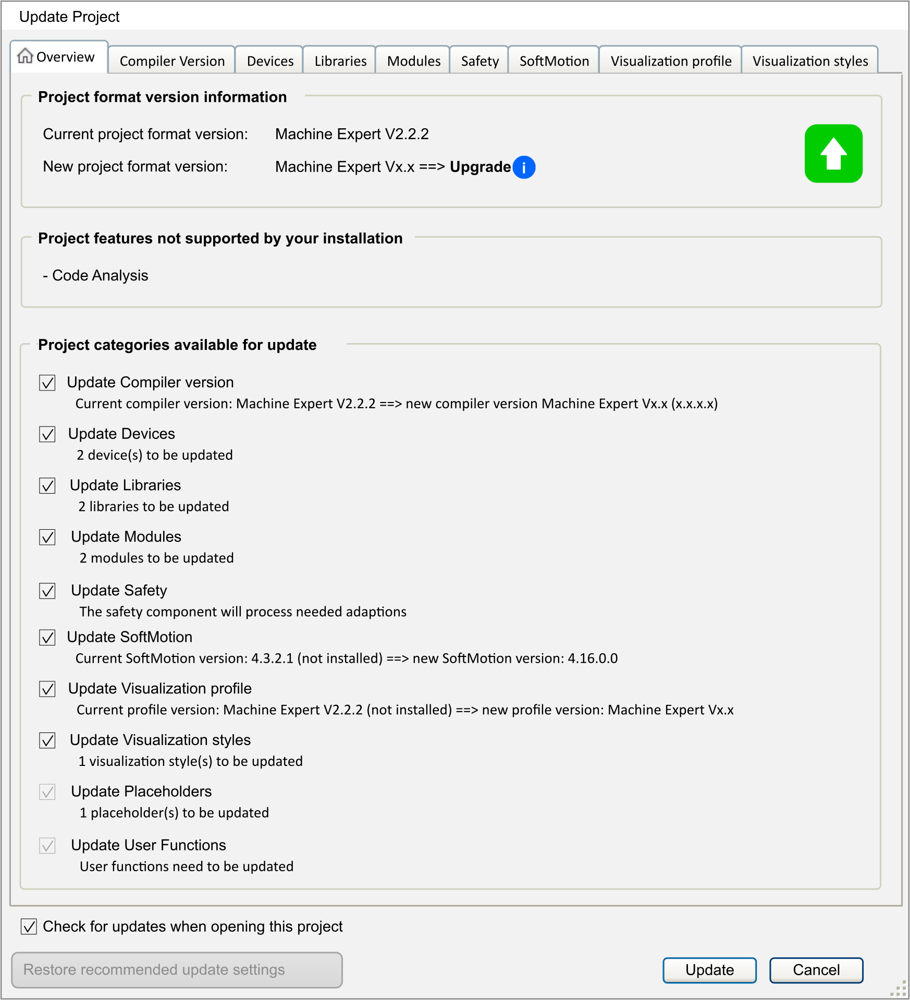

# Updating Libraries and Library References

## Overview

This topic describes the situations you can encounter when updating libraries.

## Update Project Dialog Box

When opening an existing project in EcoStruxure Machine Expert, the Update project dialog box is displayed, if one of the following elements has been installed on the local system:

* A newer compiler version.
* A newer visualization profile, style, or symbol.
* A newer device version.
* A newer library version of one of the used libraries.

  A forward compatible library (FCL) exists in the project where a device version does not meet the device version constraints. Thus, not the latest library is used in the project. For further information, refer to the chapter [*Step 2.1: Decide Whether Your Library Should Be Forward Compatible*](D-SE-0081246.html#D-SE-0081246).

The following effects occur when you update your libraries using the Libraries tab of the Update Project dialog box:

| If... | Then... |
| --- | --- |
| If you clear the option Update libraries from the Libraries tab, and you click Update. | * No existing library reference is changed. * A manual update of the libraries can be executed in the Version mapping tab of the Library Manager. * Legacy libraries are listed in the Version mapping tab, but marked as legacy, if a newer, forward-compatible library version exists. * The Update project dialog box is displayed again next time you open this project.  You can omit this by clearing the option Check for updates when opening this project in the Update project dialog box or in the Project Settings.   NOTE: If you have selected the option Update devices in the Update project dialog box, libraries referenced in the project as placeholders will be updated to the corresponding placeholder resolutions defined by the devices to be updated, even if the option Update libraries has not been selected. |
| If you select the option Update libraries with the default option Update all libraries (incl. Libraries declared with direct or newest version), and you click Update. | * The directly referenced libraries are updated. * The libraries with at least one forward compatible library version installed in the Library Repository and the version mapping of former legacy versions are updated to the newest forward compatible library version.   NOTE: There are libraries which will not be updated. This concerns libraries which are listed and gray colored in the Library Manager as required library via a reference in the device description. |
| If you select the option Update libraries with the option Update all forward compatible libraries (keep existing legacy mappings) from the list, and you click Update. | * The forward compatible libraries are updated to the newest forward compatible library version. * The legacy libraries are converted into forward compatible libraries. They are updated to the newest forward compatible library version.   NOTE: There are libraries which will not be updated. This concerns libraries which are listed and gray colored in the Library Manager as required library via a reference in the device description. |
| If you select the option Update all forward compatible libraries (replace existing legacy mappings) from the list, and you click Update. | * The forward compatible libraries are updated to the newest forward compatible library version. * The legacy libraries are converted into forward compatible libraries. They are updated to the newest forward compatible library version. * The libraries with at least one forward compatible library version installed in the Library Repository and the version mapping of former legacy versions are updated to the newest forward compatible library version.   NOTE: There are libraries which will not be updated. This concerns libraries which are listed and gray colored in the Library Manager as required library via a reference in the device description. |
| If you click Cancel. | * No existing library reference is changed. * Legacy libraries are listed in the Version mapping tab, but marked as legacy, if a newer, forward compatible library version exists. * A manual update of the libraries, the device, the visualization, or the compiler can be executed in the project. * The Update project dialog box is displayed again next time you open this project.  You can omit this by clearing the option Check for updates when opening this project in the Update project dialog box or in the Project Settings. |

## Manual Library Update

| If | Then... |
| --- | --- |
| If you want to update forward compatible libraries manually, | This manual update can be executed in the Version mapping tab of the Library Manager.  Using the Automatic button for updating has the following effects:   * The forward compatible libraries are updated to the newest forward compatible library version. * The legacy libraries are converted into forward compatible libraries and are updated to the newest forward compatible library version.   For updating only one library, right-click on the respective library in the Version mapping tab and select Edit version mapping (selected library). |
| If you want to update non-forward compatible libraries manually, | This manual update can be executed in the Libraries tab of the Library Manager:   1. In the Libraries tab, right-click a library and run the command Properties.  **Result**: The Properties dialog box is displayed. 2. In the Properties dialog box, select one of the versions installed on the local system from the Specific version list, and click OK. |

## Manual Device Update

When manually updating a device description using Update Device..., the following libraries are updated too:

* Libraries which are automatically included by the device.
* Libraries which are included as placeholders and are resolved by devices.
* Forward compatible libraries.

To [update a device](../../../../../api/crossBook?lang=en-US&virtualBookName=SoMProg&topicID=D_SE_0083377), right-click the device in the Devices tree and select Update Device...

## Project Created with Previous Version

In a project created with a previous version of EcoStruxure Machine Expert software, the versions of the libraries declared in the project are modified as follows:

* The library versions are kept unchanged for libraries declared with a [direct version](D-SE-0081223.html#D-SE-0081223).
* They are automatically updated with the [newest version](D-SE-0081224.html#D-SE-0081224) for libraries declared using the *newest* version method (version identified with **\*** in the Library Manager).
* They are automatically updated with the versions defined in the controller *Device Description File* after a controller device update command for libraries declared using the [placeholder mechanism](D-SE-0081225.html#D-SE-0081225).

EIO0000002829.05