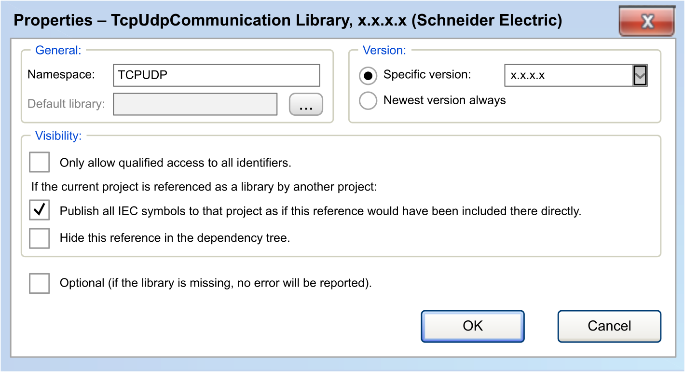

# Properties

## Overview

In the Library Manager editor view, click the Properties button to open the Properties dialog box for the selected library. It allows you to configure the namespace, version handling, availability, and visibility of library references.

Properties dialog box for a library:

NOTE: Before working on library projects and modifying namespaces, version and visibility settings, read the [guidelines for creating libraries](D-SE-0081242.html#D-SE-0081242).

## General Area of the Dialog Box

| Parameter | Description |
| --- | --- |
| Namespace | The namespace of the library is displayed.  The default namespace of the library for accessing functions of the library.  NOTE: It is a good practice to use the default namespace in accordance with your application.  For further information, refer to the Library Manager editor view [description](D-SE-0081233.html#D-SE-0081233__D-SE-0081233.4). |
| Default library | If a library placeholder is selected in the Library Manager, this field contains the name of the library which replaces the placeholder if no device-specific library is available. Refer to the Placeholder [tab](D-SE-0081234.html#D-SE-0081234__D-SE-0081234.3). |

## Version Area of the Dialog Box

Configure the version of the library that is used in the project if the selected library is not a library placeholder:

| Parameter | Description |
| --- | --- |
| Specific version | Enter the version or select one from the list that is used in the project. To be used for [container libraries](D-SE-0081247.html#D-SE-0081247__D-SE-0081247.3). |
| Newest version always | The latest version found in the library repository is used. The modules used can change because a more recent version of the library is available. To be used for [interface libraries](D-SE-0081247.html#D-SE-0081247__D-SE-0081247.3).  For common libraries, do not specify version constraints, but use a [placeholder reference](D-SE-0081248.html#D-SE-0081248). |

## Visibility Area of the Dialog Box

The settings of the Visibility area are of interest as soon as the library is included and referenced by another library. By default, they are deactivated:

| Parameter | Description |
| --- | --- |
| Only allow qualified access to all identifiers | If this option is enabled, the usage of the namespace is mandatory. |
| If the current project is referenced as a library by another project. | NOTE: Modify the following settings if you intend to create a library project. It has the effect that the selected library is referenced in the new library. |
| Publish all IEC symbols to that project as if this reference would have been included there directly | If the present project is a container library, activate this option for the selected library to make its objects visible at the top level later in the project.  Symbolic access to library modules:  `<namespace of container library>.<module name>`  NOTE: Only activate this option if the present project is a container library, not containing own modules, but just including other libraries for packaging them. This packaging for example allows you to include multiple libraries in a project at once just by including the container library. In this case, it can be desired to have the particular libraries on top level of the Library Manager of the project.  This option is relevant if a library B was added to a library A inside a project that uses library A:  If the option is activated, you can access components of library B by using the namespace of library A.  Example: `NamespaceLibA.ComponentOfLibB`  If this option is deactivated, the contents of the selected library is accessed uniquely by using the namespace. For unique access to a module from the selected library, the namespace of the present library and the namespace of the selected library are prefixed to the module.  Unique symbolic access to the library module:  `<NamespaceLibA>.<NamespaceLibB>.<ComponentofLibB>` |
| Hide this reference in the dependency tree | If this option is activated, the selected library is not displayed (later in a project) in the Library Manager as a library reference. This allows you to include hidden libraries into a library. This requires careful use because if library detected error messages are issued, it may be difficult to identify the causing library.  If this option is deactivated, the selected library is displayed as a library reference (later in a project). |

## Defining the Library as Optional

| Parameter | Description |
| --- | --- |
| Optional (if the library is missing, no error will be reported) | If this option is activated, the selected library is handled as optional. When downloading the project which references the library, no error is detected, even if the library is not available in the library repository. |

EIO0000002829.05