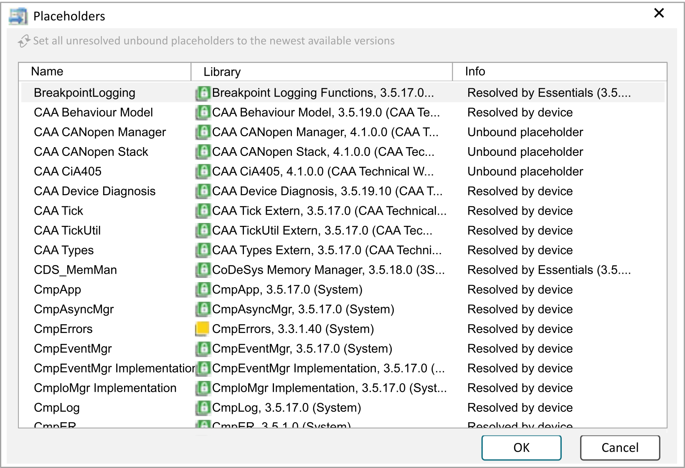

# Placeholders

## Overview

In the Library Manager editor view, click the Placeholders button to open the Placeholders dialog box. It provides information about the placeholders available in the project with their definition for resolution and allows you to assign a resolution that is valid for the open project.

NOTE: Carefully consider the possible effects of changing the library referencing. Also consider the [guidelines for creating libraries](D-SE-0081242.html#D-SE-0081242).

| Element | Description |
| --- | --- |
| Name | Identifier of the placeholder |
| Library | Resolution for the project  To switch to another version of the library, double-click the cell to edit the placeholder resolution. A list of the available versions of the selected library is displayed below the entry Other versions of <library>.  To assign another library, execute the command Other library.... The Browse Library dialog box opens for searching and, if necessary, for installing the desired library. |
| Info | Type of placeholder resolution:   * Resolved by device description * Resolved by license mechanism * Resolved by plugins * Free placeholder resolved by <special library with fixed version> |
| Set all unresolved unbound placeholders to the newest available versions | Click to resolve unresolved placeholder libraries in the Library Manager. The latest available version will be used. |

EIO0000002829.05