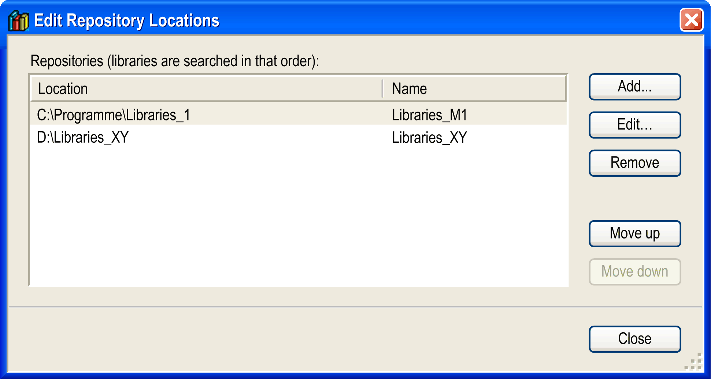
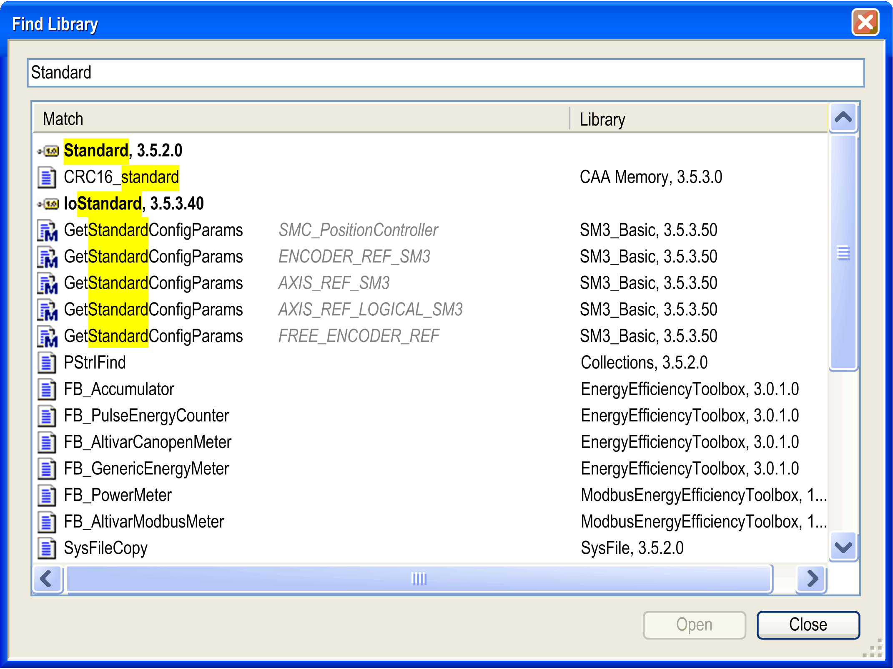

# Library Repository

## Overview

Open the Library Repository dialog box via the Tools > Library Repository... command or by clicking the Library repository button in the Library Manager editor.

A library repository is a database for libraries which have been installed on the local system in order to be available for EcoStruxure Machine Expert projects.

NOTE: A library project *\*.library*, which is stored in a library repository, cannot be opened there for editing or viewing in the programming system.

The dialog box shows the defined library Locations (repositories) and the installed libraries.

It allows you to:

* Add, modify, or remove repositories
* Install, uninstall, and export libraries

The Library Repository dialog box contains the following elements:

| Parameter | Description |
| --- | --- |
| Location list | Select a directory on the local system where library files are stored.  Select System to display the standard libraries provided by EcoStruxure Machine Expert in the Installed libraries list.  Select User to display those libraries you defined by yourself in the Installed libraries list. |
| Company list | Select a name to display those libraries provided by a primary provider (or group name defined by the primary provider) in the list of Installed libraries.  To display the libraries available at the selected Location, select (All companies) from the list. |
| Installed libraries list | The list shows libraries that are available at the selected Location from the selected Company by their names (title), version number, and company name as provided by the project information of the library. |
| Group by category option | Activate the option Group by category to sort the Installed libraries list according to the library categories. The category names are displayed as nodes which can be folded or unfolded to show/hide the libraries.  Deactivate this option to list the libraries alphabetically. |
| Edit Locations... button | Refer to the paragraph [*Library Locations (Repositories)*](#D-SE-0081239__D-SE-0081239.3). |
| Install... / Uninstall buttons | Refer to the paragraph [*Library Installation and Uninstallation*](#D-SE-0081239__D-SE-0081239.6). |
| Export... button | Opens the dialog box for saving the library project to the local file system. The data type is \*.library or \*.compiled-library (depending on the type of the selected library). |
| Find... button | Refer to the paragraph [*Find Libraries*](#D-SE-0081239__D-SE-0081239.7). |
| Details... / Dependencies... buttons | Refer to the paragraph [*Further Information on Particular Libraries*](#D-SE-0081239__D-SE-0081239.8). |
| Library Profiles... button | Opens the Library Profiles dialog box. With compiler versions of EcoStruxure Machine Expert V2.2 and later, library profiles are ignored for placeholder resolution. |

## Library Locations (Repositories)

You can use several repositories to manage libraries. The defined repositories are shown in the Location list. By default, it contains the entries System for standard libraries provided by EcoStruxure Machine Expert and User for those libraries that you defined.

To edit the path or name of a repository, click the Edit Locations... button.

The Edit Repository Locations dialog box displays:

The Edit Repository Locations dialog box contains the following elements:

| Parameter | Description |
| --- | --- |
| Repositories list | Lists the defined locations. They are searched later for a library in the given order from up to down. |
| Move up / Move down buttons | Modifies the order of the libraries. The selected location is moved up or down in the list. |

Consider that the setting Location: <All locations> displays the libraries of the previously defined locations. No installation is possible in this view.

## Defining a New Repository or Modifying Path and Name of an Existing Repository

Click the Add... button of the Edit Repository Locations dialog box to add a new repository. The Repository Location dialog displays.

To modify an existing repository, select the respective entry in the Edit Repository Locations dialog box, and click the Edit... button. The Repository Location dialog box displays.

The Repository Location dialog box contains the following elements:

| Parameter | Description |
| --- | --- |
| Location box | Enter the path of the new repository or edit the path of the selected repository.  To browse for a folder or to create a new folder, click the ... button.  Verify that the selected folder is empty. |
| Name box | Enter a symbolic name for the location, for example Libraries for System1. |

NOTE: The folder that is selected as a repository folder has to be empty. The System repository is not editable. This is indicated by the entry being displayed in italic font.

## Removing an Existing Repository

To remove a repository, select it in the Edit Repository Locations dialog box, and click the Remove button. A message is displayed asking you whether just the entry in the list should be deleted, or if also the folder containing the library files should be removed from the file system.

## Library Installation and Uninstallation

You can include those libraries in a project that are installed on the local system (Library Repository). As a precondition for the installation, it must be assigned at least a Title, Version info, and a Company name in the Summary tab of the Project Information dialog box.

To install a library, select the repository to which the library should be added in the Library Repository dialog box, and click the Install... button.

The Select Library dialog box opens. This is a standard dialog box for browsing for a file. By default, the Files of type filter is set to Compiled library files. You can modify the filter to Library files, or to All files.

Select the desired library and click Open. The library is added to the list of installed libraries in the Library Repository dialog box.

If you select a library which cannot be installed because it does not provide the obligate Project Information (title, version, company), an appropriate message displays.

To uninstall a library, select it in the list of installed libraries in the Library Repository dialog box, and click the Uninstall button.

## Find Libraries

To search for a library in the specified storage location, click the Find button in the Library Repository dialog box. The Find Library dialog box opens. It allows you to search for function blocks and the corresponding libraries.

Find Library dialog box

Enter the search string for the function block and the corresponding libraries. In addition, you can also enter the wildcards `*` and `?`.

## Further Information on Particular Libraries

To display further details for the selected library, select the line of the library containing the version, and click the Details... button. A Details dialog box displays, providing further information from the Project Information of the library. To get even more detailed information, click the More... button.

To display the dependencies concerning other libraries for the selected library, select the line of the library containing the version and click the Dependencies... button. A Dependencies dialog box displays, listing those libraries which are included in the selected library with Title, Version, and Company information.

References working via placeholders are listed according to the following syntax:

#<placeholder name>.

For details on library placeholders, refer to the [*Placeholder Mechanism* chapter](D-SE-0081225.html#D-SE-0081225).

EIO0000002829.05