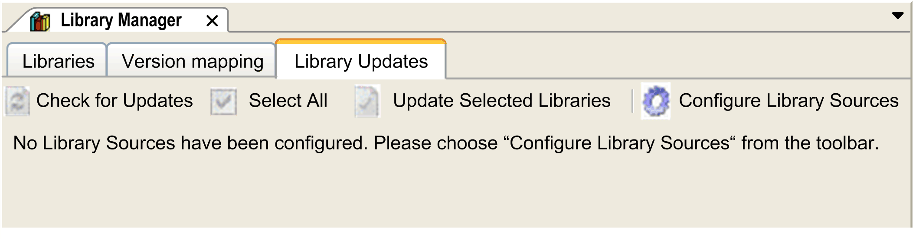
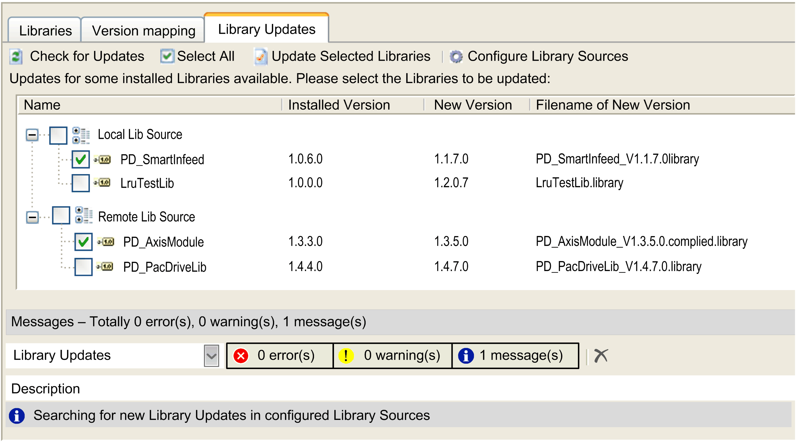

# Library Updates Tab

## Overview

The Library Updates tab of the Library Manager allows you to configure folders where new or updated libraries are stored in order to facilitate the updating process.

You can search, install, and reference updates for libraries within a project. In the Library Manager editor view, click the Library Updates tab. The menu in the tab Library Updates allows you to decide whether a referenced library is automatically updated.

## Configuring Folders for Library Updates

In order to configure folders where you can store new libraries or libraries that should be installed or updated, proceed as follows:

| Step | Action |
| --- | --- |
| 1 | In the Library Updates tab of the Library Manager, click Configure Library Sources.  **Result**: The dialog box Tools > Options > Library Updates opens, showing a list of Available Library Sources. |
| 2 | Click Add to add a folder to the list of Available Library Sources.  **Result**: The dialog box Library Source opens. |
| 3 | Enter a Name for the new library source and browse to the Location of the folder in the network. |
| 4 | Select the option Include Subfolders when searching for updates to extend your search. |
| 5 | Select the option Only install released libraries from this source if you want only released libraries to be shown. |
| 6 | Select your preferences concerning open or compiled library types:   * Prefer Compiled: If a library is available as open and as compiled library, the compiled version is considered. * Prefer Open: If a library is available as open and as compiled library, the open version is considered. * Compiled only: Compiled libraries are considered. * Open only: Open libraries are considered. |
| 7 | Click OK.  **Result**: The selected folder is added to the list of Available Library Sources. You are returned to the Library Updates tab of the Library Manager. |

## Verifying the Folders

In order to verify whether new libraries or library updates are available in the specified folders, click Check for Updates in the Library Updates tab.

**Result**: The specified folders are scanned for new library updates and the results are displayed in a list:

Forward compatible libraries ([FCL](D-SE-0081226.html#D-SE-0081226)) are considered for the updating process. Non-forward compatible libraries are ignored.

If a library detected in the folder is of a later version than the referenced library, the library is presented as a library update.

## Installing Detected Updates

In order to install the updates that have been detected, proceed as follows:

| Step | Action |
| --- | --- |
| 1 | From the list of detected libraries in the tab Library Updates, select the libraries you want to be updated or click the Select all button. |
| 2 | Click the Update Selected Libraries button.  **Result**: The libraries are updated or installed. The procedures that are performed are indicated in the Messages view. |

EIO0000002829.05