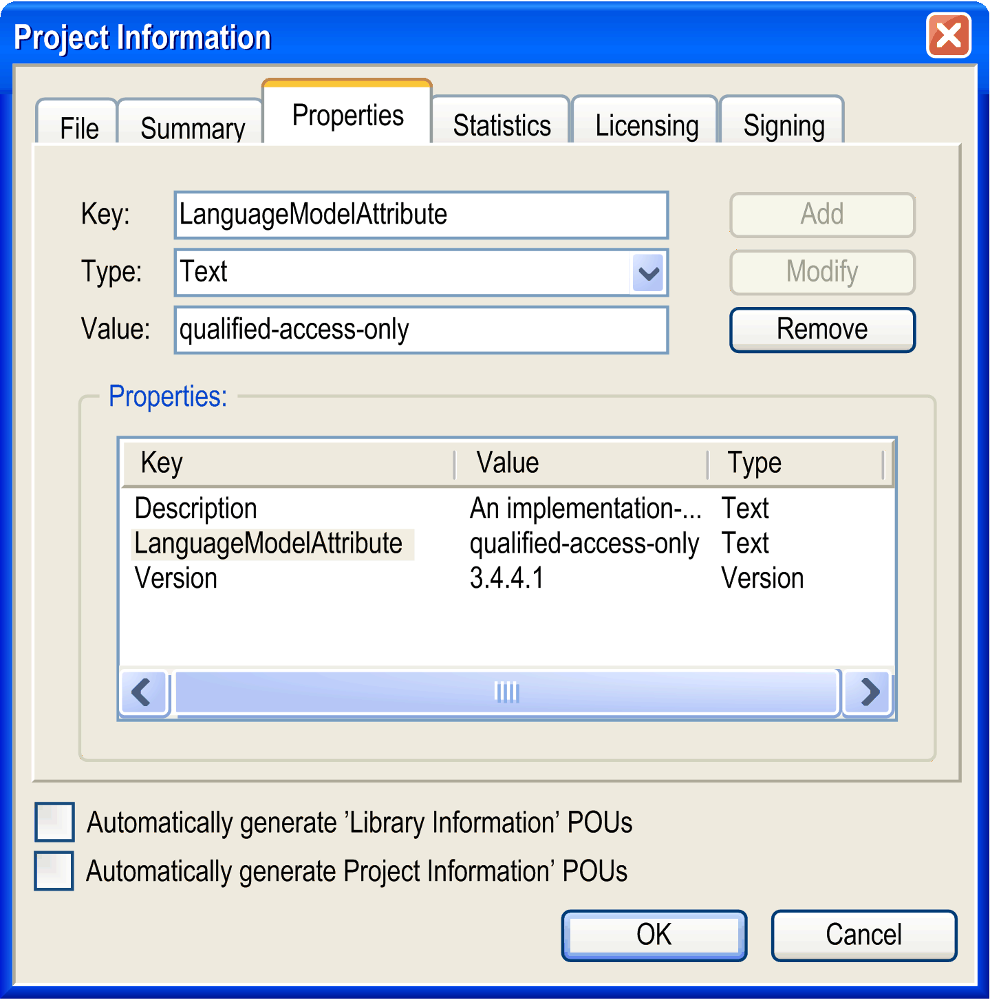

# Step 2: Fill-in the Project Information

## Overview

Specify information on the project in the Project > Project Information dialog box. This dialog box consists of several tabs. Pieces of information required for creating your own library are described here.

## Summary Tab

Specify the following information in the Summary tab of the Project Information dialog box:

| Parameter | Description |
| --- | --- |
| Company | Obligatory: Enter a company for the project. |
| Title | Obligatory: Enter a name for the project. |
| Version | Obligatory: Enter a version for the project. |
| Released | Select the option to help protect the library from later modifications.  When you later attempt to save the library, you are prompted when this flag has been set to Yes, and asked if you wish to reset the flag:   * If you click Yes, the flag is reset. * If you click No, the flag is preserved and the project is not saved. |
| Default namespace | Allows you to make each symbol unique, even if the same symbol name is used in different libraries  If you do not define a namespace, the library name is used as namespace. It is better to define a unique one. After the library has been included in a project, you can still modify the namespace in the Properties dialog box of the Library Manager - if necessary.  For enforcing the namespace, see the separate section in this chapter. |
| Library Categories | Provides helpful sorting of the entries in the Library Repository and Library Manager  If possible specify another category than Miscellaneous from the following categories:   * Application libraries which must be inserted explicitly in a project. Designed for direct access from end-user code. * Internal libraries which are automatically inserted in a project and normally should not be inserted or removed manually. * System libraries depending directly on the runtime system or implement parts of it. They should not be inserted directly in the project, but be referenced by other libraries. They are not intended to be included in the user application directly. (No resource management is provided like, for example, deleting of resources on the controller in order to get serial interfaces closed before a further download is done).   NOTE: When you create a new library, define the library categories by external description files *\*.libcat.xml*. |
| Author | Enter the name of the author of this project. |
| Description | Enter a short description of the library content. |
| Automatically generate ‘Library Information POUs’  Automatically generate ‘Project Information POUs’ | NOTE: When calling these POUs, prefix them with the corresponding library namespace. For calling the POUs of the project POUs tree, prefix them with the namespace `__Pool`. |

| WARNING | |
| --- | --- |
|  | UNINTENDED EQUIPMENT OPERATION  Do not use the parameters "Automatically generate ‘Library Information POUs’" and "Automatically generate ‘Project Information POUs’" unless you modify the namespace as directed above.  Failure to follow these instructions can result in death, serious injury, or equipment damage. |

## Enforcing the Namespace

It can be enforced that the namespace must be preceding in any case when accessing library modules or variables, from the application as well as from another library. For this purpose, set the property `LanguageModelAttribute (Text) :='qualified-access-only'` in the Properties tab.

Key name: LanguageModelAttribute

Type: Text

Value: qualified-access-only (see figure below).

Compile errors are detected if a library module or variable is used without preceding namespace.

Properties tab: Settings for enforcing the namespace:

## Properties Tab

List of configurable properties:

| Property | Type | Value | Description |
| --- | --- | --- | --- |
| Author | Text | <author name> | Author of the library version |
| Company | Text | <company name> | Serves to filter the libraries in the Add Library dialog box |
| DefaultNamespace | Text | <namespace> | Worldwide unique namespace prefix |
| Description | Text | <description> | Short description on the scope of the library |
| ForwardCompatibleLibrary | Boolean | TRUE|FALSE | This library is a forward compatible library (FCL). |
| LanguageModelAttribute | Text | `'qualified-access-only'` | Symbols of this library can only be accessed via the namespace prefix |
| Project | Text | <library project name> # | Name of the library project |
| Title | Text | <library name> # | Name of the library |
| Version | Text | <library version> | Version of the library |
| Released | Boolean | TRUE|FALSE | Library must not be modified after release |
| Placeholder | Text | <placeholder> | The placeholder that is used for referencing this library when adding the library using the Add Library dialog box. |
| IsContainerLibrary | Boolean | TRUE|FALSE | This library follows the rules for a container library |
| IsInterfaceLibrary | Boolean | TRUE|FALSE | This library follows the rules for a container library |
| IsEndUserLibrary | Boolean | TRUE|FALSE | This library is especially designed regarding the needs of an end user |

EIO0000002829.05