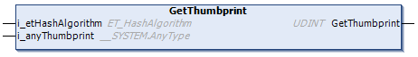

# GetThumbprint Method

## Overview

|  |  |
| --- | --- |
| Type: | Method |
| Available as of: | V1.1.2.0 |

## Functional Description

This method is used to retrieve the thumbprint of the selected certificate.

Verify the value of the property Result in case the return value is 0.

The return value of the method returns the number of characters copied into the buffer specified at i\_anyThumbprint.

## Interface

| Input | Data type | Description |
| --- | --- | --- |
| i\_etHashAlgorithm | ET\_HashAlgorithm | The hash algorithm of the thumbprint. |
| i\_anyThumbprint | \_\_System.AnyType | Buffer provided by the application to store the thumbprint. |

| Return value | Data type | Description |
| --- | --- | --- |
| GetThumbprint | UDINT | The number of characters copied into the buffer specified at i\_anyThumbprint. |

EIO0000004549.01

© 2022

Schneider Electric.

All rights reserved.