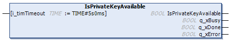

# IsPrivateKeyAvailable Method

## Overview

|  |  |
| --- | --- |
| Type: | Method |
| Available as of: | V1.1.2.0 |

## Functional Description

This method is used to verify whether a private key is available for the selected certificate.

Execute the method until one of the outputs q\_xError or q\_xDone indicates TRUE. Verify the value of the property Result to get further information about the result of the execution of the method.

If the return value is TRUE, the private key is available and the certificate can be used as an Own certificate.

## Interface

| Input | Data type | Description |
| --- | --- | --- |
| i\_timTimeout | TIME (TIME#10s0ms) | Timeout for the operation. If the specified time expires during execution, the process is aborted. This is an optional input. If it is not assigned or a value less than T#10s is specified, the timeout is set to 10 seconds. |

| Return value | Data type | Description |
| --- | --- | --- |
| IsPrivateKeyAvailable | BOOL | If this output is set to TRUE, the private key is available and the certificate can be used as an Own certificate. |

| Output | Data type | Description |
| --- | --- | --- |
| q\_xDone | BOOL | If this output is set to TRUE, the execution has been completed successfully. |
| q\_xBusy | BOOL | If this output is set to TRUE, the function block execution is in progress. |
| q\_xError | BOOL | If this output is set to TRUE, an error has been detected. For details, refer to q\_etResult and q\_etResultMsg. |

EIO0000004549.01

© 2022

Schneider Electric.

All rights reserved.