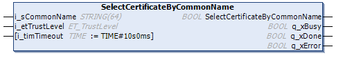

# SelectCertificateByCommonName Method

## Overview

|  |  |
| --- | --- |
| Type: | Method |
| Available as of: | V1.1.2.0 |

## Functional Description

This method is used to find and to select a certificate which corresponds to the values specified for common name and the trust level. The first certificate found is selected.

Execute the method until one of the outputs q\_xError or q\_xDone indicates TRUE. Verify the value of the property Result to get further information about the result of the execution of the method.

The return value of this function indicates whether the certificate could be selected.

## Interface

| Input | Data type | Description |
| --- | --- | --- |
| i\_sCommonName | STRING [64] | The common name of the certificate to select. |
| i\_etTrustLevel | ET\_TrustLevel | The trust level of the certificate to select. |
| i\_timTimeout | TIME (TIME#10s0ms) | Timeout for the operation. If the specified time expires during execution, the process is aborted. This is an optional input. If it is not assigned or a value less than T#10s is specified, the timeout is set to 10 seconds. |

| Return value | Data type | Description |
| --- | --- | --- |
| SelectCertificateByCommonName | BOOL | If this output is set to TRUE, the certificate has been selected. |

| Output | Data type | Description |
| --- | --- | --- |
| q\_xDone | BOOL | If this output is set to TRUE, the execution has been completed successfully. |
| q\_xBusy | BOOL | If this output is set to TRUE, the function block execution is in progress. |
| q\_xError | BOOL | If this output is set to TRUE, an error has been detected. For details, refer to q\_etResult and q\_etResultMsg. |

EIO0000004549.01

© 2022

Schneider Electric.

All rights reserved.