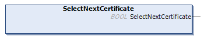

# SelectNextCertificate Method

## Overview

|  |  |
| --- | --- |
| Type: | Method |
| Available as of: | V1.1.2.0 |

## Functional Description

This method is used to select the certificate next to the selected certificate.

Verify the value of the property Result in case the return value is FALSE.

The return value of this function indicates whether the certificate could be selected.

## Interface

| Return value | Data type | Description |
| --- | --- | --- |
| SelectNextCertificate | BOOL | If this output is set to TRUE, the next certificate has been selected. |

EIO0000004549.01

© 2022

Schneider Electric.

All rights reserved.