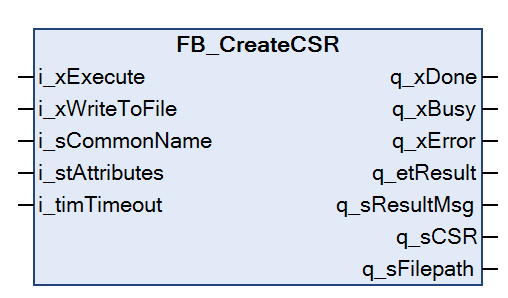

# FB\_CreateCSR

## Overview

|  |  |
| --- | --- |
| Type: | Function block |
| Available as of: | V1.0.0.0 |

## Functional Description

The function block FB\_CreateCSR is used to create a CSR (Certificate Signing Request). If the CSR is created successfully, it is provided at the output q\_sCSR of the function block. Optionally, it can be stored on the file system of the controller.

For each CSR an associated private key is created. This key file is stored on the controller and is protected against external access.

The CSR is used to obtain a signed certificate from a CA (Certificate Authority). You can install the signed certificate on the controller. It can then be used for secured communication using function blocks that support the specification of a certificate.

Examples of function blocks supporting the specification of a certificate to be used for secured communication:

| Function blocks | Library |
| --- | --- |
| FB\_TcpServer2, FB\_TcpClient2 | TcpUdpCommunication |
| FB\_MqttClient | MqttHandling |
| FB\_HttpClient | HttpHandling |
| FB\_SendEMail, FB\_Pop3EMailClient | EMailHandling |
| FB\_SqlDbRequest | SqlRemoteAccess |

For the installation of the obtained signed certificate you have two options:

* Install the signed certificate using the [FB\_InstallCertificateFromString function block](FB_InstallCertificateFromString-E404113C.html) provided by this library.
* Download the signed certificate using the Security Screen editor of EcoStruxure Machine Expert. For further information, refer to [*Downloading Certificate(s) to the Controller*](../../../../../api/crossBook?lang=en-US&virtualBookName=HowMgCer&topicID=D_SE_0096333_6).

For both options the signed certificate must be installed with trust level Own.

NOTE: The function block uses an asynchronous task to create the certificate. Therefore, the function block automatically initializes the asynchronous manager if not yet done previously in the application.

## Interface

| Input | Data type | Description |
| --- | --- | --- |
| i\_xExecute | BOOL | A rising edge of the input i\_xExecute starts the execution of the function block.  Refer to [Behavior of Function Blocks with the Input i\_xExecute](i_xExecute-E1D1178E.html). |
| i\_xWriteToFile | BOOL | If this output is set to TRUE, the CSR is created as a file on the file system of the controller. The resulting file path is provided at the output q\_sFilePath. |
| i\_sCommonName | STRING[64] | The string containing the common name of the certificate. |
| i\_stAttributes | ST\_CertificateAttributes | The structure containing optional attributes of the certificate. |
| i\_timTimeout | TIME (TIME#10s0ms) | Timeout for the operation. If the specified time expires during execution, the process is aborted. The minimum value for the timeout is 10 s. |

| Output | Data type | Description |
| --- | --- | --- |
| q\_xDone | BOOL | If this output is set to TRUE, the execution has been completed successfully. |
| q\_xBusy | BOOL | If this output is set to TRUE, the function block execution is in progress. |
| q\_xError | BOOL | If this output is set to TRUE, an error has been detected. For details, refer to q\_etResult and q\_etResultMsg. |
| q\_etResult | ET\_Result | Provides diagnostic and status information as a numeric value. |
| q\_sResultMsg | STRING [80] | Provides additional diagnostic and status information as a text message. |
| q\_sCSR | STRING [2048] | Provides the CSR as a STRING. |
| q\_sFilepath | STRING [255] | Provides the file path of the CSR stored as a file, if it was selected. |

EIO0000004549.01

© 2022

Schneider Electric.

All rights reserved.