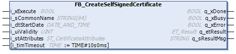

# FB\_CreateSelfSignedCertificate

## Overview

|  |  |
| --- | --- |
| Type: | Function block |
| Available as of: | V1.0.0.0 |

## Functional Description

The function block FB\_CreateSelfSignedCertificate is used to create a self-signed certificate on the controller. If the certificate is created successfully, it is installed to the certificate store of the controller as Own certificate. It can be used for secured communication using function blocks that support the specification of a certificate.

Examples of function blocks supporting the specification of a certificate to be used for secured communication:

| Function blocks | Library |
| --- | --- |
| FB\_TcpServer2, FB\_TcpClient2 | TcpUdpCommunication |
| FB\_MqttClient | MqttHandling |
| FB\_HttpClient | HttpHandling |
| FB\_SendEMail, FB\_Pop3EMailClient | EMailHandling |
| FB\_SqlDbRequest | SqlRemoteAccess |

NOTE: The function block uses an asynchronous task to create the certificate. Therefore, the function block automatically initializes the asynchronous manager if not yet done previously in the application.

## Interface

| Input | Data type | Description |
| --- | --- | --- |
| i\_xExecute | BOOL | A rising edge of the input i\_xExecute starts the execution of the function block.  Refer to [Behavior of Function Blocks with the Input i\_xExecute](i_xExecute-E1D1178E.html). |
| i\_sCommonName | STRING[64] | The string containing the common name of the certificate. |
| i\_dtStartDate | DATE\_AND\_TIME | The start date of the validity of the certificate.  The default value is the date and time of the controller. |
| i\_uiValidity | UINT | The validity period of the certificate in days.  Default value: 473040000000  (= 50 years) |
| i\_stAttributes | ST\_CertificateAttributes | The structure containing optional attributes of the certificate. |
| i\_timTimeout | TIME (TIME#10s0ms) | Timeout for the operation. If the specified time expires during execution, the process is aborted. The minimum value for the timeout is 10 s. |

| Output | Data type | Description |
| --- | --- | --- |
| q\_xDone | BOOL | If this output is set to TRUE, the execution has been completed successfully. |
| q\_xBusy | BOOL | If this output is set to TRUE, the function block execution is in progress. |
| q\_xError | BOOL | If this output is set to TRUE, an error has been detected. For details, refer to q\_etResult and q\_etResultMsg. |
| q\_etResult | ET\_Result | Provides diagnostic and status information as a numeric value. |
| q\_sResultMsg | STRING [80] | Provides additional diagnostic and status information as a text message. |

EIO0000004549.01

© 2022

Schneider Electric.

All rights reserved.