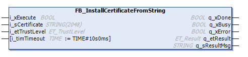

# FB\_InstallCertificateFromString

## Overview

|  |  |
| --- | --- |
| Type: | Function block |
| Available as of: | V1.0.0.0 |

## Functional Description

The function block FB\_InstallCertificateFromString is used to install a certificate from a string on the controller. The certificate to be installed must be provided in the standard Base64 format.

For a certificate which is installed with trust level Own, the corresponding private key is required on the controller. The private key is created when a certificate or the CSR is created on the controller. An externally created certificate or a certificate issued based on an externally created CSR cannot be used as Own certificate.

If the private key is not available, an error will be detected when the certificate is processed by the supported communication function blocks, for example the FB\_TcpServer2 of the TcpUdpCommunication library.

A certificate is deleted as follows:

* By executing the corresponding command from the Security Screen editor of EcoStruxure Machine Expert. For further information, refer to the description of the [Security Screen editor in the *Menu Commands* online help.](../../../../../api/crossBook?lang=en-US&virtualBookName=SoMMenu&topicID=D_SE_0099371).
* By executing the Reset Origin Device command. For further information, refer to the description of the [Reset Origin Device command in the *Menu Commands* online help.](../../../../../api/crossBook?lang=en-US&virtualBookName=SoMMenu&topicID=D_SE_0091259).

NOTE: When a certificate is deleted from the controller, the corresponding private key is also deleted. Even after re-installation of the certificate with the trust level Own, the processing is not possible as the private key is not available.

NOTE: The function block uses an asynchronous task to install the certificate. Therefore, the function block automatically initializes the asynchronous manager if not yet done previously in the application.

## Interface

| Input | Data type | Description |
| --- | --- | --- |
| i\_xExecute | BOOL | A rising edge of the input i\_xExecute starts the execution of the function block.  Refer to [Behavior of Function Blocks with the Input i\_xExecute](i_xExecute-E1D1178E.html). |
| i\_sCertificate | STRING[2048] | The certificate in the standard Base64 format. |
| i\_etTrustLevel | ET\_TrustLevel | The enumeration describing the trust level of the certificate. |
| i\_timTimeout | TIME (TIME#10s0ms) | Timeout for the operation. If the specified time expires during execution, the process is aborted. The minimum value for the timeout is 10 s. |

| Output | Data type | Description |
| --- | --- | --- |
| q\_xDone | BOOL | If this output is set to TRUE, the execution has been completed successfully. |
| q\_xBusy | BOOL | If this output is set to TRUE, the function block execution is in progress. |
| q\_xError | BOOL | If this output is set to TRUE, an error has been detected. For details, refer to q\_etResult and q\_etResultMsg. |
| q\_etResult | ET\_Result | Provides diagnostic and status information as a numeric value. |
| q\_sResultMsg | STRING [80] | Provides additional diagnostic and status information as a text message. |

EIO0000004549.01

© 2022

Schneider Electric.

All rights reserved.